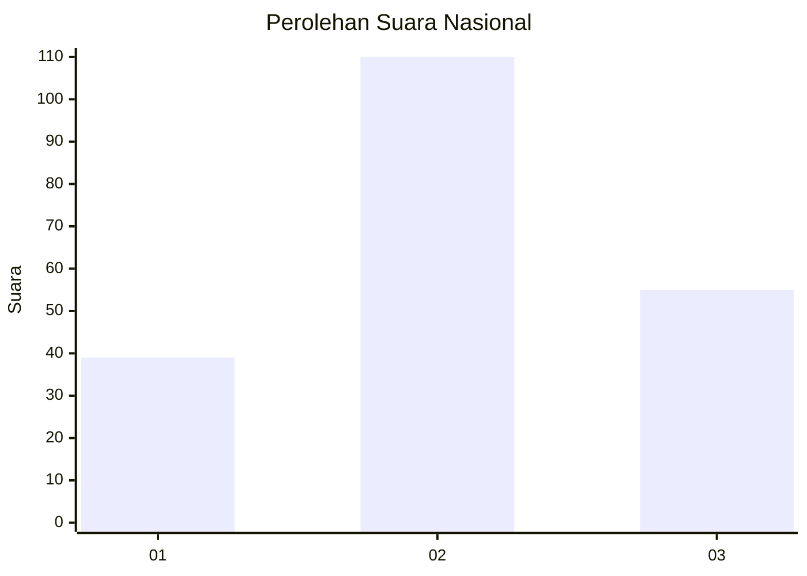
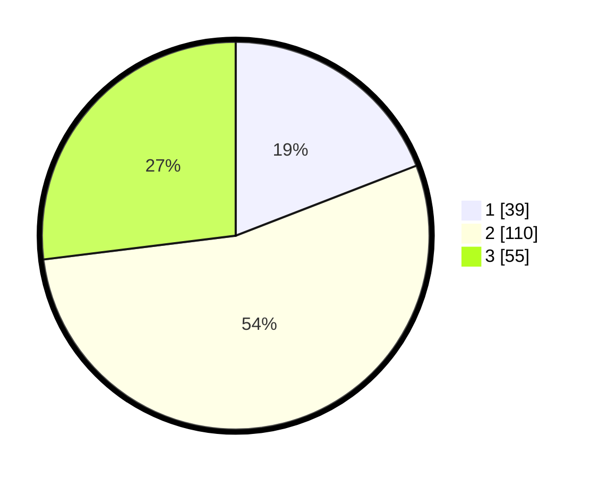

# Hasil

## Grafik

## Tabel

| No.    | Nama Paslon    | Suara | Suara (raw) | Persentase |
|:------ |:-------------- | -----:| -----------:| ----------:|
| 100025 | ANIES MUHAIMIN | 39    | [39][p-1]   | 19,12      |
| 100026 | PRABOWO GIBRAN | 110   | [110][p-2]  | 53,92      |
| 100027 | GANJAR MAHFUD  | 55    | [55][p-3]   | 26,96      |

[p-1]: https://github.com/gigit-pemilu/pemilu-2024/blob/main/pilpres/hitung-suara/sub/31-dki-jakarta/sub/72-jakarta-utara/sub/03-koja/sub/1005-tugu-selatan/sub/123-tps/sub/paslon-1.txt
[p-2]: https://github.com/gigit-pemilu/pemilu-2024/blob/main/pilpres/hitung-suara/sub/31-dki-jakarta/sub/72-jakarta-utara/sub/03-koja/sub/1005-tugu-selatan/sub/123-tps/sub/paslon-2.txt
[p-3]: https://github.com/gigit-pemilu/pemilu-2024/blob/main/pilpres/hitung-suara/sub/31-dki-jakarta/sub/72-jakarta-utara/sub/03-koja/sub/1005-tugu-selatan/sub/123-tps/sub/paslon-3.txt

## Foto C Plano

https://sirekap-obj-formc.kpu.go.id/eda2/pemilu/ppwp/31/72/03/10/05/3172031005123-20240214-224132--83a22d68-5f04-4988-828a-72ea3f220cef.jpg

https://sirekap-obj-formc.kpu.go.id/eda2/pemilu/ppwp/31/72/03/10/05/3172031005123-20240214-233239--57e6cce0-df70-46a9-88af-460018a5ea65.jpg

https://sirekap-obj-formc.kpu.go.id/eda2/pemilu/ppwp/31/72/03/10/05/3172031005123-20240214-233308--7b5c084c-76c0-44c5-92ff-a4b5c540ed7c.jpg

## Metadata

| Key        | Value               |
| ---------- | ------------------- |
| Time Stamp | 2024-02-20 17:00:00 |

