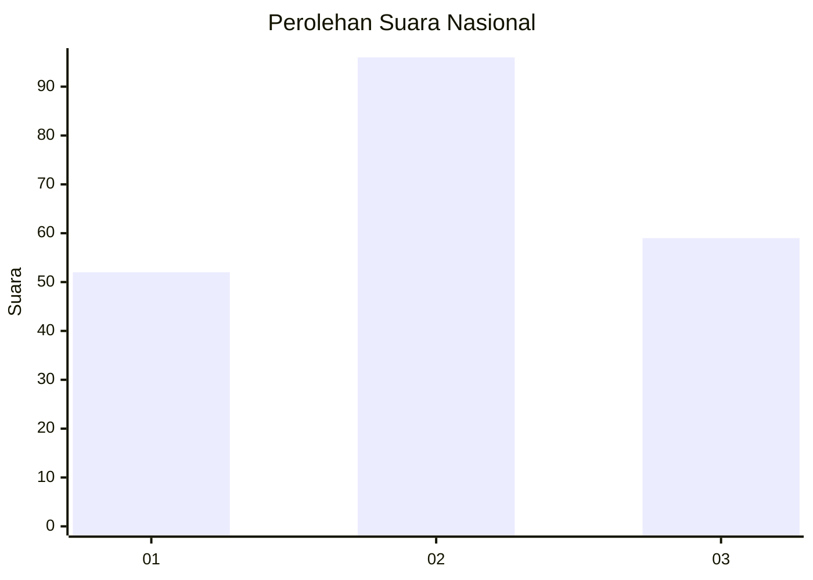
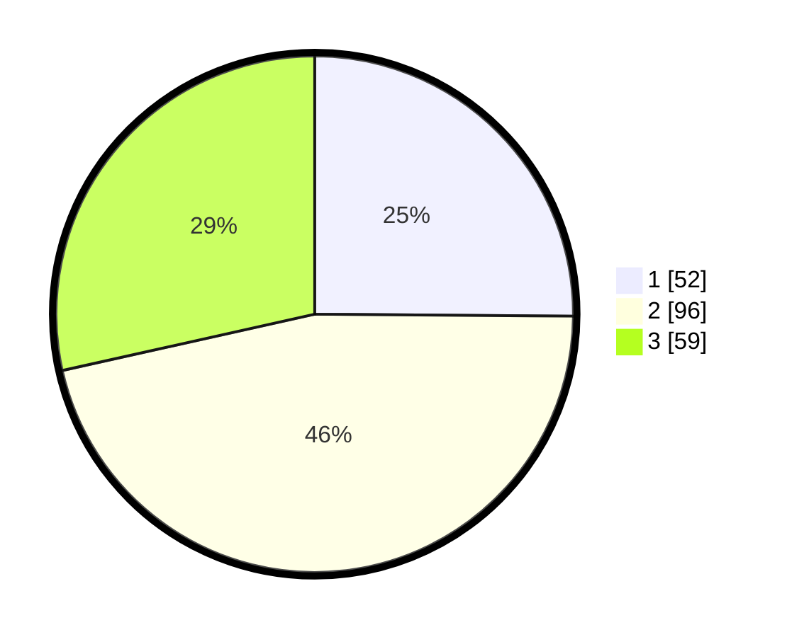

# Hasil

## Grafik

## Tabel

| No.    | Nama Paslon    | Suara | Suara (raw) | Persentase |
|:------ |:-------------- | -----:| -----------:| ----------:|
| 100025 | ANIES MUHAIMIN | 52    | [52][p-1]   | 25,12      |
| 100026 | PRABOWO GIBRAN | 96    | [96][p-2]   | 46,38      |
| 100027 | GANJAR MAHFUD  | 59    | [59][p-3]   | 28,50      |

[p-1]: https://github.com/gigit-pemilu/pemilu-2024/blob/main/pilpres/hitung-suara/sub/31-dki-jakarta/sub/72-jakarta-utara/sub/03-koja/sub/1005-tugu-selatan/sub/128-tps/sub/paslon-1.txt
[p-2]: https://github.com/gigit-pemilu/pemilu-2024/blob/main/pilpres/hitung-suara/sub/31-dki-jakarta/sub/72-jakarta-utara/sub/03-koja/sub/1005-tugu-selatan/sub/128-tps/sub/paslon-2.txt
[p-3]: https://github.com/gigit-pemilu/pemilu-2024/blob/main/pilpres/hitung-suara/sub/31-dki-jakarta/sub/72-jakarta-utara/sub/03-koja/sub/1005-tugu-selatan/sub/128-tps/sub/paslon-3.txt

## Foto C Plano

https://sirekap-obj-formc.kpu.go.id/f088/pemilu/ppwp/31/72/03/10/05/3172031005128-20240214-215932--ff3ae89c-f005-4099-a3b7-f1701fce72d1.jpg

https://sirekap-obj-formc.kpu.go.id/f088/pemilu/ppwp/31/72/03/10/05/3172031005128-20240214-220036--33ea8af2-37e4-49e7-9bc0-120e4d45d9c6.jpg

https://sirekap-obj-formc.kpu.go.id/f088/pemilu/ppwp/31/72/03/10/05/3172031005128-20240214-220136--a98e2058-3e99-4dc8-82e7-86f33a2837f2.jpg

## Metadata

| Key        | Value               |
| ---------- | ------------------- |
| Time Stamp | 2024-02-20 17:00:00 |

