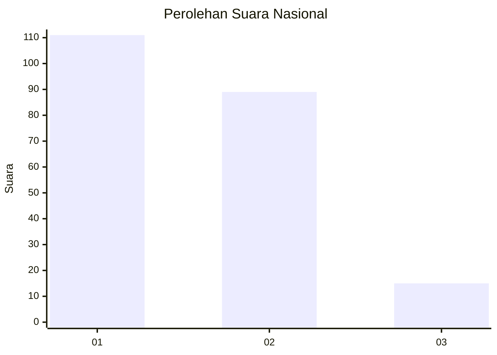
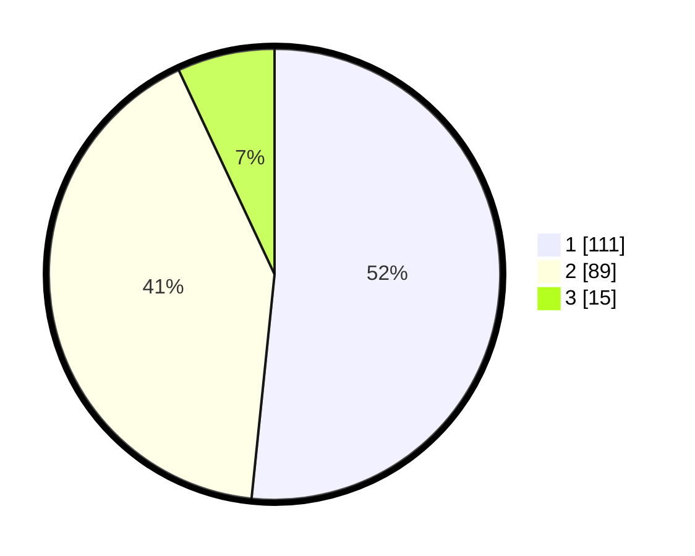

# Hasil

## Grafik

## Tabel

| No.    | Nama Paslon    | Suara | Suara (raw) | Persentase |
|:------ |:-------------- | -----:| -----------:| ----------:|
| 100025 | ANIES MUHAIMIN | 111   | [111][p-1]  | 51,63      |
| 100026 | PRABOWO GIBRAN | 89    | [89][p-2]   | 41,40      |
| 100027 | GANJAR MAHFUD  | 15    | [15][p-3]   | 6,98       |

[p-1]: https://github.com/gigit-pemilu/pemilu-2024/blob/main/pilpres/hitung-suara/sub/31-dki-jakarta/sub/72-jakarta-utara/sub/03-koja/sub/1006-rawa-badak-selatan/sub/022-tps/sub/paslon-1.txt
[p-2]: https://github.com/gigit-pemilu/pemilu-2024/blob/main/pilpres/hitung-suara/sub/31-dki-jakarta/sub/72-jakarta-utara/sub/03-koja/sub/1006-rawa-badak-selatan/sub/022-tps/sub/paslon-2.txt
[p-3]: https://github.com/gigit-pemilu/pemilu-2024/blob/main/pilpres/hitung-suara/sub/31-dki-jakarta/sub/72-jakarta-utara/sub/03-koja/sub/1006-rawa-badak-selatan/sub/022-tps/sub/paslon-3.txt

## Foto C Plano

https://sirekap-obj-formc.kpu.go.id/3b1c/pemilu/ppwp/31/72/03/10/06/3172031006022-20240215-020956--2cf223cb-8c58-4f4f-bd56-fe470d6f04b1.jpg

https://sirekap-obj-formc.kpu.go.id/3b1c/pemilu/ppwp/31/72/03/10/06/3172031006022-20240215-021140--5d7d5f48-1f83-4025-913f-eff588e2e584.jpg

https://sirekap-obj-formc.kpu.go.id/3b1c/pemilu/ppwp/31/72/03/10/06/3172031006022-20240215-021452--7b00cdd4-0577-4b0a-80d3-33c448b384d9.jpg

## Metadata

| Key        | Value               |
| ---------- | ------------------- |
| Time Stamp | 2024-02-16 13:30:32 |

