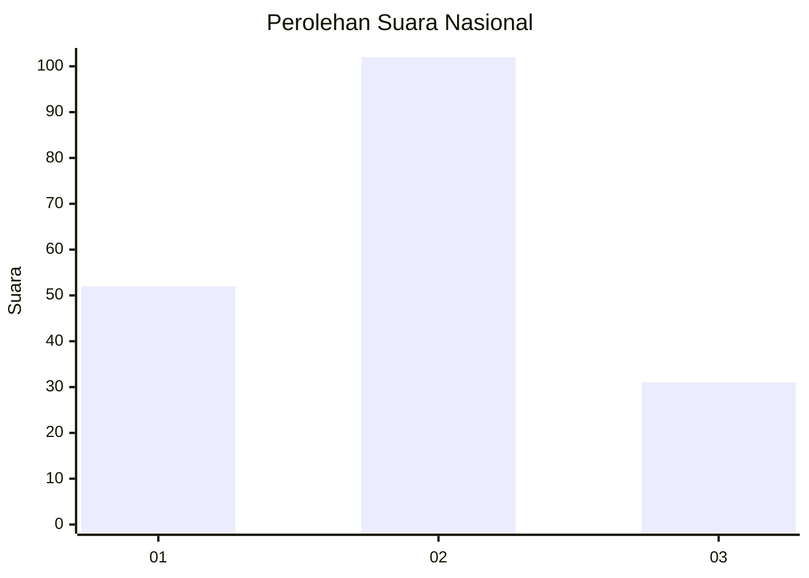
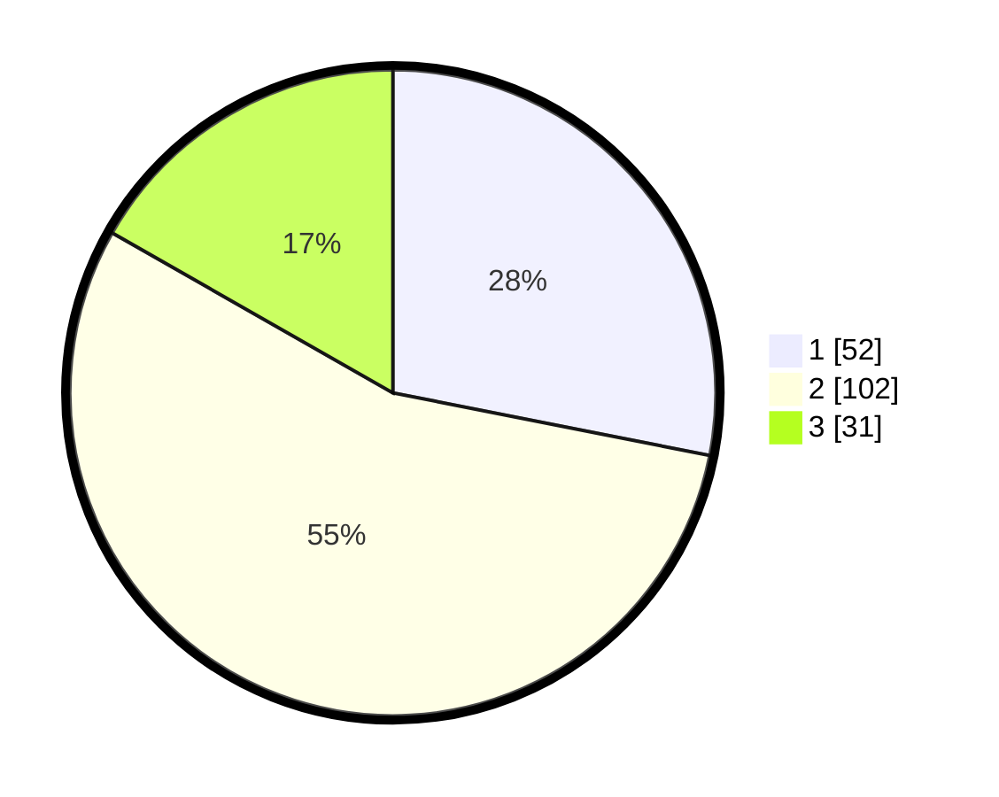

# Hasil

## Grafik

## Tabel

| No.    | Nama Paslon    | Suara | Suara (raw) | Persentase |
|:------ |:-------------- | -----:| -----------:| ----------:|
| 100025 | ANIES MUHAIMIN | 52    | [52][p-1]   | 28,11      |
| 100026 | PRABOWO GIBRAN | 102   | [102][p-2]  | 55,14      |
| 100027 | GANJAR MAHFUD  | 31    | [31][p-3]   | 16,76      |

[p-1]: https://github.com/gigit-pemilu/pemilu-2024/blob/main/pilpres/hitung-suara/sub/31-dki-jakarta/sub/72-jakarta-utara/sub/03-koja/sub/1006-rawa-badak-selatan/sub/080-tps/sub/paslon-1.txt
[p-2]: https://github.com/gigit-pemilu/pemilu-2024/blob/main/pilpres/hitung-suara/sub/31-dki-jakarta/sub/72-jakarta-utara/sub/03-koja/sub/1006-rawa-badak-selatan/sub/080-tps/sub/paslon-2.txt
[p-3]: https://github.com/gigit-pemilu/pemilu-2024/blob/main/pilpres/hitung-suara/sub/31-dki-jakarta/sub/72-jakarta-utara/sub/03-koja/sub/1006-rawa-badak-selatan/sub/080-tps/sub/paslon-3.txt

## Foto C Plano

https://sirekap-obj-formc.kpu.go.id/5309/pemilu/ppwp/31/72/03/10/06/3172031006080-20240215-012153--d3bea88f-efe4-4dff-9939-49350e56c25b.jpg

https://sirekap-obj-formc.kpu.go.id/5309/pemilu/ppwp/31/72/03/10/06/3172031006080-20240215-012254--393db437-60db-44a5-88f4-4697b3d749d5.jpg

https://sirekap-obj-formc.kpu.go.id/5309/pemilu/ppwp/31/72/03/10/06/3172031006080-20240215-012345--040e3772-d34e-4d32-8494-edfc3a4488db.jpg

## Metadata

| Key        | Value               |
| ---------- | ------------------- |
| Time Stamp | 2024-02-16 16:25:10 |

