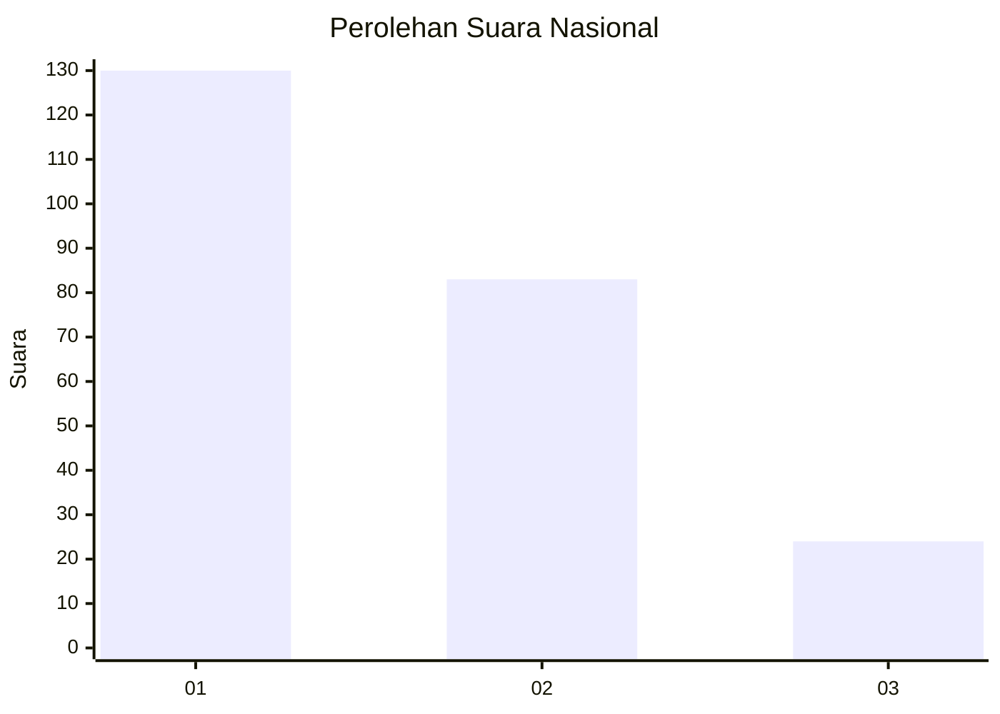
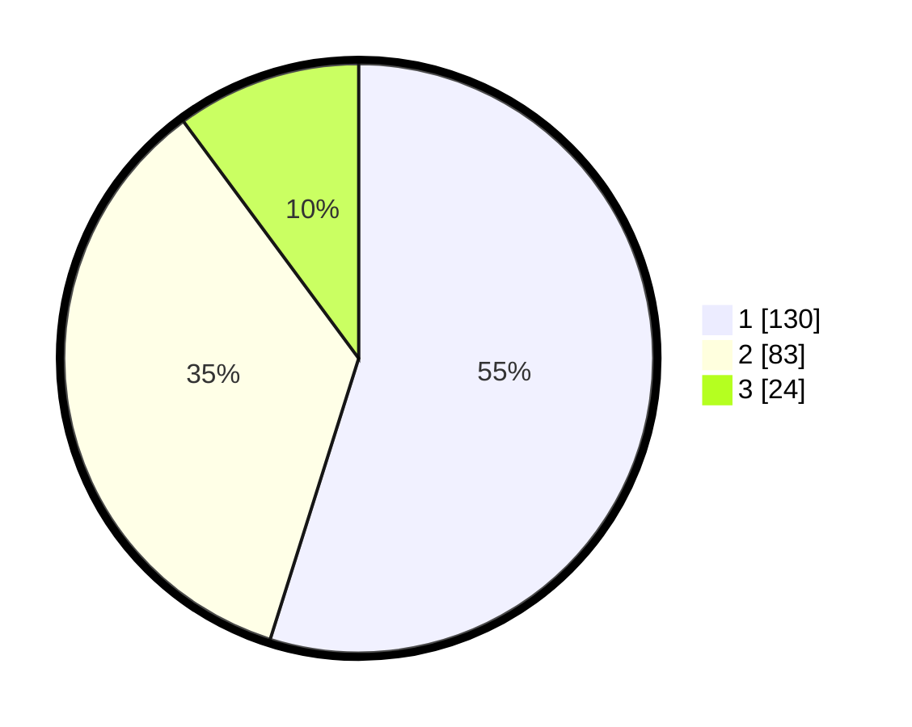

# Hasil

## Grafik

## Tabel

| No.    | Nama Paslon    | Suara | Suara (raw) | Persentase |
|:------ |:-------------- | -----:| -----------:| ----------:|
| 100025 | ANIES MUHAIMIN | 130   | [130][p-1]  | 54,85      |
| 100026 | PRABOWO GIBRAN | 83    | [83][p-2]   | 35,02      |
| 100027 | GANJAR MAHFUD  | 24    | [24][p-3]   | 10,13      |

[p-1]: https://github.com/gigit-pemilu/pemilu-2024/blob/main/pilpres/hitung-suara/sub/31-dki-jakarta/sub/72-jakarta-utara/sub/03-koja/sub/1006-rawa-badak-selatan/sub/082-tps/sub/paslon-1.txt
[p-2]: https://github.com/gigit-pemilu/pemilu-2024/blob/main/pilpres/hitung-suara/sub/31-dki-jakarta/sub/72-jakarta-utara/sub/03-koja/sub/1006-rawa-badak-selatan/sub/082-tps/sub/paslon-2.txt
[p-3]: https://github.com/gigit-pemilu/pemilu-2024/blob/main/pilpres/hitung-suara/sub/31-dki-jakarta/sub/72-jakarta-utara/sub/03-koja/sub/1006-rawa-badak-selatan/sub/082-tps/sub/paslon-3.txt

## Foto C Plano

https://sirekap-obj-formc.kpu.go.id/5931/pemilu/ppwp/31/72/03/10/06/3172031006082-20240214-214447--7dd64927-972e-43cf-ac6f-3481a77c05d3.jpg

https://sirekap-obj-formc.kpu.go.id/5931/pemilu/ppwp/31/72/03/10/06/3172031006082-20240214-214642--c8a3e2a5-c452-4f78-b98e-81667d6956cf.jpg

https://sirekap-obj-formc.kpu.go.id/5931/pemilu/ppwp/31/72/03/10/06/3172031006082-20240214-215911--d64a11fc-1bfc-462e-84d4-82020be5504b.jpg

## Metadata

| Key        | Value               |
| ---------- | ------------------- |
| Time Stamp | 2024-02-16 16:25:10 |

