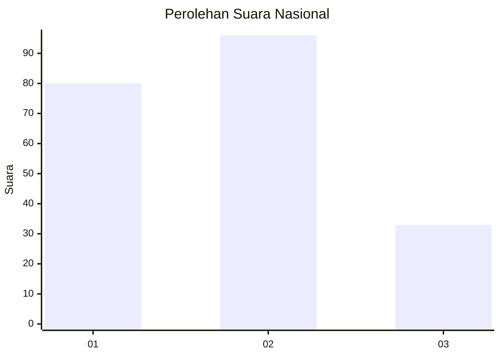
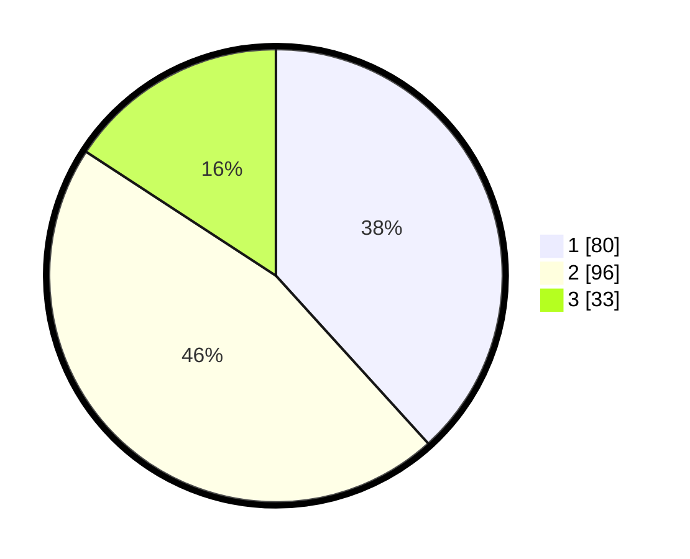

# Hasil

## Grafik

## Tabel

| No.    | Nama Paslon    | Suara | Suara (raw) | Persentase |
|:------ |:-------------- | -----:| -----------:| ----------:|
| 100025 | ANIES MUHAIMIN | 80    | [80][p-1]   | 38,28      |
| 100026 | PRABOWO GIBRAN | 96    | [96][p-2]   | 45,93      |
| 100027 | GANJAR MAHFUD  | 33    | [33][p-3]   | 15,79      |

[p-1]: https://github.com/gigit-pemilu/pemilu-2024/blob/main/pilpres/hitung-suara/sub/31-dki-jakarta/sub/72-jakarta-utara/sub/03-koja/sub/1006-rawa-badak-selatan/sub/089-tps/sub/paslon-1.txt
[p-2]: https://github.com/gigit-pemilu/pemilu-2024/blob/main/pilpres/hitung-suara/sub/31-dki-jakarta/sub/72-jakarta-utara/sub/03-koja/sub/1006-rawa-badak-selatan/sub/089-tps/sub/paslon-2.txt
[p-3]: https://github.com/gigit-pemilu/pemilu-2024/blob/main/pilpres/hitung-suara/sub/31-dki-jakarta/sub/72-jakarta-utara/sub/03-koja/sub/1006-rawa-badak-selatan/sub/089-tps/sub/paslon-3.txt

## Foto C Plano

https://sirekap-obj-formc.kpu.go.id/a46b/pemilu/ppwp/31/72/03/10/06/3172031006089-20240216-170955--820fa43a-aaaf-41d9-8a15-35d29344402c.jpg

https://sirekap-obj-formc.kpu.go.id/a46b/pemilu/ppwp/31/72/03/10/06/3172031006089-20240216-170542--0c66677f-1159-46ff-a155-28926c79208b.jpg

https://sirekap-obj-formc.kpu.go.id/a46b/pemilu/ppwp/31/72/03/10/06/3172031006089-20240216-172042--33aa664b-0e3e-48bb-a404-399c9559fa94.jpg

## Metadata

| Key        | Value               |
| ---------- | ------------------- |
| Time Stamp | 2024-02-16 22:01:00 |

