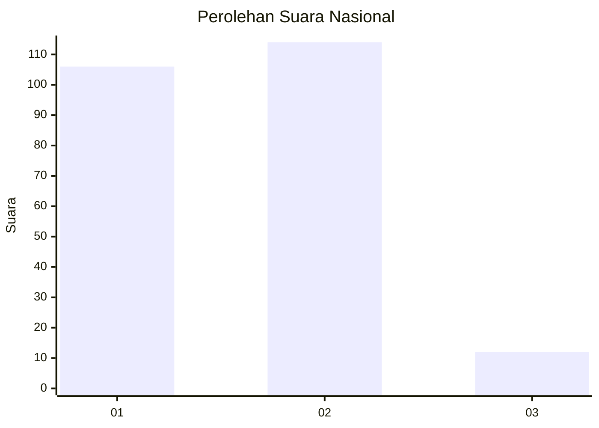
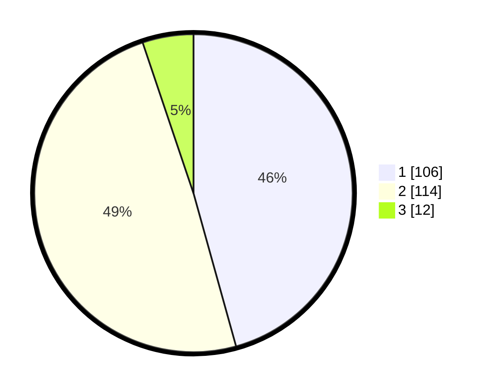

# Hasil

## Grafik

## Tabel

| No.    | Nama Paslon    | Suara | Suara (raw) | Persentase |
|:------ |:-------------- | -----:| -----------:| ----------:|
| 100025 | ANIES MUHAIMIN | 106   | [106][p-1]  | 45,69      |
| 100026 | PRABOWO GIBRAN | 114   | [114][p-2]  | 49,14      |
| 100027 | GANJAR MAHFUD  | 12    | [12][p-3]   | 5,17       |

[p-1]: https://github.com/gigit-pemilu/pemilu-2024/blob/main/pilpres/hitung-suara/sub/31-dki-jakarta/sub/72-jakarta-utara/sub/03-koja/sub/1006-rawa-badak-selatan/sub/114-tps/sub/paslon-1.txt
[p-2]: https://github.com/gigit-pemilu/pemilu-2024/blob/main/pilpres/hitung-suara/sub/31-dki-jakarta/sub/72-jakarta-utara/sub/03-koja/sub/1006-rawa-badak-selatan/sub/114-tps/sub/paslon-2.txt
[p-3]: https://github.com/gigit-pemilu/pemilu-2024/blob/main/pilpres/hitung-suara/sub/31-dki-jakarta/sub/72-jakarta-utara/sub/03-koja/sub/1006-rawa-badak-selatan/sub/114-tps/sub/paslon-3.txt

## Foto C Plano

https://sirekap-obj-formc.kpu.go.id/5f6a/pemilu/ppwp/31/72/03/10/06/3172031006114-20240214-222053--3164df6c-daf1-4cb0-bd27-696740b57504.jpg

https://sirekap-obj-formc.kpu.go.id/5f6a/pemilu/ppwp/31/72/03/10/06/3172031006114-20240214-222238--32f8fc40-fff0-45b7-973c-7e10a732e398.jpg

https://sirekap-obj-formc.kpu.go.id/5f6a/pemilu/ppwp/31/72/03/10/06/3172031006114-20240214-222823--96396a28-01b7-4fde-885a-d7b1dd2b2bd5.jpg

## Metadata

| Key        | Value               |
| ---------- | ------------------- |
| Time Stamp | 2024-02-16 16:25:10 |

