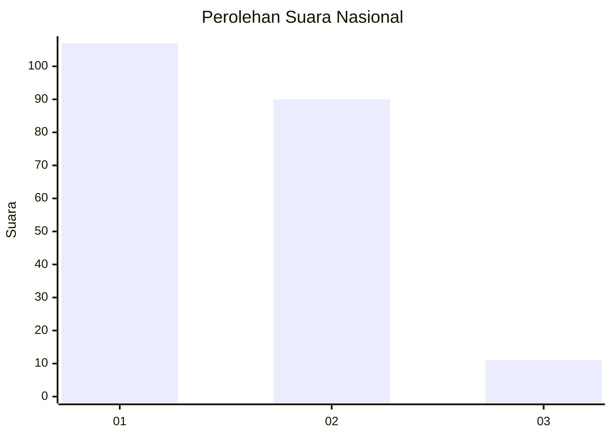
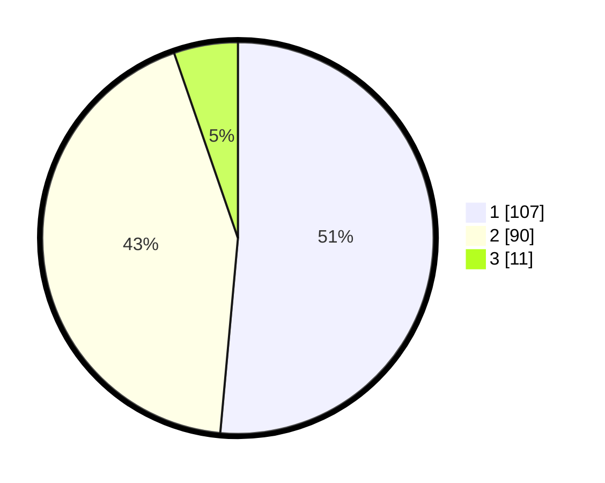

# Hasil

## Grafik

## Tabel

| No.    | Nama Paslon    | Suara | Suara (raw) | Persentase |
|:------ |:-------------- | -----:| -----------:| ----------:|
| 100025 | ANIES MUHAIMIN | 107   | [107][p-1]  | 51,44      |
| 100026 | PRABOWO GIBRAN | 90    | [90][p-2]   | 43,27      |
| 100027 | GANJAR MAHFUD  | 11    | [11][p-3]   | 5,29       |

[p-1]: https://github.com/gigit-pemilu/pemilu-2024/blob/main/pilpres/hitung-suara/sub/31-dki-jakarta/sub/72-jakarta-utara/sub/03-koja/sub/1006-rawa-badak-selatan/sub/115-tps/sub/paslon-1.txt
[p-2]: https://github.com/gigit-pemilu/pemilu-2024/blob/main/pilpres/hitung-suara/sub/31-dki-jakarta/sub/72-jakarta-utara/sub/03-koja/sub/1006-rawa-badak-selatan/sub/115-tps/sub/paslon-2.txt
[p-3]: https://github.com/gigit-pemilu/pemilu-2024/blob/main/pilpres/hitung-suara/sub/31-dki-jakarta/sub/72-jakarta-utara/sub/03-koja/sub/1006-rawa-badak-selatan/sub/115-tps/sub/paslon-3.txt

## Foto C Plano

https://sirekap-obj-formc.kpu.go.id/4c0a/pemilu/ppwp/31/72/03/10/06/3172031006115-20240215-003356--aa4a3553-daca-45c5-91a8-44caa00bab58.jpg

https://sirekap-obj-formc.kpu.go.id/4c0a/pemilu/ppwp/31/72/03/10/06/3172031006115-20240215-003658--b4981404-9842-420f-b853-18010a80c534.jpg

https://sirekap-obj-formc.kpu.go.id/4c0a/pemilu/ppwp/31/72/03/10/06/3172031006115-20240215-042308--403486af-fc26-4f20-8794-6222a14bc8a6.jpg

## Metadata

| Key        | Value               |
| ---------- | ------------------- |
| Time Stamp | 2024-02-20 17:00:00 |

