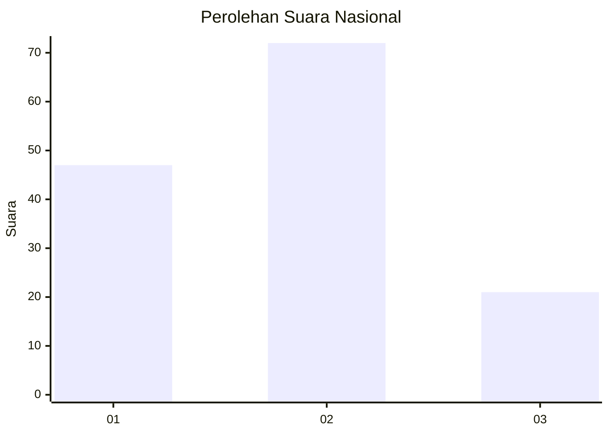
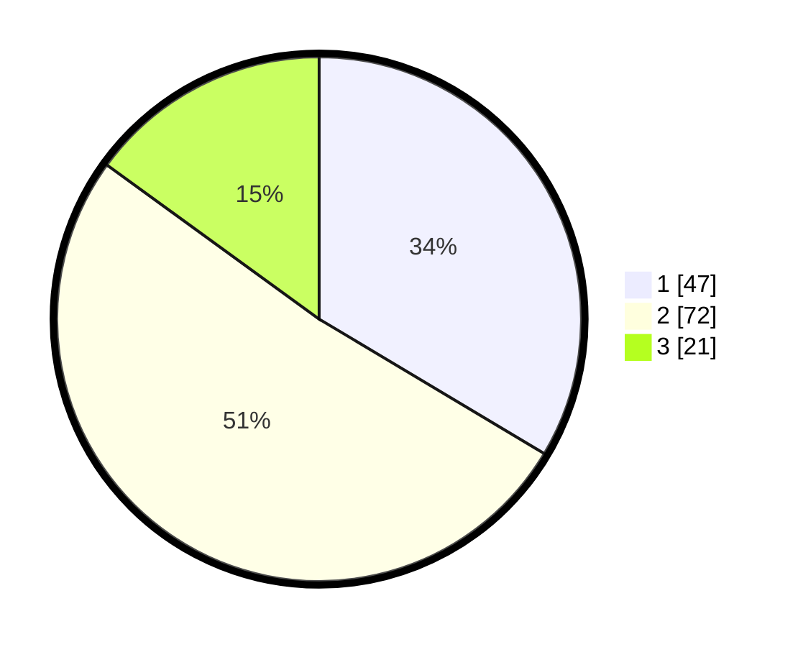

# Hasil

## Grafik

## Tabel

| No.    | Nama Paslon    | Suara | Suara (raw) | Persentase |
|:------ |:-------------- | -----:| -----------:| ----------:|
| 100025 | ANIES MUHAIMIN | 47    | [47][p-1]   | 33,57      |
| 100026 | PRABOWO GIBRAN | 72    | [72][p-2]   | 51,43      |
| 100027 | GANJAR MAHFUD  | 21    | [21][p-3]   | 15,00      |

[p-1]: https://github.com/gigit-pemilu/pemilu-2024/blob/main/pilpres/hitung-suara/sub/31-dki-jakarta/sub/72-jakarta-utara/sub/03-koja/sub/1006-rawa-badak-selatan/sub/134-tps/sub/paslon-1.txt
[p-2]: https://github.com/gigit-pemilu/pemilu-2024/blob/main/pilpres/hitung-suara/sub/31-dki-jakarta/sub/72-jakarta-utara/sub/03-koja/sub/1006-rawa-badak-selatan/sub/134-tps/sub/paslon-2.txt
[p-3]: https://github.com/gigit-pemilu/pemilu-2024/blob/main/pilpres/hitung-suara/sub/31-dki-jakarta/sub/72-jakarta-utara/sub/03-koja/sub/1006-rawa-badak-selatan/sub/134-tps/sub/paslon-3.txt

## Foto C Plano

https://sirekap-obj-formc.kpu.go.id/d4ae/pemilu/ppwp/31/72/03/10/06/3172031006134-20240216-131804--133c0c56-0572-4378-88c7-b3518bdba959.jpg

https://sirekap-obj-formc.kpu.go.id/d4ae/pemilu/ppwp/31/72/03/10/06/3172031006134-20240216-131819--c526b1b2-dcca-4c13-8c9f-ef089018c3c0.jpg

https://sirekap-obj-formc.kpu.go.id/d4ae/pemilu/ppwp/31/72/03/10/06/3172031006134-20240216-131833--c88b0bea-2eae-4333-815d-47a7cc320e34.jpg

## Metadata

| Key        | Value               |
| ---------- | ------------------- |
| Time Stamp | 2024-02-16 16:25:10 |

