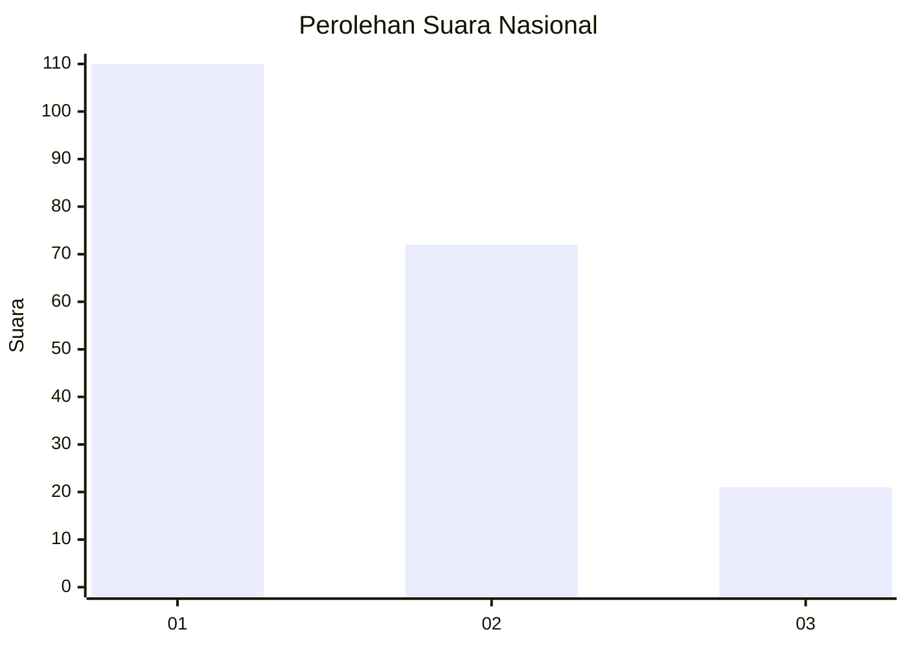
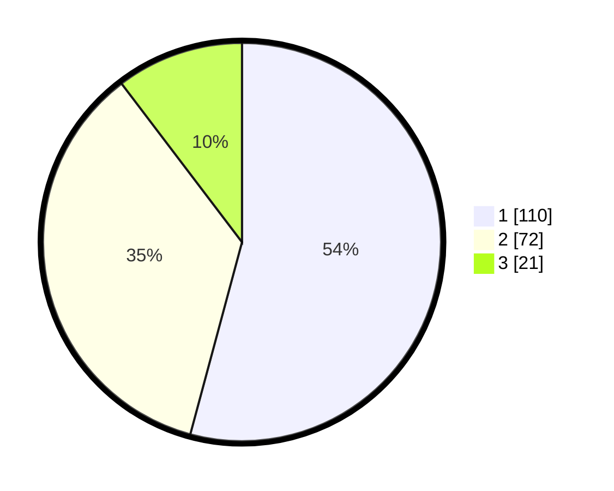

# Hasil

## Grafik

## Tabel

| No. | Nama Paslon    | Suara | Suara (raw) | Persentase |
|:--- |:-------------- | -----:| -----------:| ----------:|
| 1   | ANIES MUHAIMIN | 110   | [110][p-1]  | 54,19      |
| 2   | PRABOWO GIBRAN | 72    | [72][p-2]   | 35,47      |
| 3   | GANJAR MAHFUD  | 21    | [21][p-3]   | 10,34      |

[p-1]: https://github.com/gigit-pemilu/pemilu-2024/blob/main/pilpres/hitung-suara/sub/31-dki-jakarta/sub/72-jakarta-utara/sub/04-cilincing/sub/1001-cilincing/sub/001-tps/sub/paslon-1.txt
[p-2]: https://github.com/gigit-pemilu/pemilu-2024/blob/main/pilpres/hitung-suara/sub/31-dki-jakarta/sub/72-jakarta-utara/sub/04-cilincing/sub/1001-cilincing/sub/001-tps/sub/paslon-2.txt
[p-3]: https://github.com/gigit-pemilu/pemilu-2024/blob/main/pilpres/hitung-suara/sub/31-dki-jakarta/sub/72-jakarta-utara/sub/04-cilincing/sub/1001-cilincing/sub/001-tps/sub/paslon-3.txt

## Foto C Plano

https://sirekap-obj-formc.kpu.go.id/6d7a/pemilu/ppwp/31/72/04/10/01/3172041001001-20240214-232228--7c62bdfd-474b-4012-bf28-e2b69ab05094.jpg

https://sirekap-obj-formc.kpu.go.id/6d7a/pemilu/ppwp/31/72/04/10/01/3172041001001-20240214-232333--f8d79de9-506c-409b-bc77-cae9f2d1ef75.jpg

https://sirekap-obj-formc.kpu.go.id/6d7a/pemilu/ppwp/31/72/04/10/01/3172041001001-20240214-232530--8a439738-4e5b-4c72-9f0f-42d8765c4a57.jpg

## Metadata

| Key        | Value               |
| ---------- | ------------------- |
| Time Stamp | 2024-02-15 12:00:28 |

