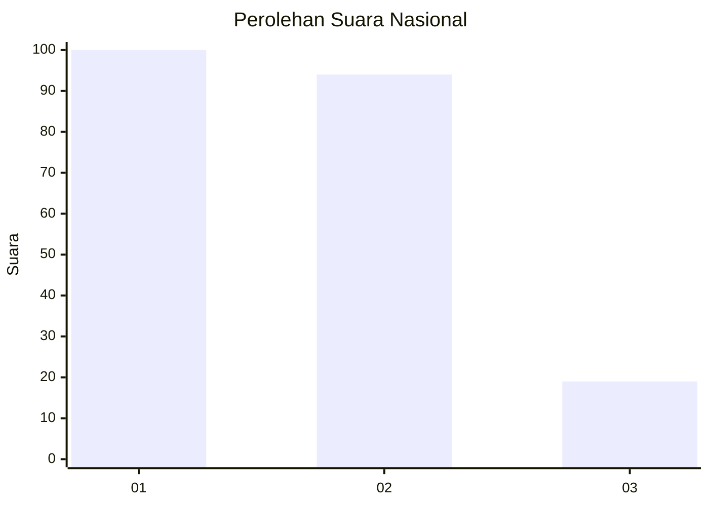
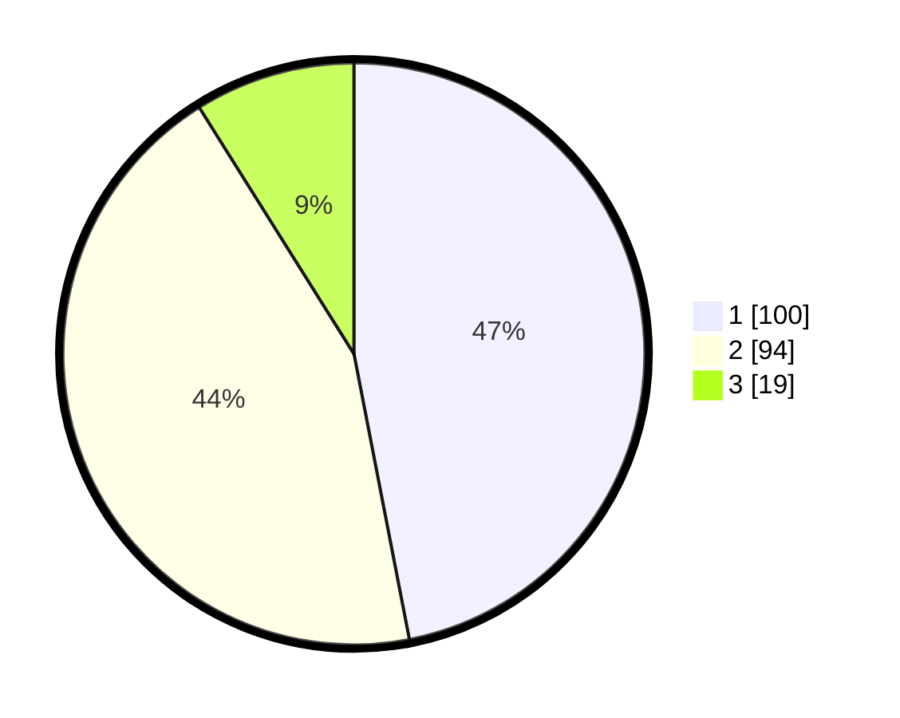

# Hasil

## Grafik

## Tabel

| No. | Nama Paslon    | Suara | Suara (raw) | Persentase |
|:--- |:-------------- | -----:| -----------:| ----------:|
| 1   | ANIES MUHAIMIN | 100   | [100][p-1]  | 46,95      |
| 2   | PRABOWO GIBRAN | 94    | [94][p-2]   | 44,13      |
| 3   | GANJAR MAHFUD  | 19    | [19][p-3]   | 8,92       |

[p-1]: https://github.com/gigit-pemilu/pemilu-2024/blob/main/pilpres/hitung-suara/sub/31-dki-jakarta/sub/72-jakarta-utara/sub/04-cilincing/sub/1001-cilincing/sub/005-tps/sub/paslon-1.txt
[p-2]: https://github.com/gigit-pemilu/pemilu-2024/blob/main/pilpres/hitung-suara/sub/31-dki-jakarta/sub/72-jakarta-utara/sub/04-cilincing/sub/1001-cilincing/sub/005-tps/sub/paslon-2.txt
[p-3]: https://github.com/gigit-pemilu/pemilu-2024/blob/main/pilpres/hitung-suara/sub/31-dki-jakarta/sub/72-jakarta-utara/sub/04-cilincing/sub/1001-cilincing/sub/005-tps/sub/paslon-3.txt

## Foto C Plano

https://sirekap-obj-formc.kpu.go.id/0e01/pemilu/ppwp/31/72/04/10/01/3172041001005-20240215-022244--f3395c6b-8435-4435-9fae-1b82488c5878.jpg

https://sirekap-obj-formc.kpu.go.id/0e01/pemilu/ppwp/31/72/04/10/01/3172041001005-20240215-014322--33b078d4-08bd-4c8e-9b15-7c0f611a0bec.jpg

https://sirekap-obj-formc.kpu.go.id/0e01/pemilu/ppwp/31/72/04/10/01/3172041001005-20240215-014356--e45d7786-c79d-4a30-ae2c-5cd63839ab96.jpg

## Metadata

| Key        | Value               |
| ---------- | ------------------- |
| Time Stamp | 2024-02-20 15:00:00 |

