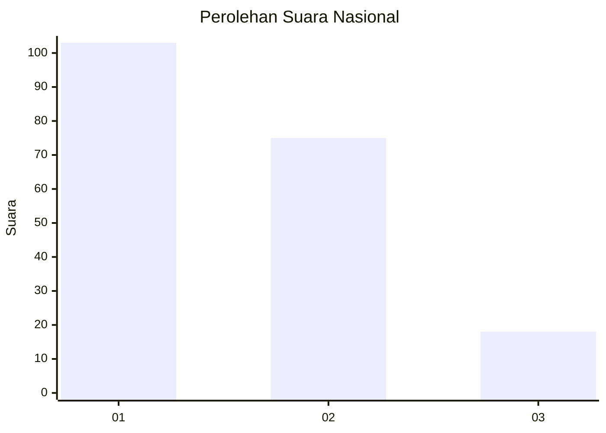
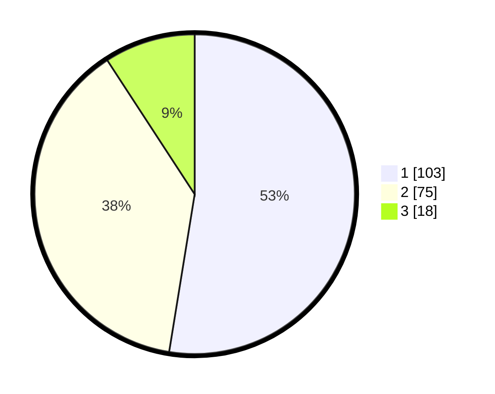

# Hasil

## Grafik

## Tabel

| No.    | Nama Paslon    | Suara | Suara (raw) | Persentase |
|:------ |:-------------- | -----:| -----------:| ----------:|
| 100025 | ANIES MUHAIMIN | 103   | [103][p-1]  | 52,55      |
| 100026 | PRABOWO GIBRAN | 75    | [75][p-2]   | 38,27      |
| 100027 | GANJAR MAHFUD  | 18    | [18][p-3]   | 9,18       |

[p-1]: https://github.com/gigit-pemilu/pemilu-2024/blob/main/pilpres/hitung-suara/sub/31-dki-jakarta/sub/72-jakarta-utara/sub/04-cilincing/sub/1001-cilincing/sub/012-tps/sub/paslon-1.txt
[p-2]: https://github.com/gigit-pemilu/pemilu-2024/blob/main/pilpres/hitung-suara/sub/31-dki-jakarta/sub/72-jakarta-utara/sub/04-cilincing/sub/1001-cilincing/sub/012-tps/sub/paslon-2.txt
[p-3]: https://github.com/gigit-pemilu/pemilu-2024/blob/main/pilpres/hitung-suara/sub/31-dki-jakarta/sub/72-jakarta-utara/sub/04-cilincing/sub/1001-cilincing/sub/012-tps/sub/paslon-3.txt

## Foto C Plano

https://sirekap-obj-formc.kpu.go.id/ad2d/pemilu/ppwp/31/72/04/10/01/3172041001012-20240216-202717--c839a749-574e-490c-be33-e2a745b4bb29.jpg

https://sirekap-obj-formc.kpu.go.id/ad2d/pemilu/ppwp/31/72/04/10/01/3172041001012-20240216-201740--feaa1fb1-921a-41fa-a579-fd48e9e66da4.jpg

https://sirekap-obj-formc.kpu.go.id/ad2d/pemilu/ppwp/31/72/04/10/01/3172041001012-20240216-202055--17a3ab36-d223-4244-bc68-daea6a418b71.jpg

## Metadata

| Key        | Value               |
| ---------- | ------------------- |
| Time Stamp | 2024-02-19 15:00:00 |

