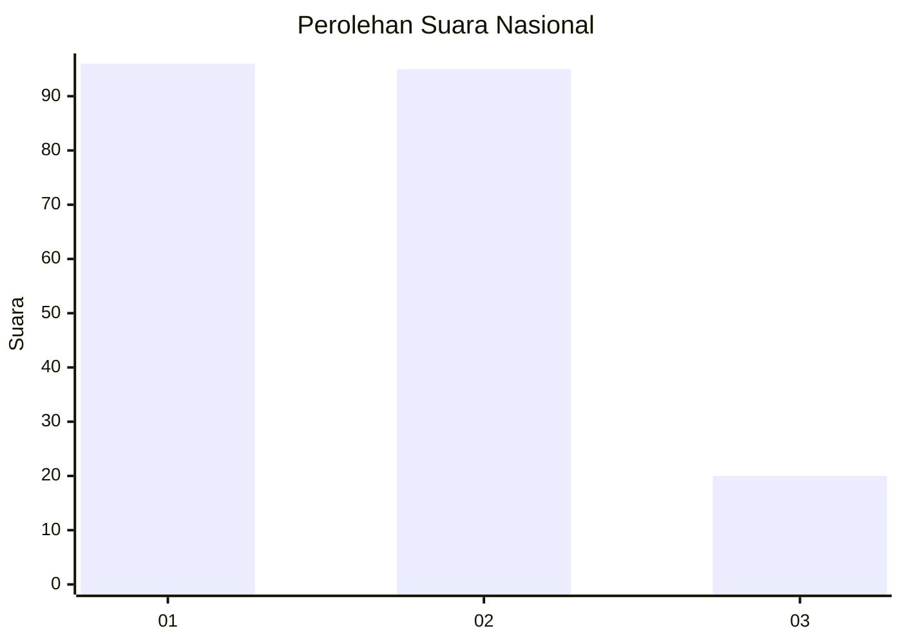
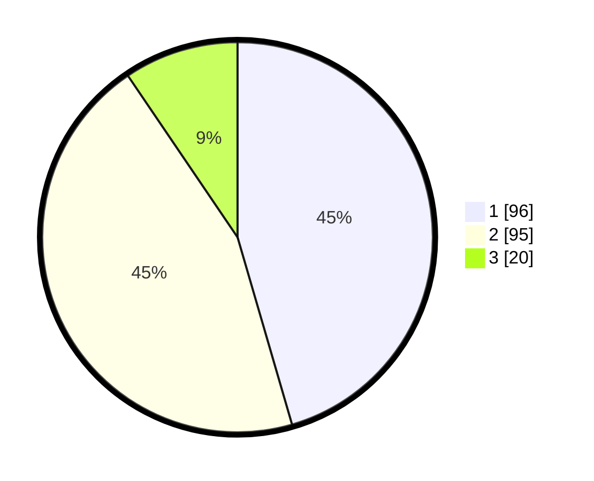

# Hasil

## Grafik

## Tabel

| No.    | Nama Paslon    | Suara | Suara (raw) | Persentase |
|:------ |:-------------- | -----:| -----------:| ----------:|
| 100025 | ANIES MUHAIMIN | 96    | [96][p-1]   | 45,50      |
| 100026 | PRABOWO GIBRAN | 95    | [95][p-2]   | 45,02      |
| 100027 | GANJAR MAHFUD  | 20    | [20][p-3]   | 9,48       |

[p-1]: https://github.com/gigit-pemilu/pemilu-2024/blob/main/pilpres/hitung-suara/sub/31-dki-jakarta/sub/72-jakarta-utara/sub/04-cilincing/sub/1001-cilincing/sub/013-tps/sub/paslon-1.txt
[p-2]: https://github.com/gigit-pemilu/pemilu-2024/blob/main/pilpres/hitung-suara/sub/31-dki-jakarta/sub/72-jakarta-utara/sub/04-cilincing/sub/1001-cilincing/sub/013-tps/sub/paslon-2.txt
[p-3]: https://github.com/gigit-pemilu/pemilu-2024/blob/main/pilpres/hitung-suara/sub/31-dki-jakarta/sub/72-jakarta-utara/sub/04-cilincing/sub/1001-cilincing/sub/013-tps/sub/paslon-3.txt

## Foto C Plano

https://sirekap-obj-formc.kpu.go.id/6be4/pemilu/ppwp/31/72/04/10/01/3172041001013-20240214-204559--5c586433-a086-4218-9e41-31fac274cc55.jpg

https://sirekap-obj-formc.kpu.go.id/6be4/pemilu/ppwp/31/72/04/10/01/3172041001013-20240214-204620--4729e22e-39c6-4082-8da6-9d49a8d232f1.jpg

https://sirekap-obj-formc.kpu.go.id/6be4/pemilu/ppwp/31/72/04/10/01/3172041001013-20240214-204643--81cd7de9-12bb-4ad1-892b-ba8e26ad45d3.jpg

## Metadata

| Key        | Value               |
| ---------- | ------------------- |
| Time Stamp | 2024-02-21 18:00:00 |

