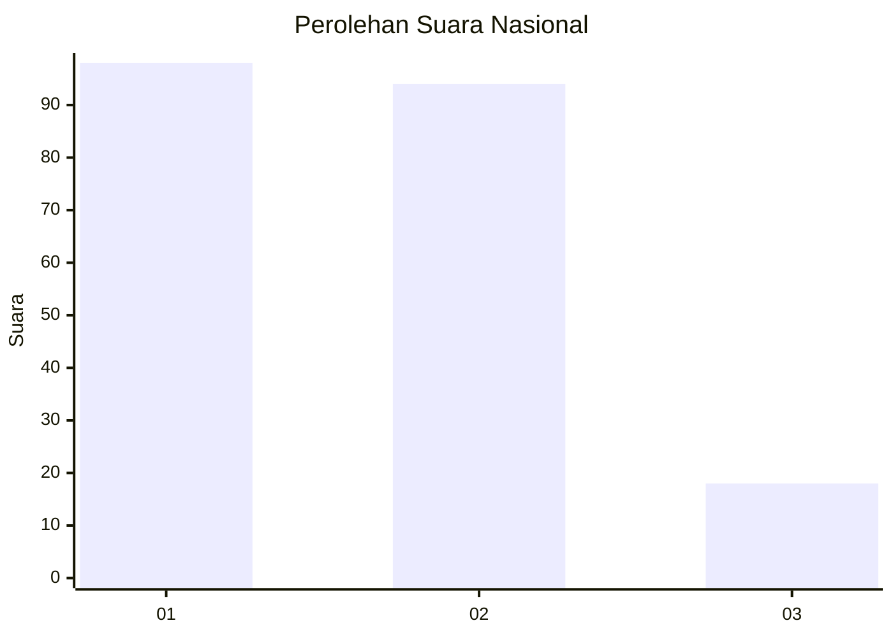
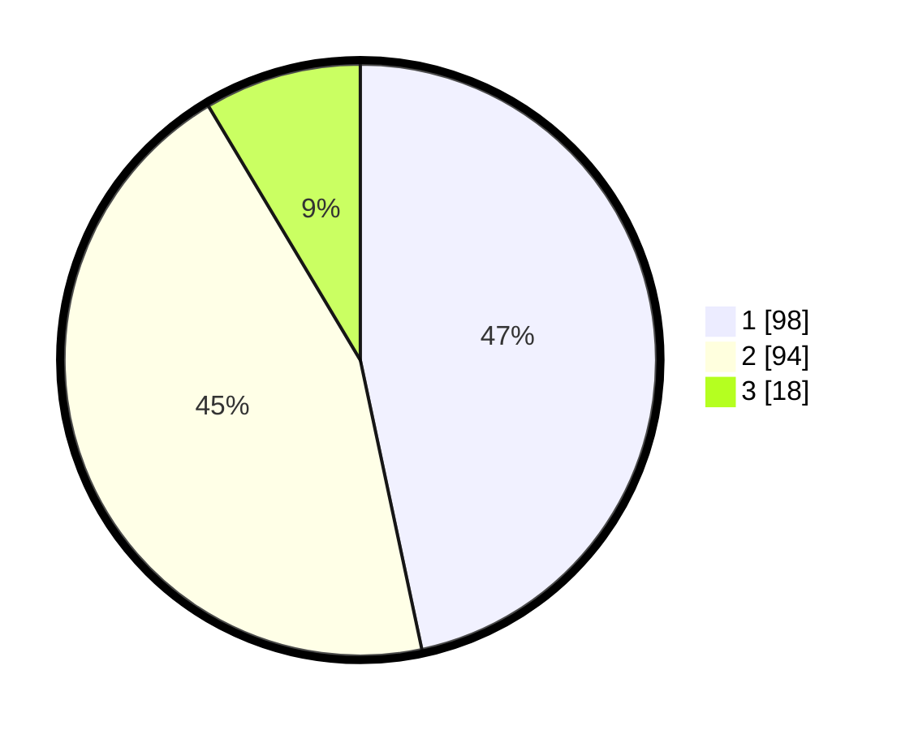

# Hasil

## Grafik

## Tabel

| No.    | Nama Paslon    | Suara | Suara (raw) | Persentase |
|:------ |:-------------- | -----:| -----------:| ----------:|
| 100025 | ANIES MUHAIMIN | 98    | [98][p-1]   | 46,67      |
| 100026 | PRABOWO GIBRAN | 94    | [94][p-2]   | 44,76      |
| 100027 | GANJAR MAHFUD  | 18    | [18][p-3]   | 8,57       |

[p-1]: https://github.com/gigit-pemilu/pemilu-2024/blob/main/pilpres/hitung-suara/sub/31-dki-jakarta/sub/72-jakarta-utara/sub/04-cilincing/sub/1001-cilincing/sub/016-tps/sub/paslon-1.txt
[p-2]: https://github.com/gigit-pemilu/pemilu-2024/blob/main/pilpres/hitung-suara/sub/31-dki-jakarta/sub/72-jakarta-utara/sub/04-cilincing/sub/1001-cilincing/sub/016-tps/sub/paslon-2.txt
[p-3]: https://github.com/gigit-pemilu/pemilu-2024/blob/main/pilpres/hitung-suara/sub/31-dki-jakarta/sub/72-jakarta-utara/sub/04-cilincing/sub/1001-cilincing/sub/016-tps/sub/paslon-3.txt

## Foto C Plano

https://sirekap-obj-formc.kpu.go.id/d9ef/pemilu/ppwp/31/72/04/10/01/3172041001016-20240214-231625--4b15d78c-53ef-472d-a10f-af8c5cfd80d2.jpg

https://sirekap-obj-formc.kpu.go.id/d9ef/pemilu/ppwp/31/72/04/10/01/3172041001016-20240214-231803--38ea3d48-336c-4c4f-8094-7354f7310b42.jpg

https://sirekap-obj-formc.kpu.go.id/d9ef/pemilu/ppwp/31/72/04/10/01/3172041001016-20240214-232150--2199b37f-1e11-4b57-ae1a-5eb226bdf3db.jpg

## Metadata

| Key        | Value               |
| ---------- | ------------------- |
| Time Stamp | 2024-02-21 18:00:00 |

