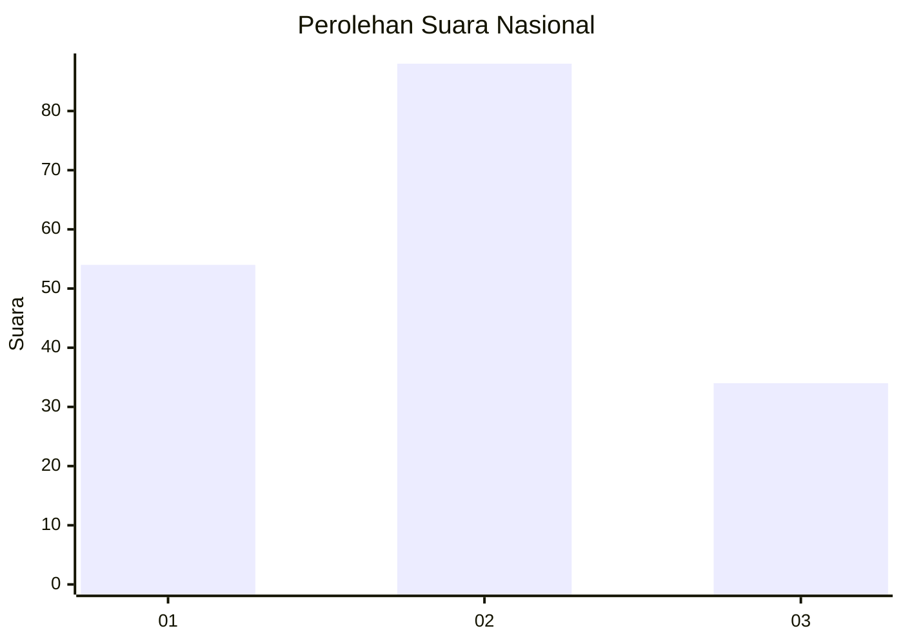
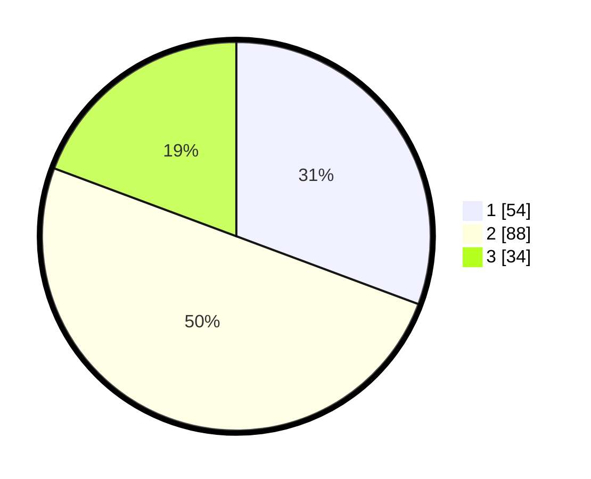

# Hasil

## Grafik

## Tabel

| No.    | Nama Paslon    | Suara | Suara (raw) | Persentase |
|:------ |:-------------- | -----:| -----------:| ----------:|
| 100025 | ANIES MUHAIMIN | 54    | [54][p-1]   | 30,68      |
| 100026 | PRABOWO GIBRAN | 88    | [88][p-2]   | 50,00      |
| 100027 | GANJAR MAHFUD  | 34    | [34][p-3]   | 19,32      |

[p-1]: https://github.com/gigit-pemilu/pemilu-2024/blob/main/pilpres/hitung-suara/sub/31-dki-jakarta/sub/72-jakarta-utara/sub/04-cilincing/sub/1001-cilincing/sub/024-tps/sub/paslon-1.txt
[p-2]: https://github.com/gigit-pemilu/pemilu-2024/blob/main/pilpres/hitung-suara/sub/31-dki-jakarta/sub/72-jakarta-utara/sub/04-cilincing/sub/1001-cilincing/sub/024-tps/sub/paslon-2.txt
[p-3]: https://github.com/gigit-pemilu/pemilu-2024/blob/main/pilpres/hitung-suara/sub/31-dki-jakarta/sub/72-jakarta-utara/sub/04-cilincing/sub/1001-cilincing/sub/024-tps/sub/paslon-3.txt

## Foto C Plano

https://sirekap-obj-formc.kpu.go.id/3a8e/pemilu/ppwp/31/72/04/10/01/3172041001024-20240214-225103--cce676f3-beb5-47fa-bb6a-93ac3d195b1e.jpg

https://sirekap-obj-formc.kpu.go.id/3a8e/pemilu/ppwp/31/72/04/10/01/3172041001024-20240214-221806--98a85f47-1526-4845-b630-c7b269c40cd7.jpg

https://sirekap-obj-formc.kpu.go.id/3a8e/pemilu/ppwp/31/72/04/10/01/3172041001024-20240214-221452--9233bb53-fa9f-4f46-a723-22edc2169cee.jpg

## Metadata

| Key        | Value               |
| ---------- | ------------------- |
| Time Stamp | 2024-02-21 18:00:00 |

