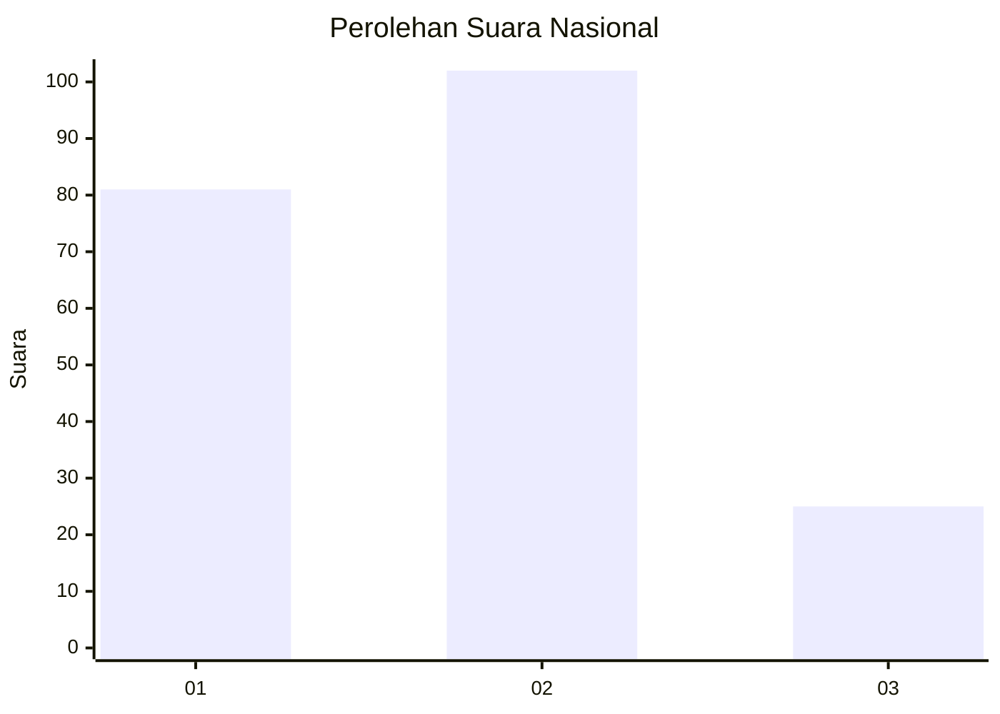
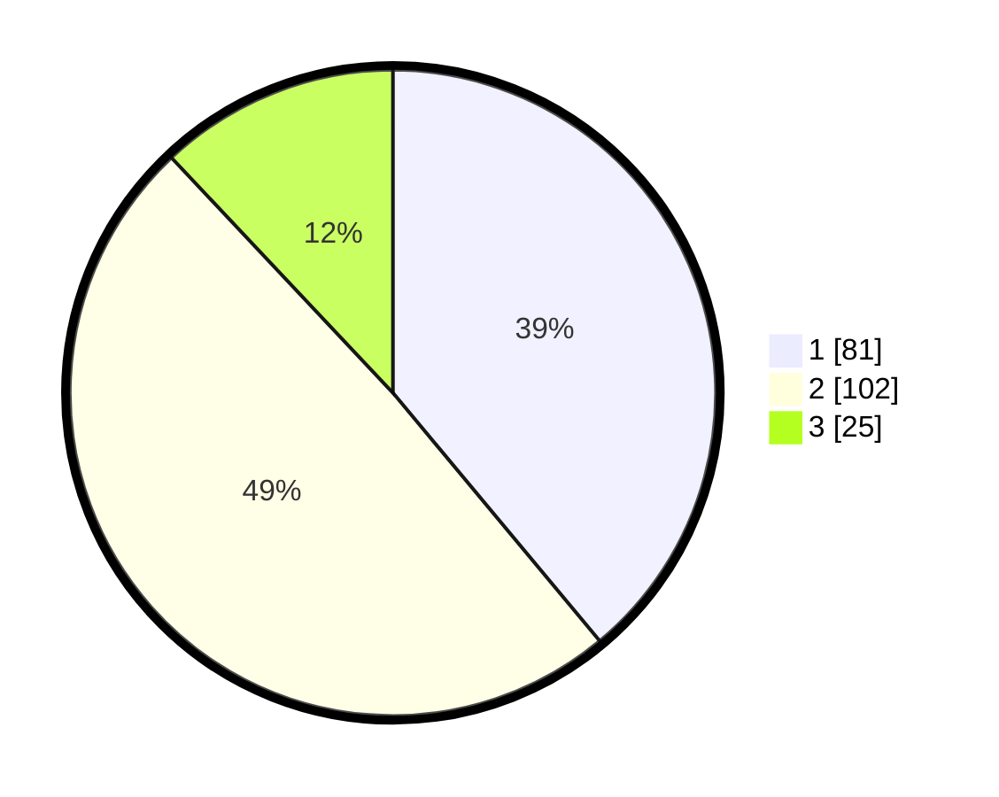

# Hasil

## Grafik

## Tabel

| No.    | Nama Paslon    | Suara | Suara (raw) | Persentase |
|:------ |:-------------- | -----:| -----------:| ----------:|
| 100025 | ANIES MUHAIMIN | 81    | [81][p-1]   | 38,94      |
| 100026 | PRABOWO GIBRAN | 102   | [102][p-2]  | 49,04      |
| 100027 | GANJAR MAHFUD  | 25    | [25][p-3]   | 12,02      |

[p-1]: https://github.com/gigit-pemilu/pemilu-2024/blob/main/pilpres/hitung-suara/sub/31-dki-jakarta/sub/72-jakarta-utara/sub/04-cilincing/sub/1001-cilincing/sub/039-tps/sub/paslon-1.txt
[p-2]: https://github.com/gigit-pemilu/pemilu-2024/blob/main/pilpres/hitung-suara/sub/31-dki-jakarta/sub/72-jakarta-utara/sub/04-cilincing/sub/1001-cilincing/sub/039-tps/sub/paslon-2.txt
[p-3]: https://github.com/gigit-pemilu/pemilu-2024/blob/main/pilpres/hitung-suara/sub/31-dki-jakarta/sub/72-jakarta-utara/sub/04-cilincing/sub/1001-cilincing/sub/039-tps/sub/paslon-3.txt

## Foto C Plano

https://sirekap-obj-formc.kpu.go.id/67db/pemilu/ppwp/31/72/04/10/01/3172041001039-20240214-222725--c45ab26a-05d9-43c5-b9ac-2b9efa224451.jpg

https://sirekap-obj-formc.kpu.go.id/67db/pemilu/ppwp/31/72/04/10/01/3172041001039-20240214-222917--5d24d2bb-f959-4edf-901d-2cfee472123b.jpg

https://sirekap-obj-formc.kpu.go.id/67db/pemilu/ppwp/31/72/04/10/01/3172041001039-20240214-223006--96fe812c-38c4-4bfd-9078-a83b1b146d03.jpg

## Metadata

| Key        | Value               |
| ---------- | ------------------- |
| Time Stamp | 2024-02-20 16:00:00 |

