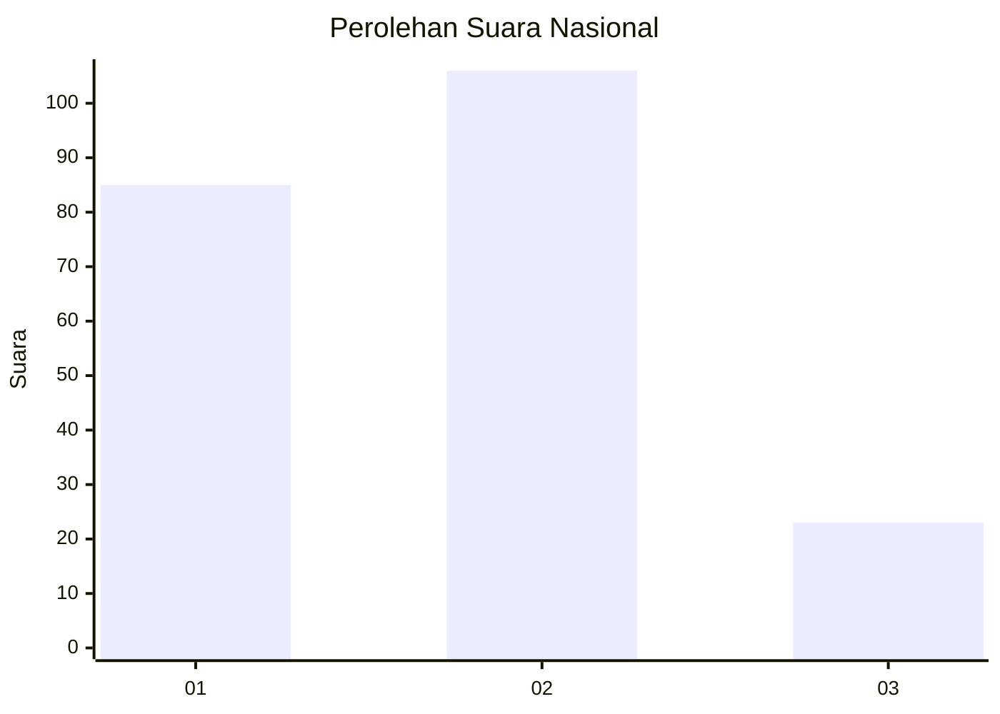
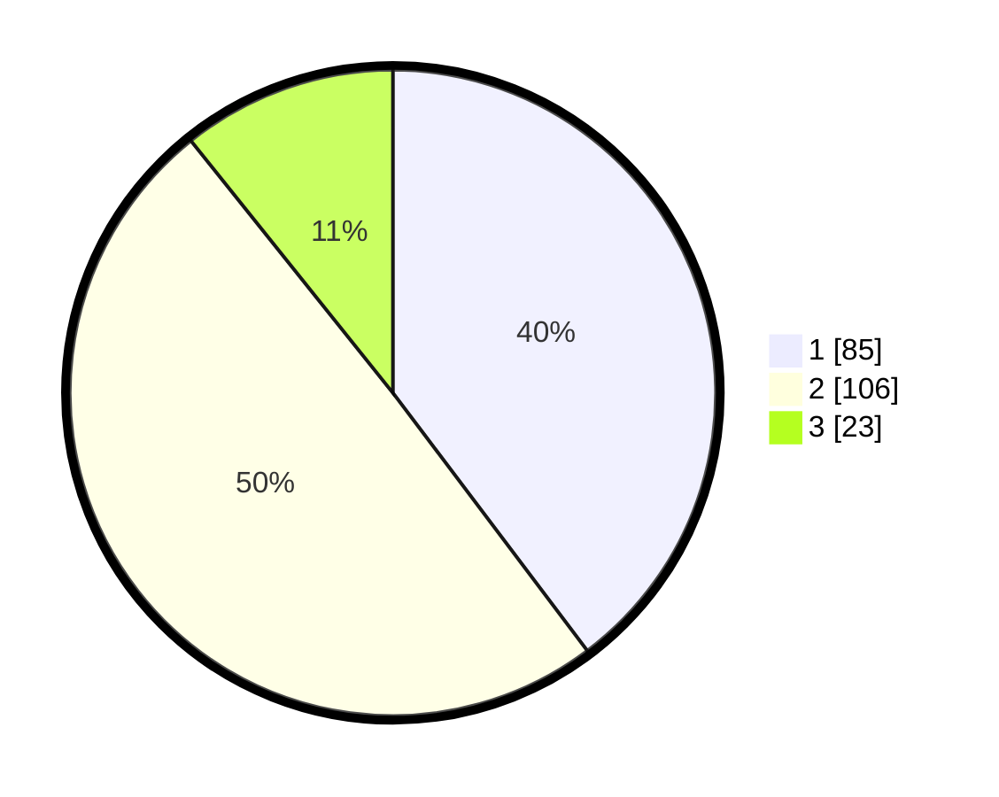

# Hasil

## Grafik

## Tabel

| No.    | Nama Paslon    | Suara | Suara (raw) | Persentase |
|:------ |:-------------- | -----:| -----------:| ----------:|
| 100025 | ANIES MUHAIMIN | 85    | [85][p-1]   | 39,72      |
| 100026 | PRABOWO GIBRAN | 106   | [106][p-2]  | 49,53      |
| 100027 | GANJAR MAHFUD  | 23    | [23][p-3]   | 10,75      |

[p-1]: https://github.com/gigit-pemilu/pemilu-2024/blob/main/pilpres/hitung-suara/sub/31-dki-jakarta/sub/72-jakarta-utara/sub/04-cilincing/sub/1001-cilincing/sub/044-tps/sub/paslon-1.txt
[p-2]: https://github.com/gigit-pemilu/pemilu-2024/blob/main/pilpres/hitung-suara/sub/31-dki-jakarta/sub/72-jakarta-utara/sub/04-cilincing/sub/1001-cilincing/sub/044-tps/sub/paslon-2.txt
[p-3]: https://github.com/gigit-pemilu/pemilu-2024/blob/main/pilpres/hitung-suara/sub/31-dki-jakarta/sub/72-jakarta-utara/sub/04-cilincing/sub/1001-cilincing/sub/044-tps/sub/paslon-3.txt

## Foto C Plano

https://sirekap-obj-formc.kpu.go.id/1b2a/pemilu/ppwp/31/72/04/10/01/3172041001044-20240214-230331--1f1bbb31-8af9-4bb9-b4d9-5b743da31ae7.jpg

https://sirekap-obj-formc.kpu.go.id/1b2a/pemilu/ppwp/31/72/04/10/01/3172041001044-20240214-231339--b5bbb87a-ebf6-44cc-9880-3fe8bc6f138a.jpg

https://sirekap-obj-formc.kpu.go.id/1b2a/pemilu/ppwp/31/72/04/10/01/3172041001044-20240214-231936--f923288f-a57c-45b5-90f6-be0366ec479e.jpg

## Metadata

| Key        | Value               |
| ---------- | ------------------- |
| Time Stamp | 2024-02-20 16:00:00 |

