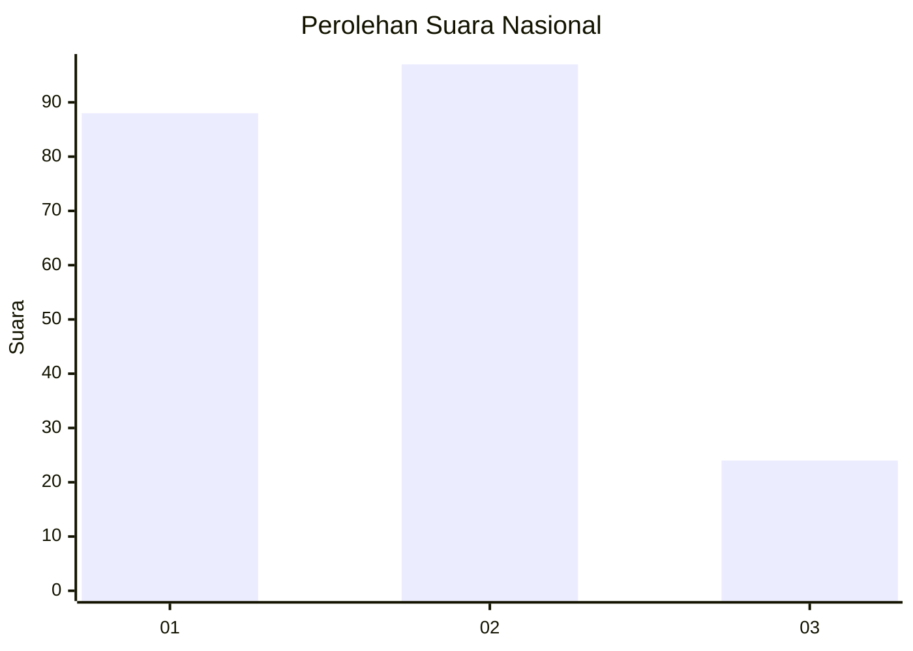
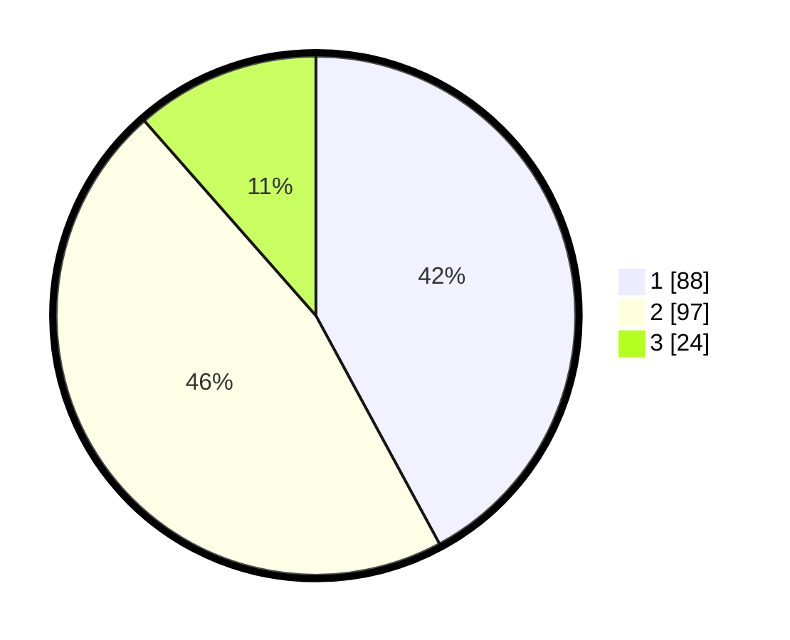

# Hasil

## Grafik

## Tabel

| No.    | Nama Paslon    | Suara | Suara (raw) | Persentase |
|:------ |:-------------- | -----:| -----------:| ----------:|
| 100025 | ANIES MUHAIMIN | 88    | [88][p-1]   | 42,11      |
| 100026 | PRABOWO GIBRAN | 97    | [97][p-2]   | 46,41      |
| 100027 | GANJAR MAHFUD  | 24    | [24][p-3]   | 11,48      |

[p-1]: https://github.com/gigit-pemilu/pemilu-2024/blob/main/pilpres/hitung-suara/sub/31-dki-jakarta/sub/72-jakarta-utara/sub/04-cilincing/sub/1001-cilincing/sub/046-tps/sub/paslon-1.txt
[p-2]: https://github.com/gigit-pemilu/pemilu-2024/blob/main/pilpres/hitung-suara/sub/31-dki-jakarta/sub/72-jakarta-utara/sub/04-cilincing/sub/1001-cilincing/sub/046-tps/sub/paslon-2.txt
[p-3]: https://github.com/gigit-pemilu/pemilu-2024/blob/main/pilpres/hitung-suara/sub/31-dki-jakarta/sub/72-jakarta-utara/sub/04-cilincing/sub/1001-cilincing/sub/046-tps/sub/paslon-3.txt

## Foto C Plano

https://sirekap-obj-formc.kpu.go.id/fe85/pemilu/ppwp/31/72/04/10/01/3172041001046-20240214-234202--ed833a63-f31f-42f2-92af-61465b39939e.jpg

https://sirekap-obj-formc.kpu.go.id/fe85/pemilu/ppwp/31/72/04/10/01/3172041001046-20240214-234359--26909470-caa4-457a-8c37-023ed0d3d14b.jpg

https://sirekap-obj-formc.kpu.go.id/fe85/pemilu/ppwp/31/72/04/10/01/3172041001046-20240214-234456--727c0540-8560-4fe9-b0f2-b0a839dc0541.jpg

## Metadata

| Key        | Value               |
| ---------- | ------------------- |
| Time Stamp | 2024-02-20 16:00:00 |

