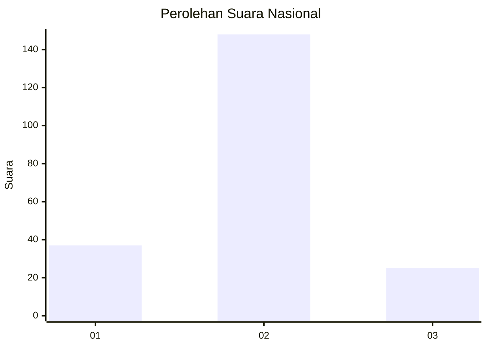
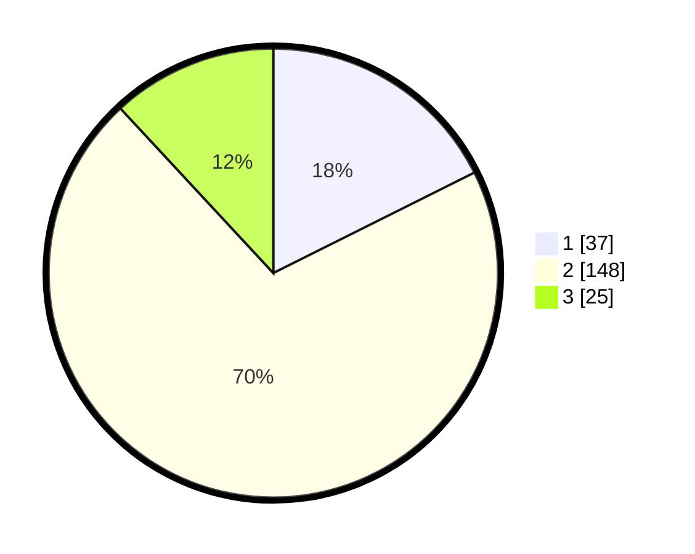

# Hasil

## Grafik

## Tabel

| No.    | Nama Paslon    | Suara | Suara (raw) | Persentase |
|:------ |:-------------- | -----:| -----------:| ----------:|
| 100025 | ANIES MUHAIMIN | 37    | [37][p-1]   | 17,62      |
| 100026 | PRABOWO GIBRAN | 148   | [148][p-2]  | 70,48      |
| 100027 | GANJAR MAHFUD  | 25    | [25][p-3]   | 11,90      |

[p-1]: https://github.com/gigit-pemilu/pemilu-2024/blob/main/pilpres/hitung-suara/sub/31-dki-jakarta/sub/72-jakarta-utara/sub/04-cilincing/sub/1001-cilincing/sub/051-tps/sub/paslon-1.txt
[p-2]: https://github.com/gigit-pemilu/pemilu-2024/blob/main/pilpres/hitung-suara/sub/31-dki-jakarta/sub/72-jakarta-utara/sub/04-cilincing/sub/1001-cilincing/sub/051-tps/sub/paslon-2.txt
[p-3]: https://github.com/gigit-pemilu/pemilu-2024/blob/main/pilpres/hitung-suara/sub/31-dki-jakarta/sub/72-jakarta-utara/sub/04-cilincing/sub/1001-cilincing/sub/051-tps/sub/paslon-3.txt

## Foto C Plano

https://sirekap-obj-formc.kpu.go.id/0af1/pemilu/ppwp/31/72/04/10/01/3172041001051-20240214-200052--1b913f3a-8fb9-4831-9504-4ef5c87e74cb.jpg

https://sirekap-obj-formc.kpu.go.id/0af1/pemilu/ppwp/31/72/04/10/01/3172041001051-20240214-200308--cf9ff172-d1c4-4c8f-a913-0ef2604e7800.jpg

https://sirekap-obj-formc.kpu.go.id/0af1/pemilu/ppwp/31/72/04/10/01/3172041001051-20240214-200725--a16946ad-961e-4664-b263-e8a4237f7524.jpg

## Metadata

| Key        | Value               |
| ---------- | ------------------- |
| Time Stamp | 2024-02-21 18:00:00 |

