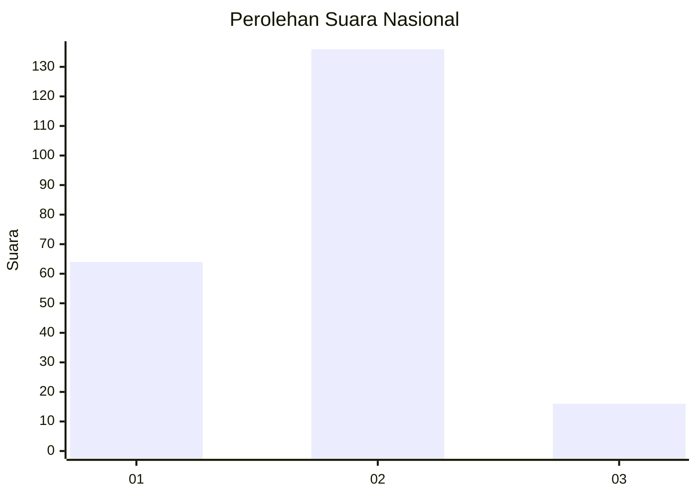
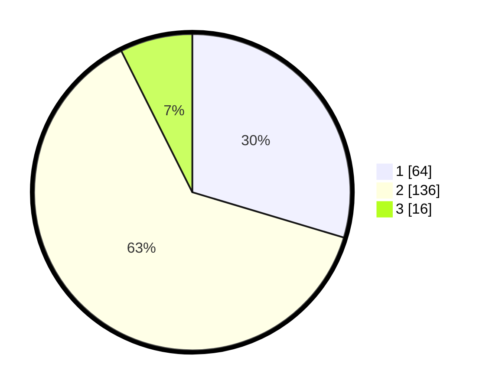

# Hasil

## Grafik

## Tabel

| No.    | Nama Paslon    | Suara | Suara (raw) | Persentase |
|:------ |:-------------- | -----:| -----------:| ----------:|
| 100025 | ANIES MUHAIMIN | 64    | [64][p-1]   | 29,63      |
| 100026 | PRABOWO GIBRAN | 136   | [136][p-2]  | 62,96      |
| 100027 | GANJAR MAHFUD  | 16    | [16][p-3]   | 7,41       |

[p-1]: https://github.com/gigit-pemilu/pemilu-2024/blob/main/pilpres/hitung-suara/sub/31-dki-jakarta/sub/72-jakarta-utara/sub/04-cilincing/sub/1001-cilincing/sub/054-tps/sub/paslon-1.txt
[p-2]: https://github.com/gigit-pemilu/pemilu-2024/blob/main/pilpres/hitung-suara/sub/31-dki-jakarta/sub/72-jakarta-utara/sub/04-cilincing/sub/1001-cilincing/sub/054-tps/sub/paslon-2.txt
[p-3]: https://github.com/gigit-pemilu/pemilu-2024/blob/main/pilpres/hitung-suara/sub/31-dki-jakarta/sub/72-jakarta-utara/sub/04-cilincing/sub/1001-cilincing/sub/054-tps/sub/paslon-3.txt

## Foto C Plano

https://sirekap-obj-formc.kpu.go.id/3b49/pemilu/ppwp/31/72/04/10/01/3172041001054-20240214-214448--797e1d18-1f63-4634-8458-ad21143c8bad.jpg

https://sirekap-obj-formc.kpu.go.id/3b49/pemilu/ppwp/31/72/04/10/01/3172041001054-20240214-192723--74ecf0a3-45f4-49b1-806b-1764b5d1ed54.jpg

https://sirekap-obj-formc.kpu.go.id/3b49/pemilu/ppwp/31/72/04/10/01/3172041001054-20240214-215250--39fb0cd2-6f69-4eef-b032-6f4158caf759.jpg

## Metadata

| Key        | Value               |
| ---------- | ------------------- |
| Time Stamp | 2024-02-15 06:00:23 |

