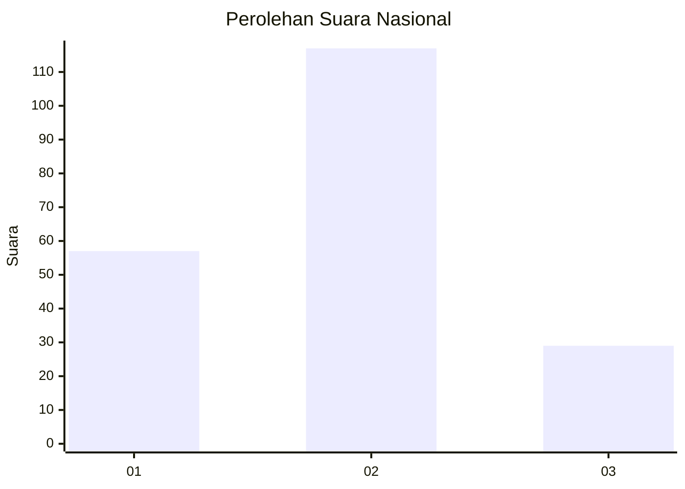
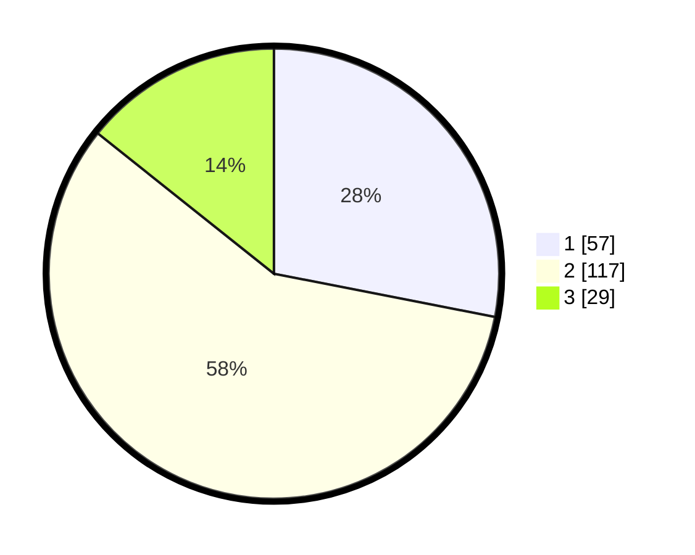

# Hasil

## Grafik

## Tabel

| No.    | Nama Paslon    | Suara | Suara (raw) | Persentase |
|:------ |:-------------- | -----:| -----------:| ----------:|
| 100025 | ANIES MUHAIMIN | 57    | [57][p-1]   | 28,08      |
| 100026 | PRABOWO GIBRAN | 117   | [117][p-2]  | 57,64      |
| 100027 | GANJAR MAHFUD  | 29    | [29][p-3]   | 14,29      |

[p-1]: https://github.com/gigit-pemilu/pemilu-2024/blob/main/pilpres/hitung-suara/sub/31-dki-jakarta/sub/72-jakarta-utara/sub/04-cilincing/sub/1001-cilincing/sub/055-tps/sub/paslon-1.txt
[p-2]: https://github.com/gigit-pemilu/pemilu-2024/blob/main/pilpres/hitung-suara/sub/31-dki-jakarta/sub/72-jakarta-utara/sub/04-cilincing/sub/1001-cilincing/sub/055-tps/sub/paslon-2.txt
[p-3]: https://github.com/gigit-pemilu/pemilu-2024/blob/main/pilpres/hitung-suara/sub/31-dki-jakarta/sub/72-jakarta-utara/sub/04-cilincing/sub/1001-cilincing/sub/055-tps/sub/paslon-3.txt

## Foto C Plano

https://sirekap-obj-formc.kpu.go.id/d1e3/pemilu/ppwp/31/72/04/10/01/3172041001055-20240214-221237--80e4734f-b8fb-4d9e-896f-ba68f12d448e.jpg

https://sirekap-obj-formc.kpu.go.id/d1e3/pemilu/ppwp/31/72/04/10/01/3172041001055-20240214-221357--24e17a05-5626-4418-abad-123bb63b6100.jpg

https://sirekap-obj-formc.kpu.go.id/d1e3/pemilu/ppwp/31/72/04/10/01/3172041001055-20240214-221455--c7036ef7-d667-49dc-b9a8-979824bc14e6.jpg

## Metadata

| Key        | Value               |
| ---------- | ------------------- |
| Time Stamp | 2024-02-21 18:00:00 |

