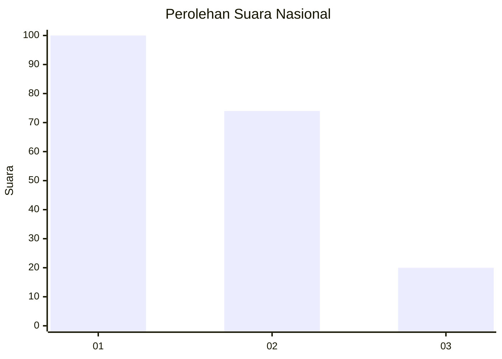
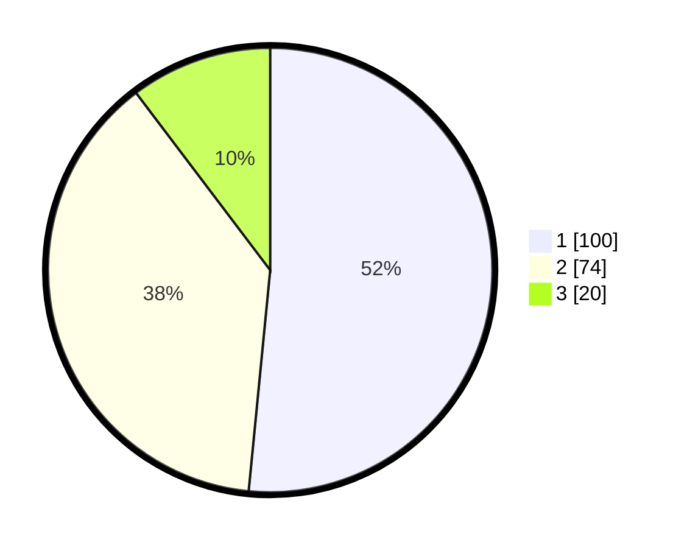

# Hasil

## Grafik

## Tabel

| No.    | Nama Paslon    | Suara | Suara (raw) | Persentase |
|:------ |:-------------- | -----:| -----------:| ----------:|
| 100025 | ANIES MUHAIMIN | 100   | [100][p-1]  | 51,55      |
| 100026 | PRABOWO GIBRAN | 74    | [74][p-2]   | 38,14      |
| 100027 | GANJAR MAHFUD  | 20    | [20][p-3]   | 10,31      |

[p-1]: https://github.com/gigit-pemilu/pemilu-2024/blob/main/pilpres/hitung-suara/sub/31-dki-jakarta/sub/72-jakarta-utara/sub/04-cilincing/sub/1001-cilincing/sub/074-tps/sub/paslon-1.txt
[p-2]: https://github.com/gigit-pemilu/pemilu-2024/blob/main/pilpres/hitung-suara/sub/31-dki-jakarta/sub/72-jakarta-utara/sub/04-cilincing/sub/1001-cilincing/sub/074-tps/sub/paslon-2.txt
[p-3]: https://github.com/gigit-pemilu/pemilu-2024/blob/main/pilpres/hitung-suara/sub/31-dki-jakarta/sub/72-jakarta-utara/sub/04-cilincing/sub/1001-cilincing/sub/074-tps/sub/paslon-3.txt

## Foto C Plano

https://sirekap-obj-formc.kpu.go.id/5294/pemilu/ppwp/31/72/04/10/01/3172041001074-20240214-192758--cd523e83-ca15-4842-b5b7-a6619816994b.jpg

https://sirekap-obj-formc.kpu.go.id/5294/pemilu/ppwp/31/72/04/10/01/3172041001074-20240214-192736--74c001c3-7060-4eed-990b-3e4c8852a6a3.jpg

https://sirekap-obj-formc.kpu.go.id/5294/pemilu/ppwp/31/72/04/10/01/3172041001074-20240214-192812--ca8f50d6-ab06-4259-8ed7-df39b4ce1bf3.jpg

## Metadata

| Key        | Value               |
| ---------- | ------------------- |
| Time Stamp | 2024-02-21 18:00:00 |

