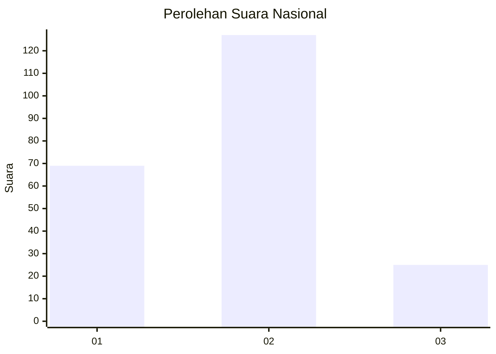
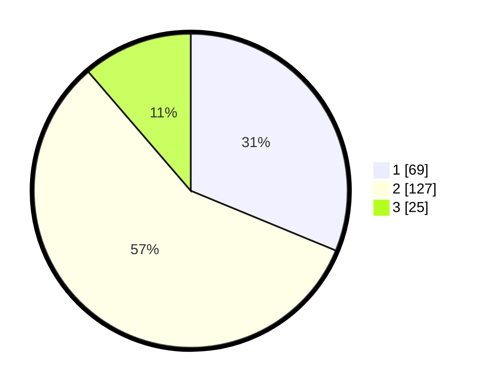

# Hasil

## Grafik

## Tabel

| No.    | Nama Paslon    | Suara | Suara (raw) | Persentase |
|:------ |:-------------- | -----:| -----------:| ----------:|
| 100025 | ANIES MUHAIMIN | 69    | [69][p-1]   | 31,22      |
| 100026 | PRABOWO GIBRAN | 127   | [127][p-2]  | 57,47      |
| 100027 | GANJAR MAHFUD  | 25    | [25][p-3]   | 11,31      |

[p-1]: https://github.com/gigit-pemilu/pemilu-2024/blob/main/pilpres/hitung-suara/sub/31-dki-jakarta/sub/72-jakarta-utara/sub/04-cilincing/sub/1001-cilincing/sub/083-tps/sub/paslon-1.txt
[p-2]: https://github.com/gigit-pemilu/pemilu-2024/blob/main/pilpres/hitung-suara/sub/31-dki-jakarta/sub/72-jakarta-utara/sub/04-cilincing/sub/1001-cilincing/sub/083-tps/sub/paslon-2.txt
[p-3]: https://github.com/gigit-pemilu/pemilu-2024/blob/main/pilpres/hitung-suara/sub/31-dki-jakarta/sub/72-jakarta-utara/sub/04-cilincing/sub/1001-cilincing/sub/083-tps/sub/paslon-3.txt

## Foto C Plano

https://sirekap-obj-formc.kpu.go.id/2a55/pemilu/ppwp/31/72/04/10/01/3172041001083-20240214-223331--cd20aec1-813e-4385-95fc-a431a59a9050.jpg

https://sirekap-obj-formc.kpu.go.id/2a55/pemilu/ppwp/31/72/04/10/01/3172041001083-20240214-223612--ddb06c55-0ec7-4c9a-bacb-844584a06b28.jpg

https://sirekap-obj-formc.kpu.go.id/2a55/pemilu/ppwp/31/72/04/10/01/3172041001083-20240214-223752--12e99bd4-afd0-46cf-bf05-68aab8b98278.jpg

## Metadata

| Key        | Value               |
| ---------- | ------------------- |
| Time Stamp | 2024-02-20 16:00:00 |

