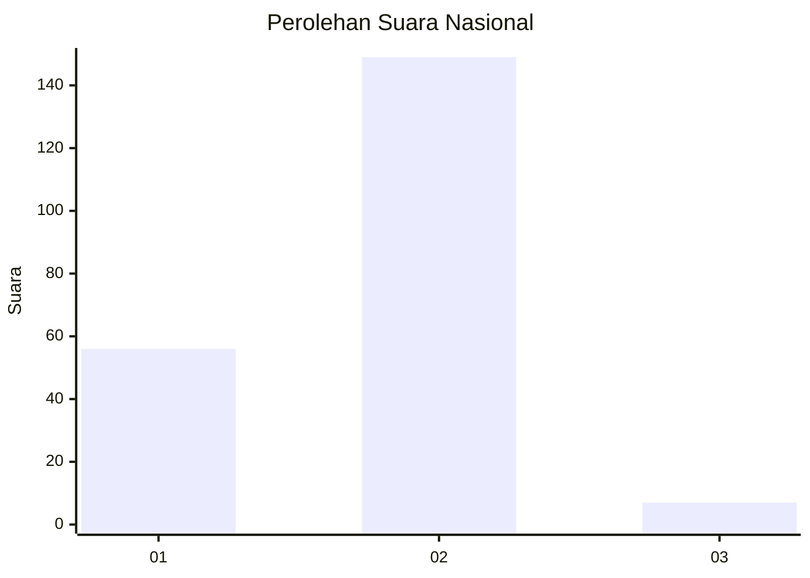
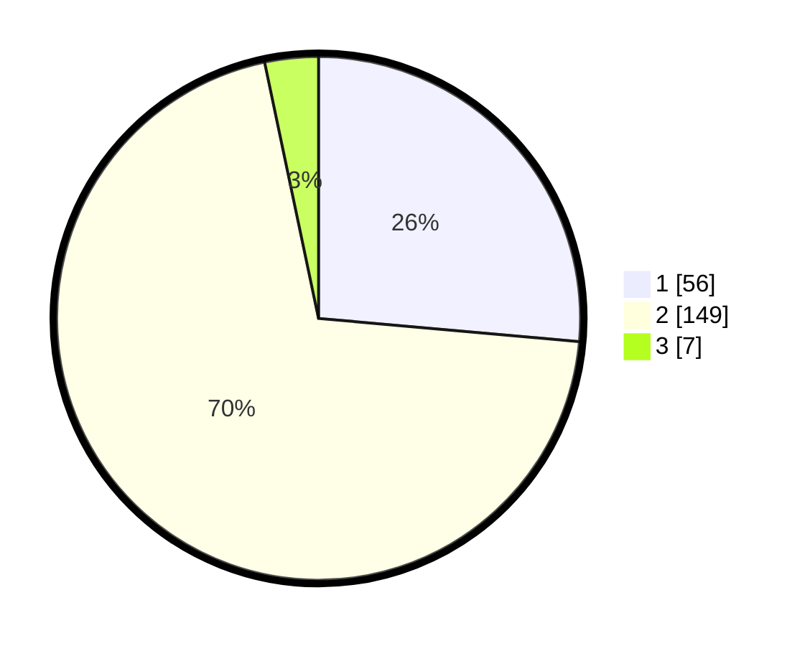

# Hasil

## Grafik

## Tabel

| No.    | Nama Paslon    | Suara | Suara (raw) | Persentase |
|:------ |:-------------- | -----:| -----------:| ----------:|
| 100025 | ANIES MUHAIMIN | 56    | [56][p-1]   | 26,42      |
| 100026 | PRABOWO GIBRAN | 149   | [149][p-2]  | 70,28      |
| 100027 | GANJAR MAHFUD  | 7     | [7][p-3]    | 3,30       |

[p-1]: https://github.com/gigit-pemilu/pemilu-2024/blob/main/pilpres/hitung-suara/sub/31-dki-jakarta/sub/72-jakarta-utara/sub/04-cilincing/sub/1001-cilincing/sub/132-tps/sub/paslon-1.txt
[p-2]: https://github.com/gigit-pemilu/pemilu-2024/blob/main/pilpres/hitung-suara/sub/31-dki-jakarta/sub/72-jakarta-utara/sub/04-cilincing/sub/1001-cilincing/sub/132-tps/sub/paslon-2.txt
[p-3]: https://github.com/gigit-pemilu/pemilu-2024/blob/main/pilpres/hitung-suara/sub/31-dki-jakarta/sub/72-jakarta-utara/sub/04-cilincing/sub/1001-cilincing/sub/132-tps/sub/paslon-3.txt

## Foto C Plano

https://sirekap-obj-formc.kpu.go.id/6979/pemilu/ppwp/31/72/04/10/01/3172041001132-20240214-194638--eff6b591-08d8-4b75-8270-0da175839990.jpg

https://sirekap-obj-formc.kpu.go.id/6979/pemilu/ppwp/31/72/04/10/01/3172041001132-20240215-032944--8c4fd096-76ac-489b-8423-2cc204e5ab12.jpg

https://sirekap-obj-formc.kpu.go.id/6979/pemilu/ppwp/31/72/04/10/01/3172041001132-20240214-195020--d46efe7e-4971-4639-943f-a4a3f70ebc13.jpg

## Metadata

| Key        | Value               |
| ---------- | ------------------- |
| Time Stamp | 2024-02-20 16:00:00 |

