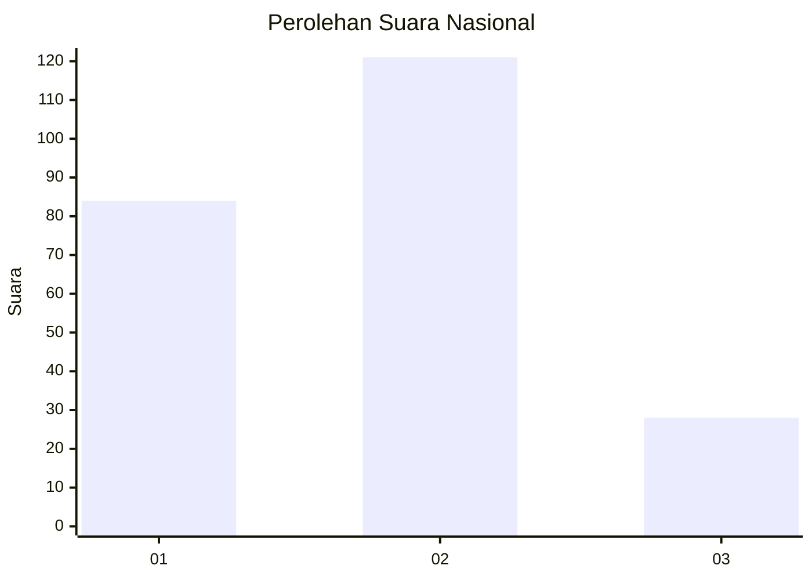
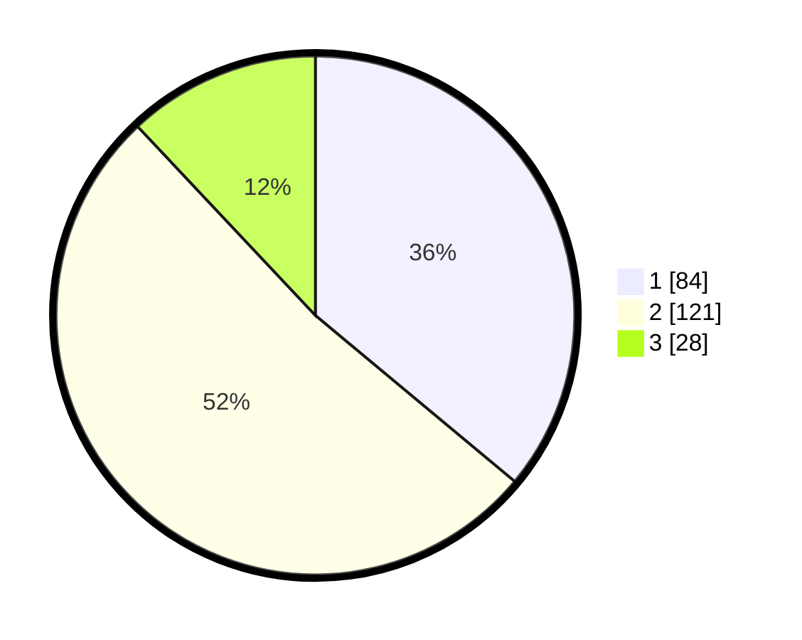

# Hasil

## Grafik

## Tabel

| No.    | Nama Paslon    | Suara | Suara (raw) | Persentase |
|:------ |:-------------- | -----:| -----------:| ----------:|
| 100025 | ANIES MUHAIMIN | 84    | [84][p-1]   | 36,05      |
| 100026 | PRABOWO GIBRAN | 121   | [121][p-2]  | 51,93      |
| 100027 | GANJAR MAHFUD  | 28    | [28][p-3]   | 12,02      |

[p-1]: https://github.com/gigit-pemilu/pemilu-2024/blob/main/pilpres/hitung-suara/sub/31-dki-jakarta/sub/72-jakarta-utara/sub/04-cilincing/sub/1001-cilincing/sub/146-tps/sub/paslon-1.txt
[p-2]: https://github.com/gigit-pemilu/pemilu-2024/blob/main/pilpres/hitung-suara/sub/31-dki-jakarta/sub/72-jakarta-utara/sub/04-cilincing/sub/1001-cilincing/sub/146-tps/sub/paslon-2.txt
[p-3]: https://github.com/gigit-pemilu/pemilu-2024/blob/main/pilpres/hitung-suara/sub/31-dki-jakarta/sub/72-jakarta-utara/sub/04-cilincing/sub/1001-cilincing/sub/146-tps/sub/paslon-3.txt

## Foto C Plano

https://sirekap-obj-formc.kpu.go.id/4522/pemilu/ppwp/31/72/04/10/01/3172041001146-20240215-011012--197d7a98-3b72-493b-8620-f361c2eb2d23.jpg

https://sirekap-obj-formc.kpu.go.id/4522/pemilu/ppwp/31/72/04/10/01/3172041001146-20240215-011120--fb6b042b-db1e-47ae-a782-2c59ecd467a8.jpg

https://sirekap-obj-formc.kpu.go.id/4522/pemilu/ppwp/31/72/04/10/01/3172041001146-20240215-011242--a41b1539-3039-44c2-b70c-1fec6d3e998c.jpg

## Metadata

| Key        | Value               |
| ---------- | ------------------- |
| Time Stamp | 2024-02-21 18:00:00 |

