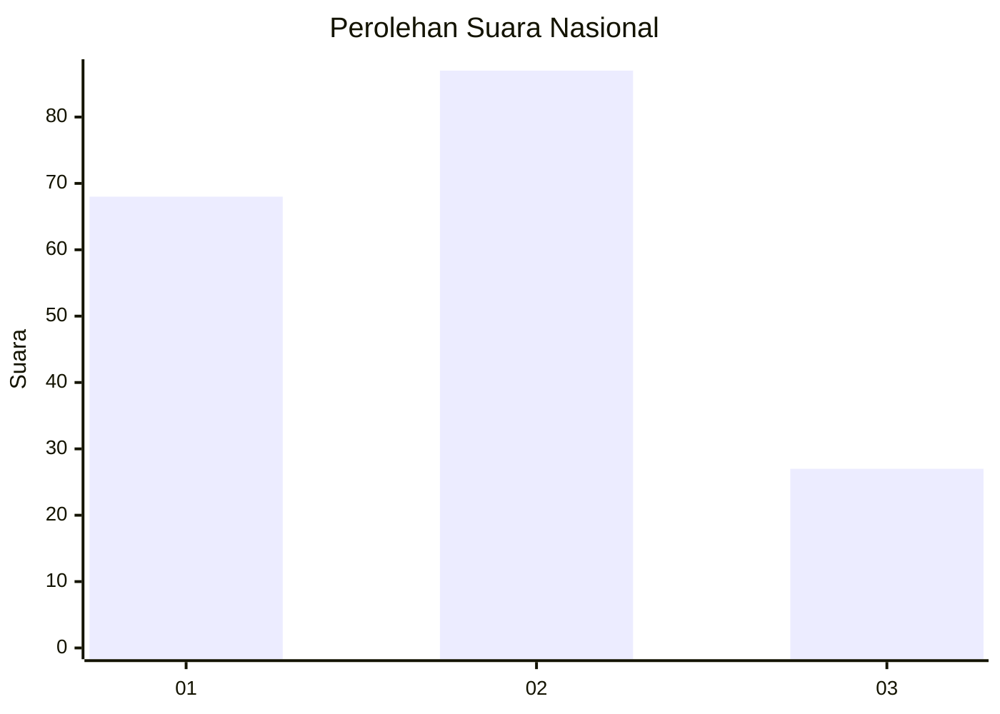
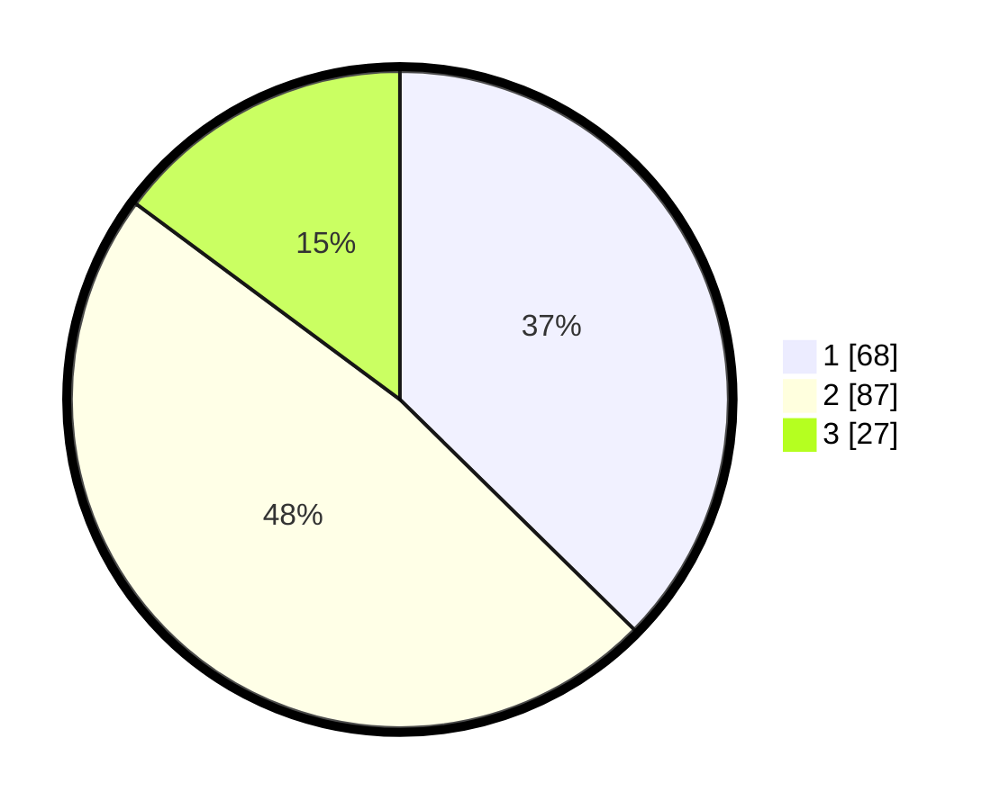

# Hasil

## Grafik

## Tabel

| No.    | Nama Paslon    | Suara | Suara (raw) | Persentase |
|:------ |:-------------- | -----:| -----------:| ----------:|
| 100025 | ANIES MUHAIMIN | 68    | [68][p-1]   | 37,36      |
| 100026 | PRABOWO GIBRAN | 87    | [87][p-2]   | 47,80      |
| 100027 | GANJAR MAHFUD  | 27    | [27][p-3]   | 14,84      |

[p-1]: https://github.com/gigit-pemilu/pemilu-2024/blob/main/pilpres/hitung-suara/sub/31-dki-jakarta/sub/72-jakarta-utara/sub/04-cilincing/sub/1002-sukapura/sub/016-tps/sub/paslon-1.txt
[p-2]: https://github.com/gigit-pemilu/pemilu-2024/blob/main/pilpres/hitung-suara/sub/31-dki-jakarta/sub/72-jakarta-utara/sub/04-cilincing/sub/1002-sukapura/sub/016-tps/sub/paslon-2.txt
[p-3]: https://github.com/gigit-pemilu/pemilu-2024/blob/main/pilpres/hitung-suara/sub/31-dki-jakarta/sub/72-jakarta-utara/sub/04-cilincing/sub/1002-sukapura/sub/016-tps/sub/paslon-3.txt

## Foto C Plano

https://sirekap-obj-formc.kpu.go.id/f66f/pemilu/ppwp/31/72/04/10/02/3172041002016-20240218-114424--ccb9c4a6-49a1-432d-ac20-d059aadc1ee9.jpg

https://sirekap-obj-formc.kpu.go.id/f66f/pemilu/ppwp/31/72/04/10/02/3172041002016-20240214-200643--ecbf38c3-168a-4146-b24c-2699a869d99b.jpg

https://sirekap-obj-formc.kpu.go.id/f66f/pemilu/ppwp/31/72/04/10/02/3172041002016-20240214-200830--0c01faa7-2b87-4497-8c52-145f17a8cc74.jpg

## Metadata

| Key        | Value               |
| ---------- | ------------------- |
| Time Stamp | 2024-02-20 17:00:00 |

