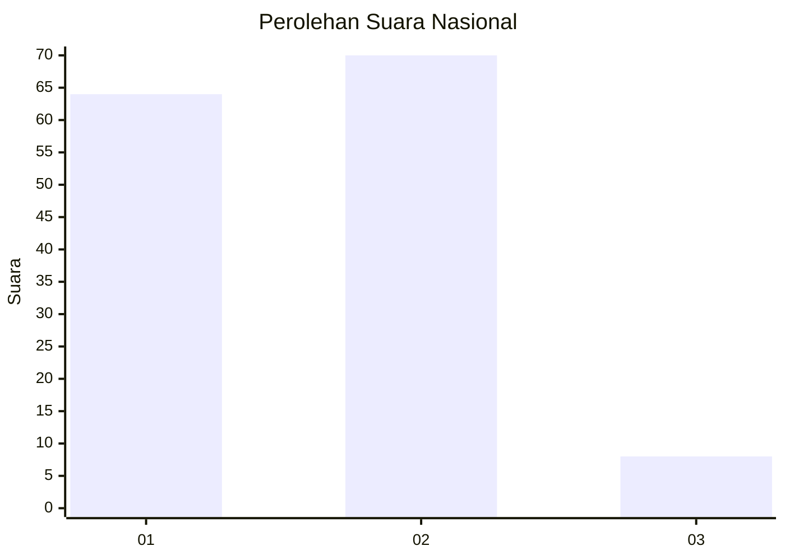
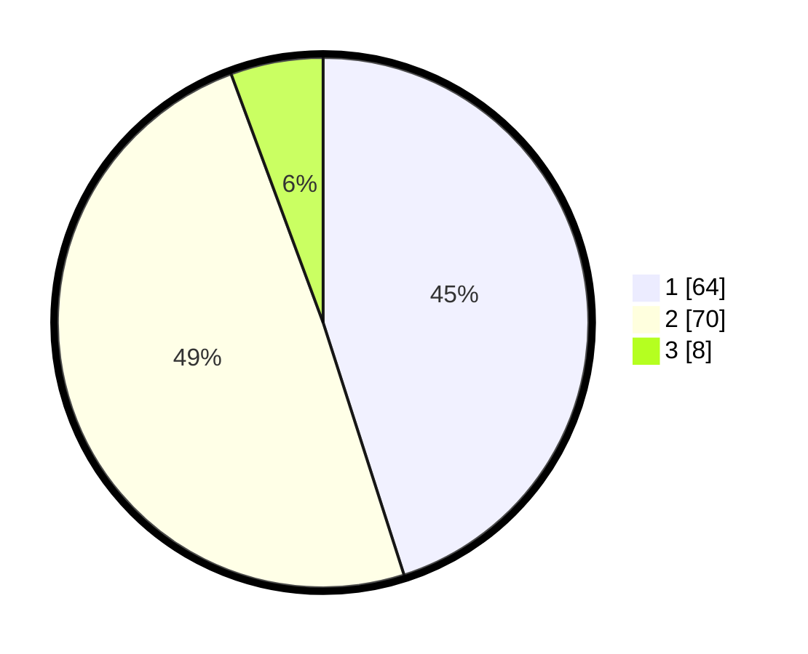

# Hasil

## Grafik

## Tabel

| No.    | Nama Paslon    | Suara | Suara (raw) | Persentase |
|:------ |:-------------- | -----:| -----------:| ----------:|
| 100025 | ANIES MUHAIMIN | 64    | [64][p-1]   | 45,07      |
| 100026 | PRABOWO GIBRAN | 70    | [70][p-2]   | 49,30      |
| 100027 | GANJAR MAHFUD  | 8     | [8][p-3]    | 5,63       |

[p-1]: https://github.com/gigit-pemilu/pemilu-2024/blob/main/pilpres/hitung-suara/sub/31-dki-jakarta/sub/72-jakarta-utara/sub/04-cilincing/sub/1002-sukapura/sub/022-tps/sub/paslon-1.txt
[p-2]: https://github.com/gigit-pemilu/pemilu-2024/blob/main/pilpres/hitung-suara/sub/31-dki-jakarta/sub/72-jakarta-utara/sub/04-cilincing/sub/1002-sukapura/sub/022-tps/sub/paslon-2.txt
[p-3]: https://github.com/gigit-pemilu/pemilu-2024/blob/main/pilpres/hitung-suara/sub/31-dki-jakarta/sub/72-jakarta-utara/sub/04-cilincing/sub/1002-sukapura/sub/022-tps/sub/paslon-3.txt

## Foto C Plano

https://sirekap-obj-formc.kpu.go.id/b93d/pemilu/ppwp/31/72/04/10/02/3172041002022-20240214-232646--b52352ce-50bd-49b8-9aa6-9ad45696f5b2.jpg

https://sirekap-obj-formc.kpu.go.id/b93d/pemilu/ppwp/31/72/04/10/02/3172041002022-20240214-232710--d0d616aa-bb82-4727-9ce6-6c8d41041656.jpg

https://sirekap-obj-formc.kpu.go.id/b93d/pemilu/ppwp/31/72/04/10/02/3172041002022-20240214-232724--55a81438-f45b-40e0-a490-fbb4131e4e72.jpg

## Metadata

| Key        | Value               |
| ---------- | ------------------- |
| Time Stamp | 2024-02-20 22:00:00 |

