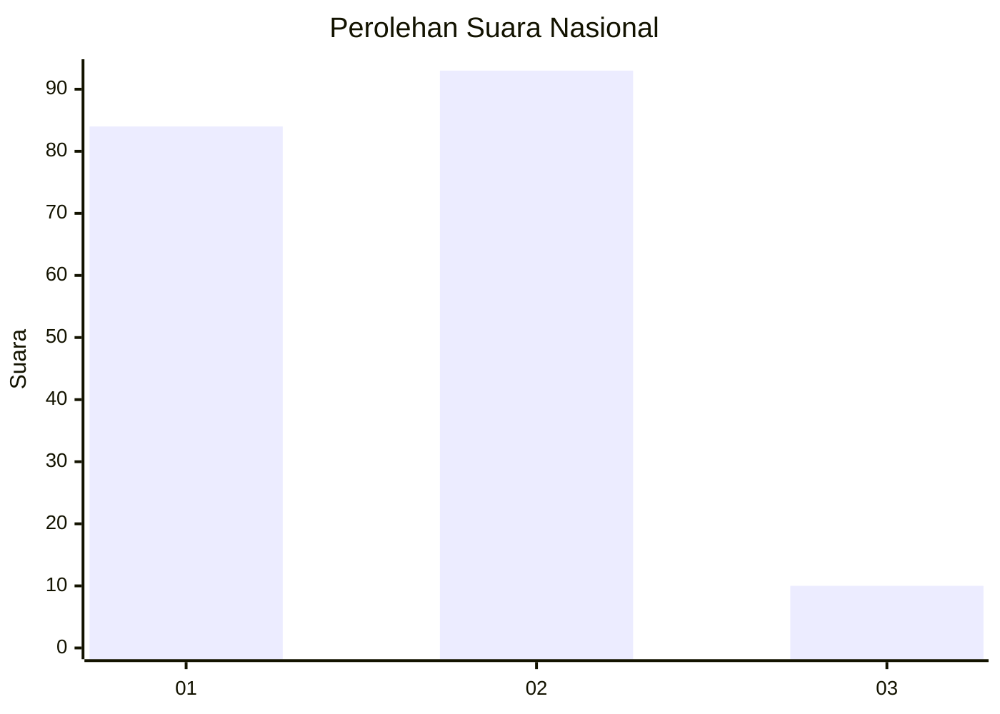
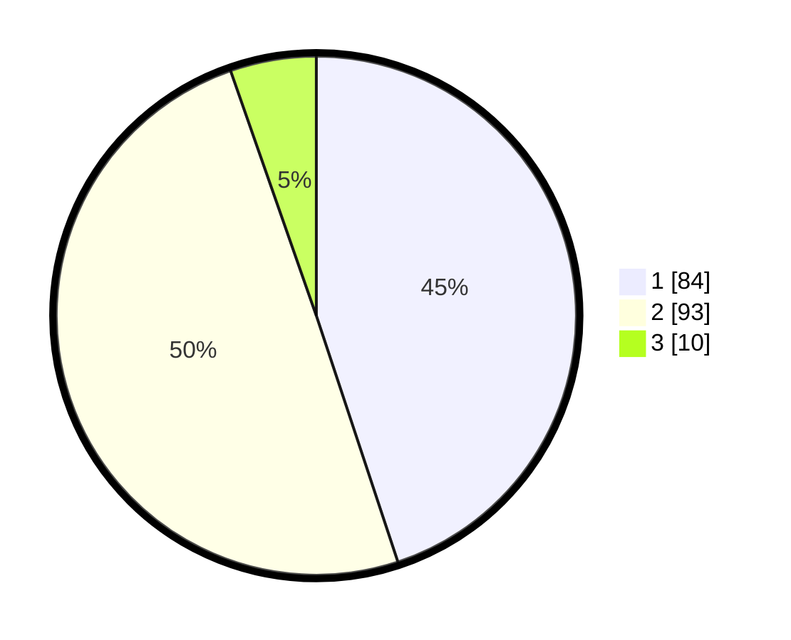

# Hasil

## Grafik

## Tabel

| No.    | Nama Paslon    | Suara | Suara (raw) | Persentase |
|:------ |:-------------- | -----:| -----------:| ----------:|
| 100025 | ANIES MUHAIMIN | 84    | [84][p-1]   | 44,92      |
| 100026 | PRABOWO GIBRAN | 93    | [93][p-2]   | 49,73      |
| 100027 | GANJAR MAHFUD  | 10    | [10][p-3]   | 5,35       |

[p-1]: https://github.com/gigit-pemilu/pemilu-2024/blob/main/pilpres/hitung-suara/sub/31-dki-jakarta/sub/72-jakarta-utara/sub/04-cilincing/sub/1002-sukapura/sub/034-tps/sub/paslon-1.txt
[p-2]: https://github.com/gigit-pemilu/pemilu-2024/blob/main/pilpres/hitung-suara/sub/31-dki-jakarta/sub/72-jakarta-utara/sub/04-cilincing/sub/1002-sukapura/sub/034-tps/sub/paslon-2.txt
[p-3]: https://github.com/gigit-pemilu/pemilu-2024/blob/main/pilpres/hitung-suara/sub/31-dki-jakarta/sub/72-jakarta-utara/sub/04-cilincing/sub/1002-sukapura/sub/034-tps/sub/paslon-3.txt

## Foto C Plano

https://sirekap-obj-formc.kpu.go.id/a522/pemilu/ppwp/31/72/04/10/02/3172041002034-20240215-010404--1bdc4de3-bd2f-4d5d-bdb1-33b3e4531345.jpg

https://sirekap-obj-formc.kpu.go.id/a522/pemilu/ppwp/31/72/04/10/02/3172041002034-20240215-010023--cc019fb4-7227-4f40-bbef-6de85d44e6a9.jpg

https://sirekap-obj-formc.kpu.go.id/a522/pemilu/ppwp/31/72/04/10/02/3172041002034-20240215-005943--177dbba9-7514-431f-9e52-d551bc2ae80a.jpg

## Metadata

| Key        | Value               |
| ---------- | ------------------- |
| Time Stamp | 2024-02-21 18:00:00 |

