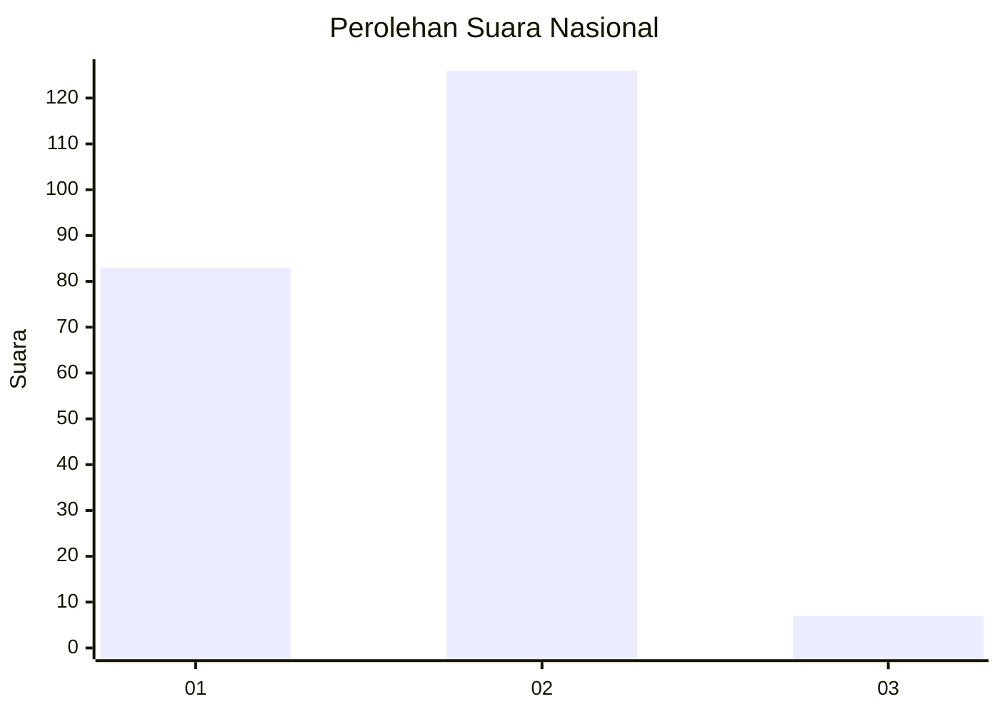
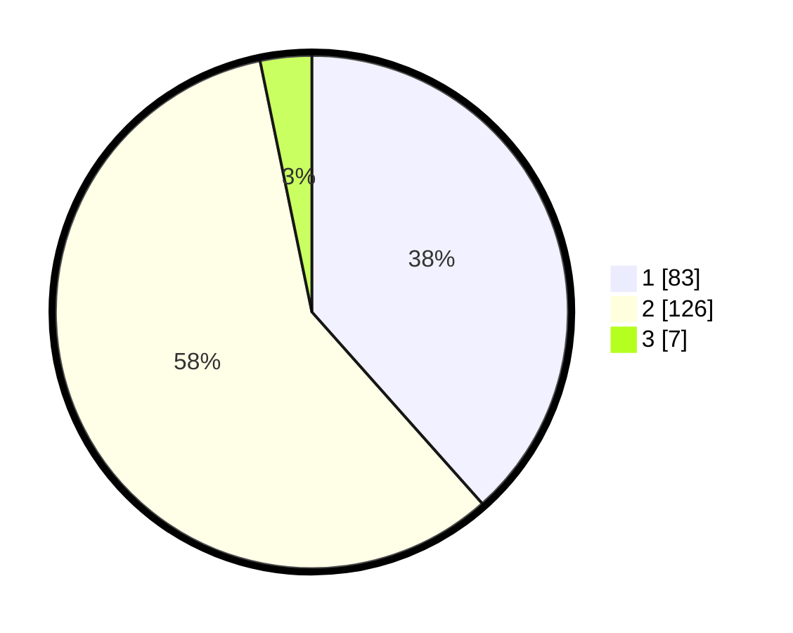

# Hasil

## Grafik

## Tabel

| No.    | Nama Paslon    | Suara | Suara (raw) | Persentase |
|:------ |:-------------- | -----:| -----------:| ----------:|
| 100025 | ANIES MUHAIMIN | 83    | [83][p-1]   | 38,43      |
| 100026 | PRABOWO GIBRAN | 126   | [126][p-2]  | 58,33      |
| 100027 | GANJAR MAHFUD  | 7     | [7][p-3]    | 3,24       |

[p-1]: https://github.com/gigit-pemilu/pemilu-2024/blob/main/pilpres/hitung-suara/sub/31-dki-jakarta/sub/72-jakarta-utara/sub/04-cilincing/sub/1002-sukapura/sub/035-tps/sub/paslon-1.txt
[p-2]: https://github.com/gigit-pemilu/pemilu-2024/blob/main/pilpres/hitung-suara/sub/31-dki-jakarta/sub/72-jakarta-utara/sub/04-cilincing/sub/1002-sukapura/sub/035-tps/sub/paslon-2.txt
[p-3]: https://github.com/gigit-pemilu/pemilu-2024/blob/main/pilpres/hitung-suara/sub/31-dki-jakarta/sub/72-jakarta-utara/sub/04-cilincing/sub/1002-sukapura/sub/035-tps/sub/paslon-3.txt

## Foto C Plano

https://sirekap-obj-formc.kpu.go.id/2f6a/pemilu/ppwp/31/72/04/10/02/3172041002035-20240215-035039--2f237aeb-0e6d-4754-86dc-53239fa408c9.jpg

https://sirekap-obj-formc.kpu.go.id/2f6a/pemilu/ppwp/31/72/04/10/02/3172041002035-20240215-010829--ce0c2ced-db97-4179-bf0b-66f1835ca7cf.jpg

https://sirekap-obj-formc.kpu.go.id/2f6a/pemilu/ppwp/31/72/04/10/02/3172041002035-20240215-034919--b7354fad-a1f8-4285-961c-2af85fc5b90c.jpg

## Metadata

| Key        | Value               |
| ---------- | ------------------- |
| Time Stamp | 2024-02-21 18:00:00 |

