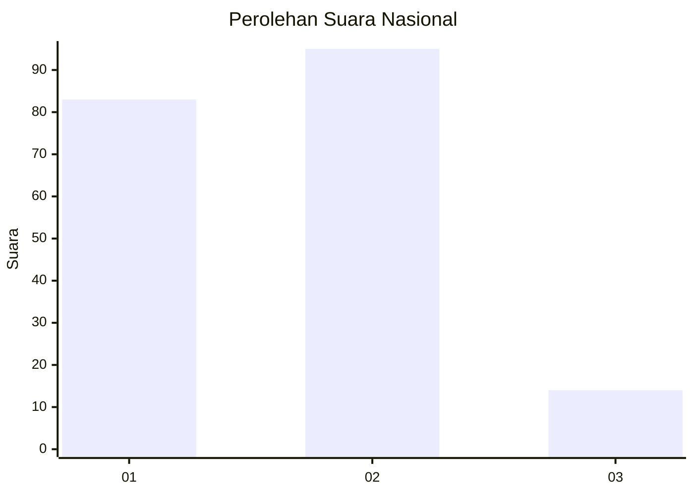
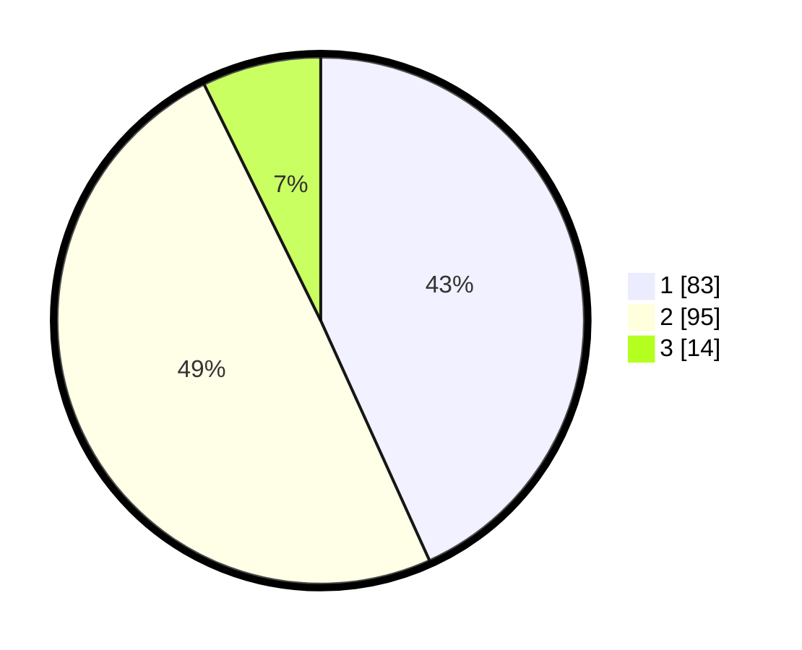

# Hasil

## Grafik

## Tabel

| No.    | Nama Paslon    | Suara | Suara (raw) | Persentase |
|:------ |:-------------- | -----:| -----------:| ----------:|
| 100025 | ANIES MUHAIMIN | 83    | [83][p-1]   | 43,23      |
| 100026 | PRABOWO GIBRAN | 95    | [95][p-2]   | 49,48      |
| 100027 | GANJAR MAHFUD  | 14    | [14][p-3]   | 7,29       |

[p-1]: https://github.com/gigit-pemilu/pemilu-2024/blob/main/pilpres/hitung-suara/sub/31-dki-jakarta/sub/72-jakarta-utara/sub/04-cilincing/sub/1002-sukapura/sub/066-tps/sub/paslon-1.txt
[p-2]: https://github.com/gigit-pemilu/pemilu-2024/blob/main/pilpres/hitung-suara/sub/31-dki-jakarta/sub/72-jakarta-utara/sub/04-cilincing/sub/1002-sukapura/sub/066-tps/sub/paslon-2.txt
[p-3]: https://github.com/gigit-pemilu/pemilu-2024/blob/main/pilpres/hitung-suara/sub/31-dki-jakarta/sub/72-jakarta-utara/sub/04-cilincing/sub/1002-sukapura/sub/066-tps/sub/paslon-3.txt

## Foto C Plano

https://sirekap-obj-formc.kpu.go.id/113d/pemilu/ppwp/31/72/04/10/02/3172041002066-20240217-143102--9b5751bf-a125-4f7b-83ba-23f35c930fe3.jpg

https://sirekap-obj-formc.kpu.go.id/113d/pemilu/ppwp/31/72/04/10/02/3172041002066-20240214-212824--db570b19-c8a4-4d6a-920b-d5593cf4ec07.jpg

https://sirekap-obj-formc.kpu.go.id/113d/pemilu/ppwp/31/72/04/10/02/3172041002066-20240214-213003--701ff11f-cb06-4d3b-a786-4ac6c5b0c066.jpg

## Metadata

| Key        | Value               |
| ---------- | ------------------- |
| Time Stamp | 2024-02-21 18:00:00 |

