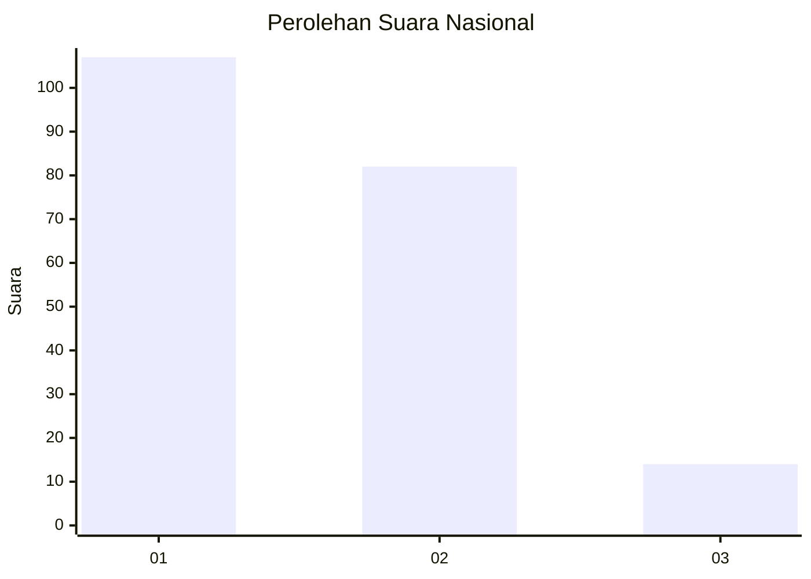
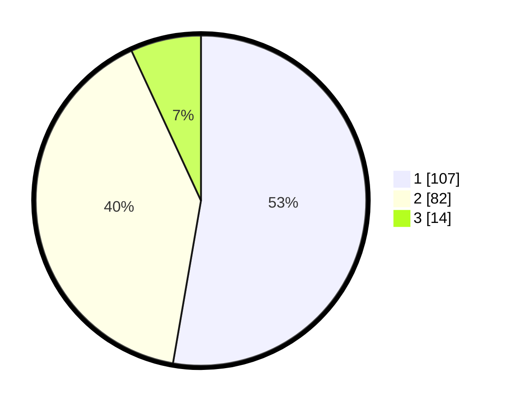

# Hasil

## Grafik

## Tabel

| No.    | Nama Paslon    | Suara | Suara (raw) | Persentase |
|:------ |:-------------- | -----:| -----------:| ----------:|
| 100025 | ANIES MUHAIMIN | 107   | [107][p-1]  | 52,71      |
| 100026 | PRABOWO GIBRAN | 82    | [82][p-2]   | 40,39      |
| 100027 | GANJAR MAHFUD  | 14    | [14][p-3]   | 6,90       |

[p-1]: https://github.com/gigit-pemilu/pemilu-2024/blob/main/pilpres/hitung-suara/sub/31-dki-jakarta/sub/72-jakarta-utara/sub/04-cilincing/sub/1002-sukapura/sub/073-tps/sub/paslon-1.txt
[p-2]: https://github.com/gigit-pemilu/pemilu-2024/blob/main/pilpres/hitung-suara/sub/31-dki-jakarta/sub/72-jakarta-utara/sub/04-cilincing/sub/1002-sukapura/sub/073-tps/sub/paslon-2.txt
[p-3]: https://github.com/gigit-pemilu/pemilu-2024/blob/main/pilpres/hitung-suara/sub/31-dki-jakarta/sub/72-jakarta-utara/sub/04-cilincing/sub/1002-sukapura/sub/073-tps/sub/paslon-3.txt

## Foto C Plano

https://sirekap-obj-formc.kpu.go.id/1242/pemilu/ppwp/31/72/04/10/02/3172041002073-20240214-222114--04a7aa6f-3e37-445d-9b60-49da32616b58.jpg

https://sirekap-obj-formc.kpu.go.id/1242/pemilu/ppwp/31/72/04/10/02/3172041002073-20240214-223209--46d6cf3f-d19c-403d-bd0b-f0a93c5bec6d.jpg

https://sirekap-obj-formc.kpu.go.id/1242/pemilu/ppwp/31/72/04/10/02/3172041002073-20240214-223714--444f0ce9-a2b4-4015-92bd-685cc6ff5801.jpg

## Metadata

| Key        | Value               |
| ---------- | ------------------- |
| Time Stamp | 2024-02-20 23:00:00 |

