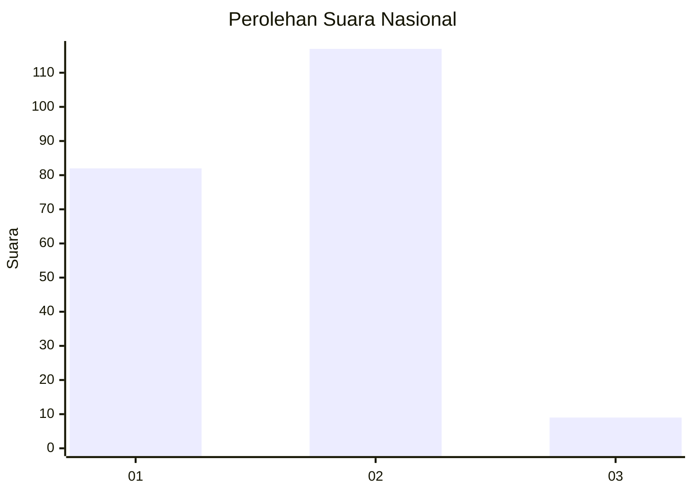
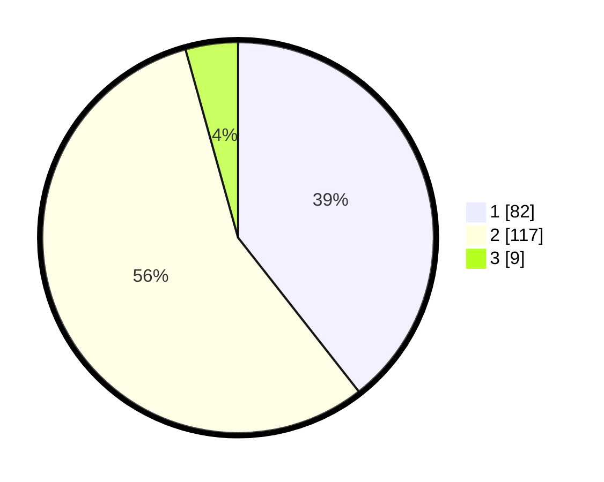

# Hasil

## Grafik

## Tabel

| No.    | Nama Paslon    | Suara | Suara (raw) | Persentase |
|:------ |:-------------- | -----:| -----------:| ----------:|
| 100025 | ANIES MUHAIMIN | 82    | [82][p-1]   | 39,42      |
| 100026 | PRABOWO GIBRAN | 117   | [117][p-2]  | 56,25      |
| 100027 | GANJAR MAHFUD  | 9     | [9][p-3]    | 4,33       |

[p-1]: https://github.com/gigit-pemilu/pemilu-2024/blob/main/pilpres/hitung-suara/sub/31-dki-jakarta/sub/72-jakarta-utara/sub/04-cilincing/sub/1002-sukapura/sub/077-tps/sub/paslon-1.txt
[p-2]: https://github.com/gigit-pemilu/pemilu-2024/blob/main/pilpres/hitung-suara/sub/31-dki-jakarta/sub/72-jakarta-utara/sub/04-cilincing/sub/1002-sukapura/sub/077-tps/sub/paslon-2.txt
[p-3]: https://github.com/gigit-pemilu/pemilu-2024/blob/main/pilpres/hitung-suara/sub/31-dki-jakarta/sub/72-jakarta-utara/sub/04-cilincing/sub/1002-sukapura/sub/077-tps/sub/paslon-3.txt

## Foto C Plano

https://sirekap-obj-formc.kpu.go.id/10fb/pemilu/ppwp/31/72/04/10/02/3172041002077-20240214-215725--a56b0b26-3ed5-45f3-84a1-2ea028269b39.jpg

https://sirekap-obj-formc.kpu.go.id/10fb/pemilu/ppwp/31/72/04/10/02/3172041002077-20240214-234725--0f342302-ca0e-458c-9b4d-264a296eb677.jpg

https://sirekap-obj-formc.kpu.go.id/10fb/pemilu/ppwp/31/72/04/10/02/3172041002077-20240214-235006--9cc2266f-a82a-4d15-9b16-e32df29764c5.jpg

## Metadata

| Key        | Value               |
| ---------- | ------------------- |
| Time Stamp | 2024-02-21 18:00:00 |

