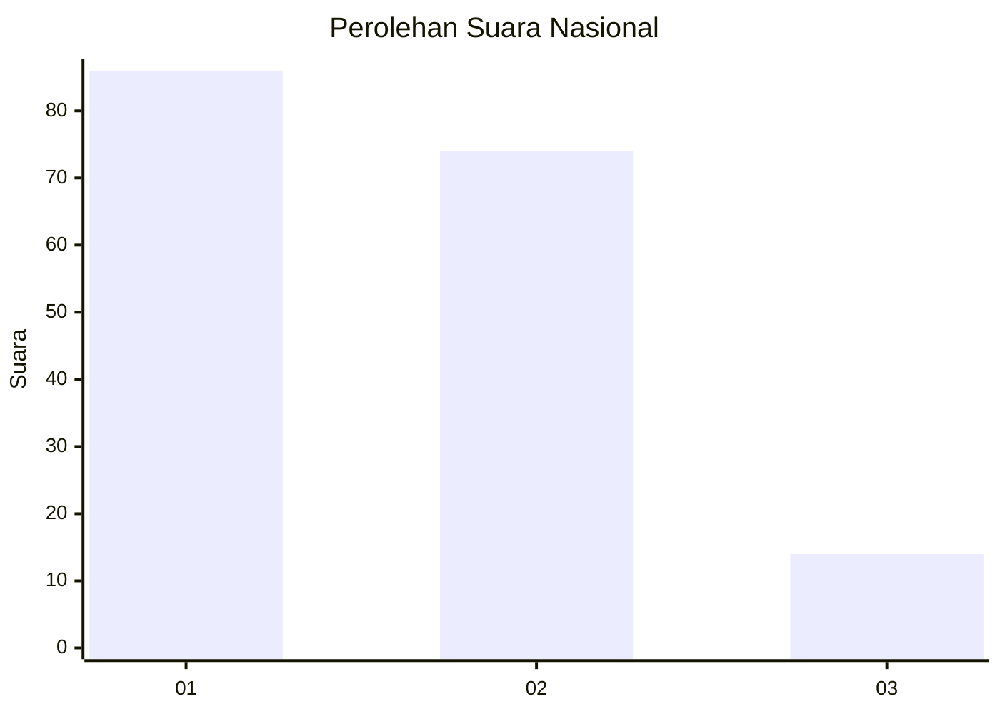
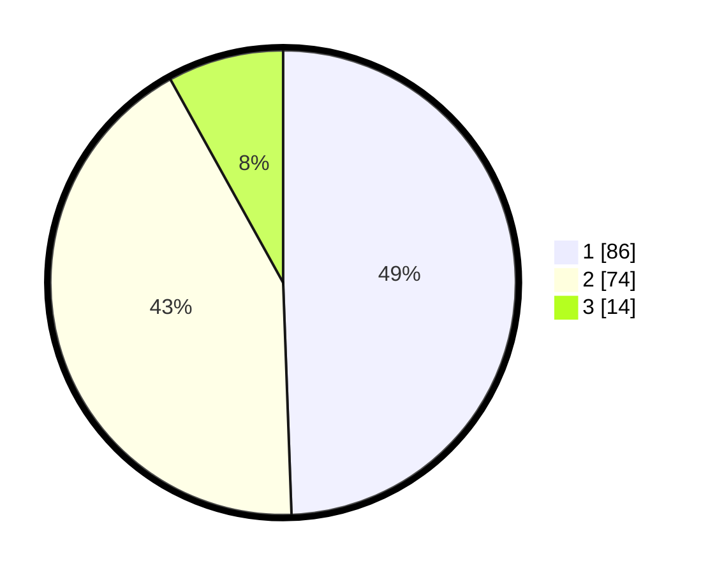

# Hasil

## Grafik

## Tabel

| No.    | Nama Paslon    | Suara | Suara (raw) | Persentase |
|:------ |:-------------- | -----:| -----------:| ----------:|
| 100025 | ANIES MUHAIMIN | 86    | [86][p-1]   | 49,43      |
| 100026 | PRABOWO GIBRAN | 74    | [74][p-2]   | 42,53      |
| 100027 | GANJAR MAHFUD  | 14    | [14][p-3]   | 8,05       |

[p-1]: https://github.com/gigit-pemilu/pemilu-2024/blob/main/pilpres/hitung-suara/sub/31-dki-jakarta/sub/72-jakarta-utara/sub/04-cilincing/sub/1002-sukapura/sub/081-tps/sub/paslon-1.txt
[p-2]: https://github.com/gigit-pemilu/pemilu-2024/blob/main/pilpres/hitung-suara/sub/31-dki-jakarta/sub/72-jakarta-utara/sub/04-cilincing/sub/1002-sukapura/sub/081-tps/sub/paslon-2.txt
[p-3]: https://github.com/gigit-pemilu/pemilu-2024/blob/main/pilpres/hitung-suara/sub/31-dki-jakarta/sub/72-jakarta-utara/sub/04-cilincing/sub/1002-sukapura/sub/081-tps/sub/paslon-3.txt

## Foto C Plano

https://sirekap-obj-formc.kpu.go.id/bfd7/pemilu/ppwp/31/72/04/10/02/3172041002081-20240214-231309--7f2216f4-5c3b-4eae-a7ff-6dc11416d9bb.jpg

https://sirekap-obj-formc.kpu.go.id/bfd7/pemilu/ppwp/31/72/04/10/02/3172041002081-20240214-231417--f2a9e540-fb00-4fcf-bbdf-b3f87b9652eb.jpg

https://sirekap-obj-formc.kpu.go.id/bfd7/pemilu/ppwp/31/72/04/10/02/3172041002081-20240214-231544--586c290c-eff7-477b-93b5-32ab37e81825.jpg

## Metadata

| Key        | Value               |
| ---------- | ------------------- |
| Time Stamp | 2024-02-17 13:37:34 |

