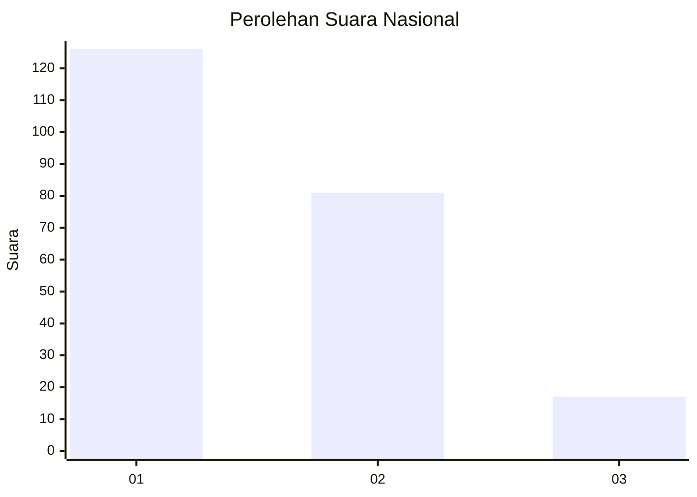
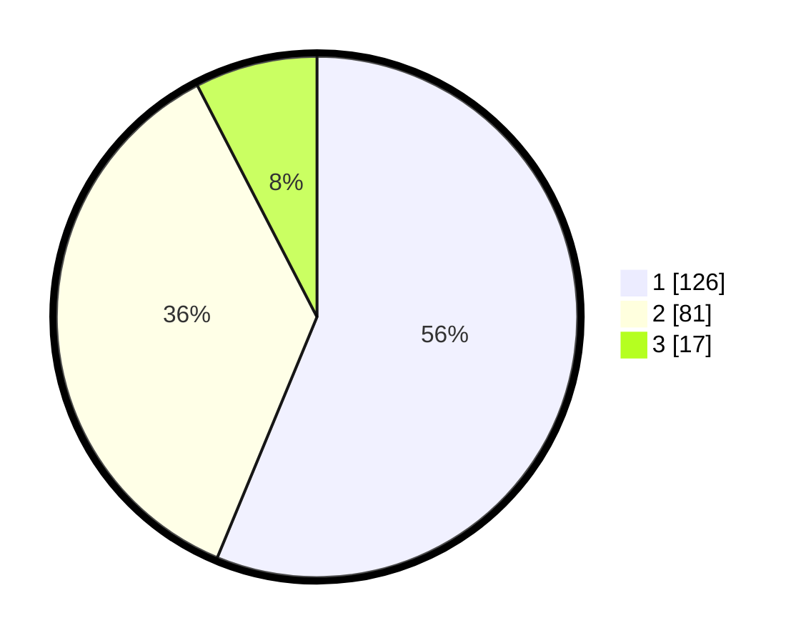

# Hasil

## Grafik

## Tabel

| No.    | Nama Paslon    | Suara | Suara (raw) | Persentase |
|:------ |:-------------- | -----:| -----------:| ----------:|
| 100025 | ANIES MUHAIMIN | 126   | [126][p-1]  | 56,25      |
| 100026 | PRABOWO GIBRAN | 81    | [81][p-2]   | 36,16      |
| 100027 | GANJAR MAHFUD  | 17    | [17][p-3]   | 7,59       |

[p-1]: https://github.com/gigit-pemilu/pemilu-2024/blob/main/pilpres/hitung-suara/sub/31-dki-jakarta/sub/72-jakarta-utara/sub/04-cilincing/sub/1002-sukapura/sub/095-tps/sub/paslon-1.txt
[p-2]: https://github.com/gigit-pemilu/pemilu-2024/blob/main/pilpres/hitung-suara/sub/31-dki-jakarta/sub/72-jakarta-utara/sub/04-cilincing/sub/1002-sukapura/sub/095-tps/sub/paslon-2.txt
[p-3]: https://github.com/gigit-pemilu/pemilu-2024/blob/main/pilpres/hitung-suara/sub/31-dki-jakarta/sub/72-jakarta-utara/sub/04-cilincing/sub/1002-sukapura/sub/095-tps/sub/paslon-3.txt

## Foto C Plano

https://sirekap-obj-formc.kpu.go.id/9094/pemilu/ppwp/31/72/04/10/02/3172041002095-20240215-022531--28b1d8cd-f3e8-467b-bb1b-aae57d53ab1d.jpg

https://sirekap-obj-formc.kpu.go.id/9094/pemilu/ppwp/31/72/04/10/02/3172041002095-20240215-022659--853a74e0-bf86-49d4-8b1e-3cabbba79821.jpg

https://sirekap-obj-formc.kpu.go.id/9094/pemilu/ppwp/31/72/04/10/02/3172041002095-20240215-022828--de189eee-64b6-4433-93ee-b21a9dae6e55.jpg

## Metadata

| Key        | Value               |
| ---------- | ------------------- |
| Time Stamp | 2024-02-21 15:00:00 |

