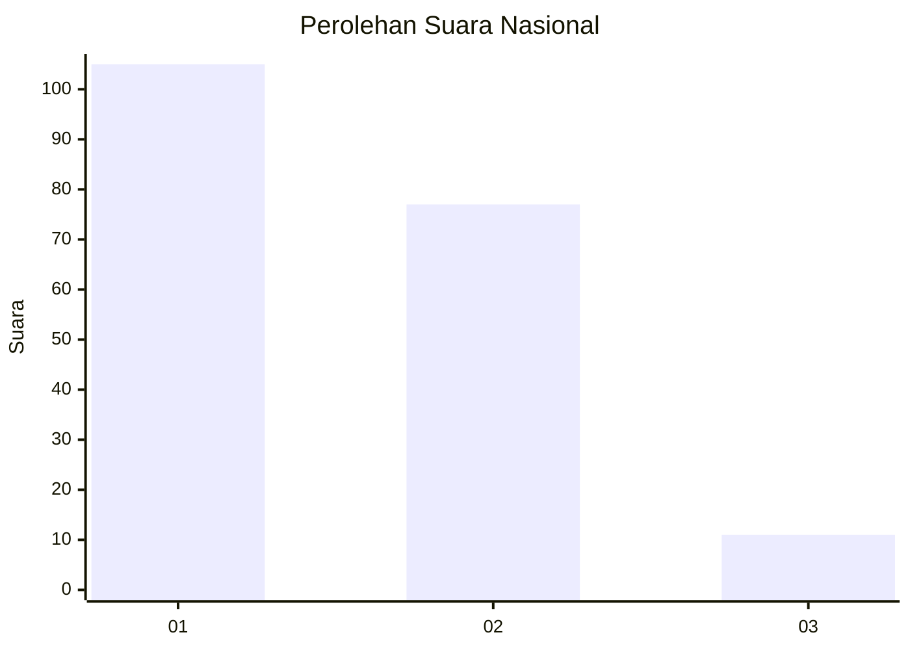
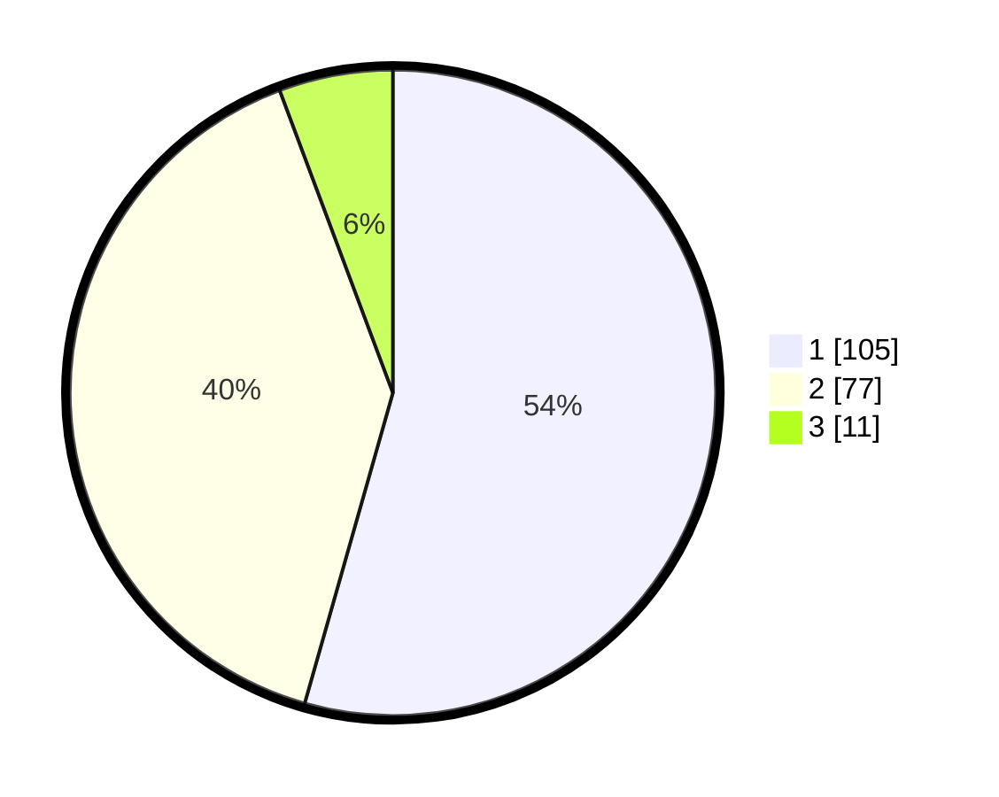

# Hasil

## Grafik

## Tabel

| No.    | Nama Paslon    | Suara | Suara (raw) | Persentase |
|:------ |:-------------- | -----:| -----------:| ----------:|
| 100025 | ANIES MUHAIMIN | 105   | [105][p-1]  | 54,40      |
| 100026 | PRABOWO GIBRAN | 77    | [77][p-2]   | 39,90      |
| 100027 | GANJAR MAHFUD  | 11    | [11][p-3]   | 5,70       |

[p-1]: https://github.com/gigit-pemilu/pemilu-2024/blob/main/pilpres/hitung-suara/sub/31-dki-jakarta/sub/72-jakarta-utara/sub/04-cilincing/sub/1002-sukapura/sub/097-tps/sub/paslon-1.txt
[p-2]: https://github.com/gigit-pemilu/pemilu-2024/blob/main/pilpres/hitung-suara/sub/31-dki-jakarta/sub/72-jakarta-utara/sub/04-cilincing/sub/1002-sukapura/sub/097-tps/sub/paslon-2.txt
[p-3]: https://github.com/gigit-pemilu/pemilu-2024/blob/main/pilpres/hitung-suara/sub/31-dki-jakarta/sub/72-jakarta-utara/sub/04-cilincing/sub/1002-sukapura/sub/097-tps/sub/paslon-3.txt

## Foto C Plano

https://sirekap-obj-formc.kpu.go.id/1690/pemilu/ppwp/31/72/04/10/02/3172041002097-20240214-175444--9b01ce8c-3b65-4a74-ac73-7bc6b662cd01.jpg

https://sirekap-obj-formc.kpu.go.id/1690/pemilu/ppwp/31/72/04/10/02/3172041002097-20240214-232644--60f20e1e-8819-437d-abaf-5ba62bf79e23.jpg

https://sirekap-obj-formc.kpu.go.id/1690/pemilu/ppwp/31/72/04/10/02/3172041002097-20240214-190803--65a61452-a058-4f40-8e2a-7ff384bbf9b9.jpg

## Metadata

| Key        | Value               |
| ---------- | ------------------- |
| Time Stamp | 2024-02-21 18:00:00 |

