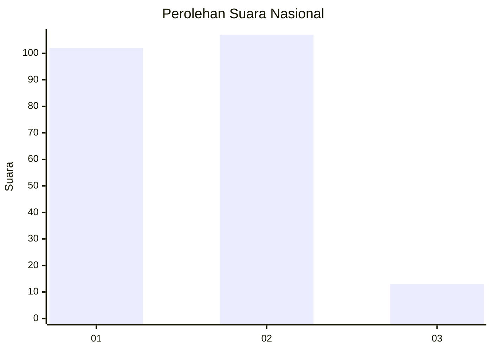
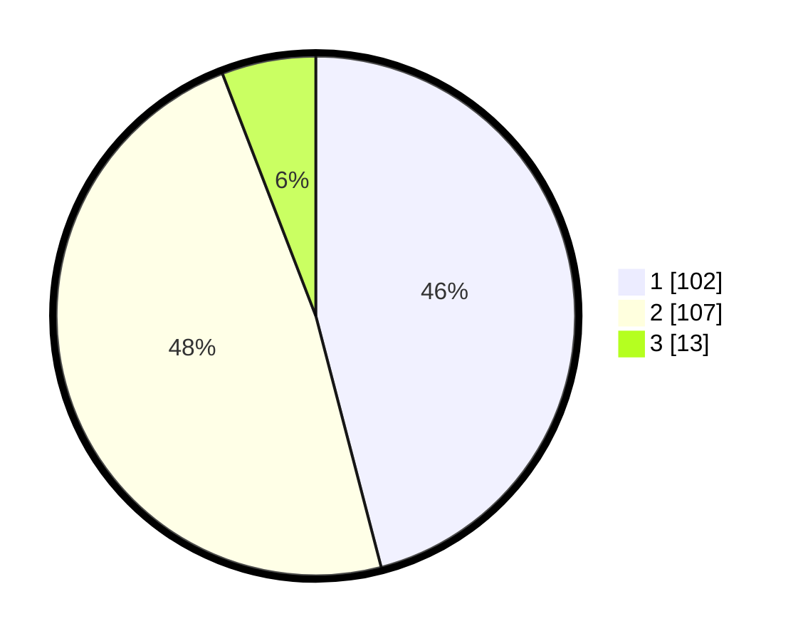

# Hasil

## Grafik

## Tabel

| No.    | Nama Paslon    | Suara | Suara (raw) | Persentase |
|:------ |:-------------- | -----:| -----------:| ----------:|
| 100025 | ANIES MUHAIMIN | 102   | [102][p-1]  | 45,95      |
| 100026 | PRABOWO GIBRAN | 107   | [107][p-2]  | 48,20      |
| 100027 | GANJAR MAHFUD  | 13    | [13][p-3]   | 5,86       |

[p-1]: https://github.com/gigit-pemilu/pemilu-2024/blob/main/pilpres/hitung-suara/sub/31-dki-jakarta/sub/72-jakarta-utara/sub/04-cilincing/sub/1002-sukapura/sub/111-tps/sub/paslon-1.txt
[p-2]: https://github.com/gigit-pemilu/pemilu-2024/blob/main/pilpres/hitung-suara/sub/31-dki-jakarta/sub/72-jakarta-utara/sub/04-cilincing/sub/1002-sukapura/sub/111-tps/sub/paslon-2.txt
[p-3]: https://github.com/gigit-pemilu/pemilu-2024/blob/main/pilpres/hitung-suara/sub/31-dki-jakarta/sub/72-jakarta-utara/sub/04-cilincing/sub/1002-sukapura/sub/111-tps/sub/paslon-3.txt

## Foto C Plano

https://sirekap-obj-formc.kpu.go.id/8844/pemilu/ppwp/31/72/04/10/02/3172041002111-20240214-222002--c0cd0833-817c-4258-81b5-9b18e2d52236.jpg

https://sirekap-obj-formc.kpu.go.id/8844/pemilu/ppwp/31/72/04/10/02/3172041002111-20240214-222008--30443793-dbe8-473f-93ae-c45b1ed71645.jpg

https://sirekap-obj-formc.kpu.go.id/8844/pemilu/ppwp/31/72/04/10/02/3172041002111-20240214-222014--9604bc0e-aa80-44b4-8f6f-199f532fe05a.jpg

## Metadata

| Key        | Value               |
| ---------- | ------------------- |
| Time Stamp | 2024-02-21 18:00:00 |

