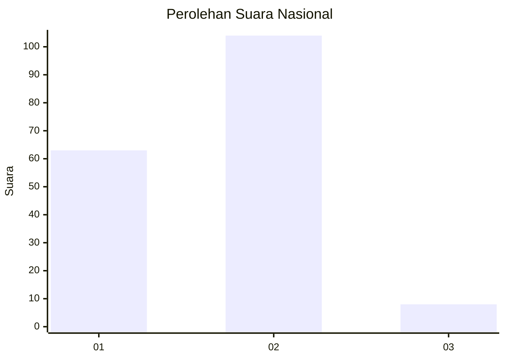
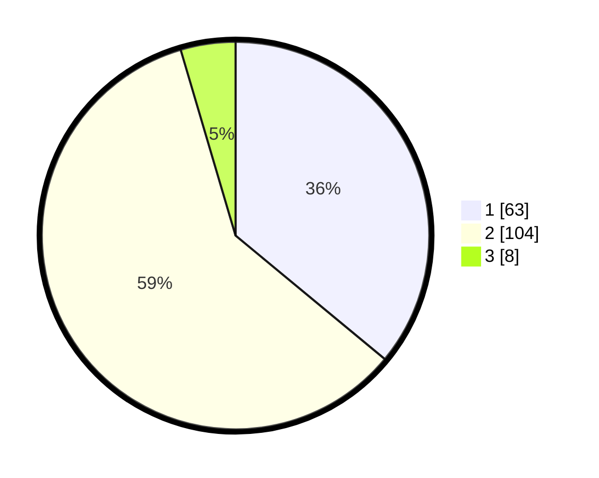

# Hasil

## Grafik

## Tabel

| No.    | Nama Paslon    | Suara | Suara (raw) | Persentase |
|:------ |:-------------- | -----:| -----------:| ----------:|
| 100025 | ANIES MUHAIMIN | 63    | [63][p-1]   | 36,00      |
| 100026 | PRABOWO GIBRAN | 104   | [104][p-2]  | 59,43      |
| 100027 | GANJAR MAHFUD  | 8     | [8][p-3]    | 4,57       |

[p-1]: https://github.com/gigit-pemilu/pemilu-2024/blob/main/pilpres/hitung-suara/sub/31-dki-jakarta/sub/72-jakarta-utara/sub/04-cilincing/sub/1002-sukapura/sub/115-tps/sub/paslon-1.txt
[p-2]: https://github.com/gigit-pemilu/pemilu-2024/blob/main/pilpres/hitung-suara/sub/31-dki-jakarta/sub/72-jakarta-utara/sub/04-cilincing/sub/1002-sukapura/sub/115-tps/sub/paslon-2.txt
[p-3]: https://github.com/gigit-pemilu/pemilu-2024/blob/main/pilpres/hitung-suara/sub/31-dki-jakarta/sub/72-jakarta-utara/sub/04-cilincing/sub/1002-sukapura/sub/115-tps/sub/paslon-3.txt

## Foto C Plano

https://sirekap-obj-formc.kpu.go.id/ad21/pemilu/ppwp/31/72/04/10/02/3172041002115-20240215-013608--036bf796-8009-4298-a2b7-be5fca7234b9.jpg

https://sirekap-obj-formc.kpu.go.id/ad21/pemilu/ppwp/31/72/04/10/02/3172041002115-20240215-013650--1ad8fa63-b2f5-4f00-a791-026dca909d38.jpg

https://sirekap-obj-formc.kpu.go.id/ad21/pemilu/ppwp/31/72/04/10/02/3172041002115-20240215-013729--a98ec51c-37c1-4848-aa7d-8a45d359820f.jpg

## Metadata

| Key        | Value               |
| ---------- | ------------------- |
| Time Stamp | 2024-02-21 18:00:00 |

