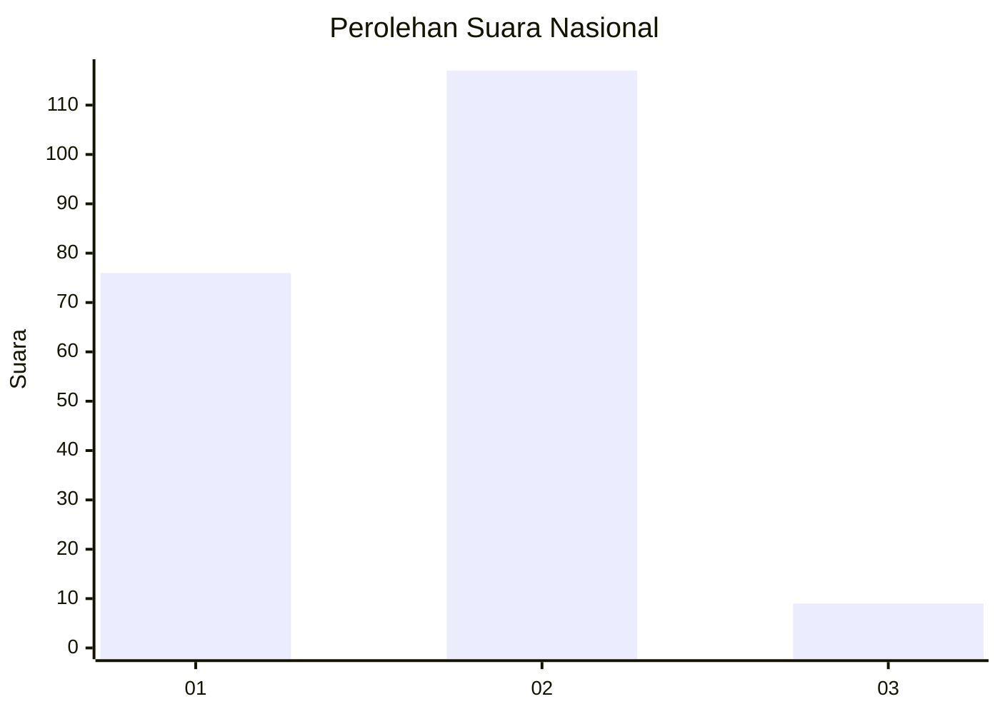
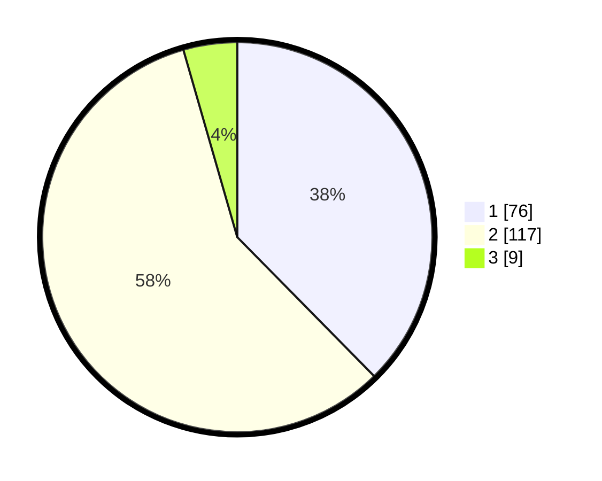

# Hasil

## Grafik

## Tabel

| No.    | Nama Paslon    | Suara | Suara (raw) | Persentase |
|:------ |:-------------- | -----:| -----------:| ----------:|
| 100025 | ANIES MUHAIMIN | 76    | [76][p-1]   | 37,62      |
| 100026 | PRABOWO GIBRAN | 117   | [117][p-2]  | 57,92      |
| 100027 | GANJAR MAHFUD  | 9     | [9][p-3]    | 4,46       |

[p-1]: https://github.com/gigit-pemilu/pemilu-2024/blob/main/pilpres/hitung-suara/sub/31-dki-jakarta/sub/72-jakarta-utara/sub/04-cilincing/sub/1002-sukapura/sub/126-tps/sub/paslon-1.txt
[p-2]: https://github.com/gigit-pemilu/pemilu-2024/blob/main/pilpres/hitung-suara/sub/31-dki-jakarta/sub/72-jakarta-utara/sub/04-cilincing/sub/1002-sukapura/sub/126-tps/sub/paslon-2.txt
[p-3]: https://github.com/gigit-pemilu/pemilu-2024/blob/main/pilpres/hitung-suara/sub/31-dki-jakarta/sub/72-jakarta-utara/sub/04-cilincing/sub/1002-sukapura/sub/126-tps/sub/paslon-3.txt

## Foto C Plano

https://sirekap-obj-formc.kpu.go.id/8d26/pemilu/ppwp/31/72/04/10/02/3172041002126-20240214-235915--dd0c1f7b-1cd0-40cf-bae9-0e0894e95503.jpg

https://sirekap-obj-formc.kpu.go.id/8d26/pemilu/ppwp/31/72/04/10/02/3172041002126-20240215-000003--cc66e104-74d2-4c8d-a3c5-95257e3403b4.jpg

https://sirekap-obj-formc.kpu.go.id/8d26/pemilu/ppwp/31/72/04/10/02/3172041002126-20240215-000045--9175a5a9-7f59-4123-b60e-4e541c15705d.jpg

## Metadata

| Key        | Value               |
| ---------- | ------------------- |
| Time Stamp | 2024-02-21 18:00:00 |

