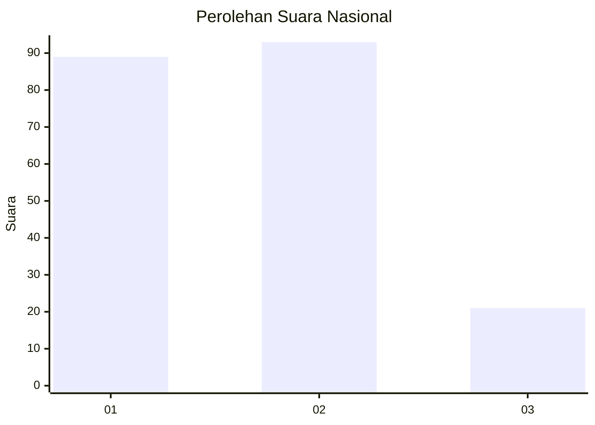
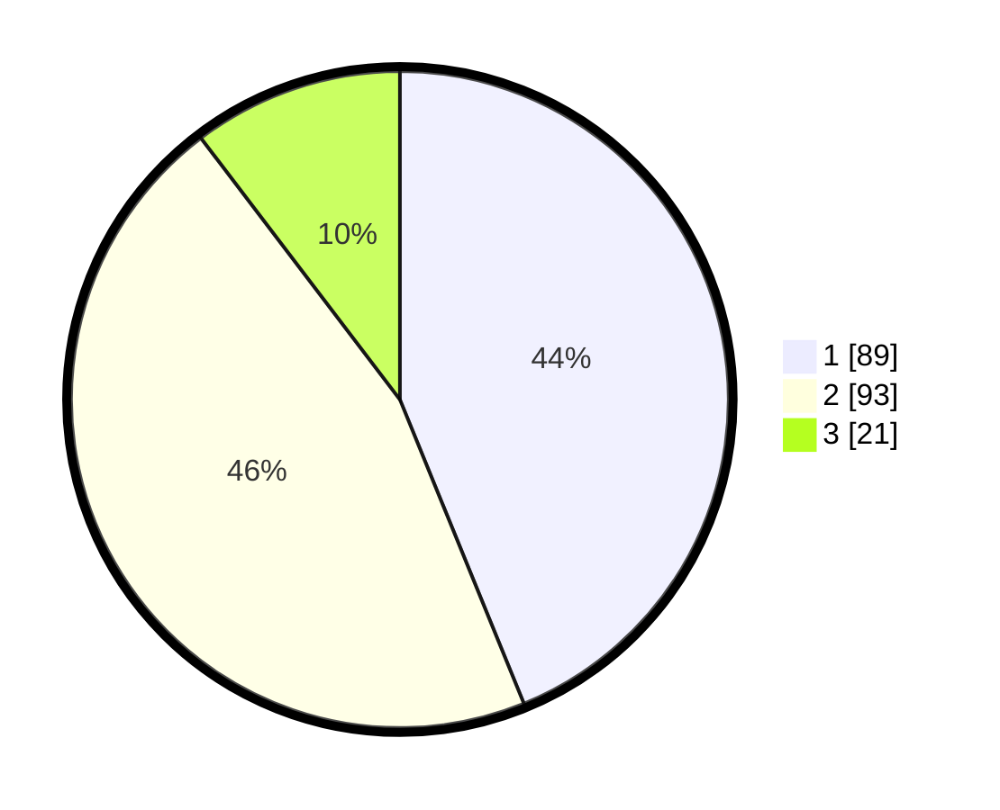

# Hasil

## Grafik

## Tabel

| No.    | Nama Paslon    | Suara | Suara (raw) | Persentase |
|:------ |:-------------- | -----:| -----------:| ----------:|
| 100025 | ANIES MUHAIMIN | 89    | [89][p-1]   | 43,84      |
| 100026 | PRABOWO GIBRAN | 93    | [93][p-2]   | 45,81      |
| 100027 | GANJAR MAHFUD  | 21    | [21][p-3]   | 10,34      |

[p-1]: https://github.com/gigit-pemilu/pemilu-2024/blob/main/pilpres/hitung-suara/sub/31-dki-jakarta/sub/72-jakarta-utara/sub/04-cilincing/sub/1002-sukapura/sub/130-tps/sub/paslon-1.txt
[p-2]: https://github.com/gigit-pemilu/pemilu-2024/blob/main/pilpres/hitung-suara/sub/31-dki-jakarta/sub/72-jakarta-utara/sub/04-cilincing/sub/1002-sukapura/sub/130-tps/sub/paslon-2.txt
[p-3]: https://github.com/gigit-pemilu/pemilu-2024/blob/main/pilpres/hitung-suara/sub/31-dki-jakarta/sub/72-jakarta-utara/sub/04-cilincing/sub/1002-sukapura/sub/130-tps/sub/paslon-3.txt

## Foto C Plano

https://sirekap-obj-formc.kpu.go.id/dd3f/pemilu/ppwp/31/72/04/10/02/3172041002130-20240215-141659--2fc7bc9b-7b46-4d57-b3d8-51751ccd9ba1.jpg

https://sirekap-obj-formc.kpu.go.id/dd3f/pemilu/ppwp/31/72/04/10/02/3172041002130-20240214-223134--6b633b5f-f800-4177-bfb1-6cfb73fd1a7a.jpg

https://sirekap-obj-formc.kpu.go.id/dd3f/pemilu/ppwp/31/72/04/10/02/3172041002130-20240214-223210--80db74cd-5410-4db2-a567-88a03b223902.jpg

## Metadata

| Key        | Value               |
| ---------- | ------------------- |
| Time Stamp | 2024-02-20 22:00:00 |

