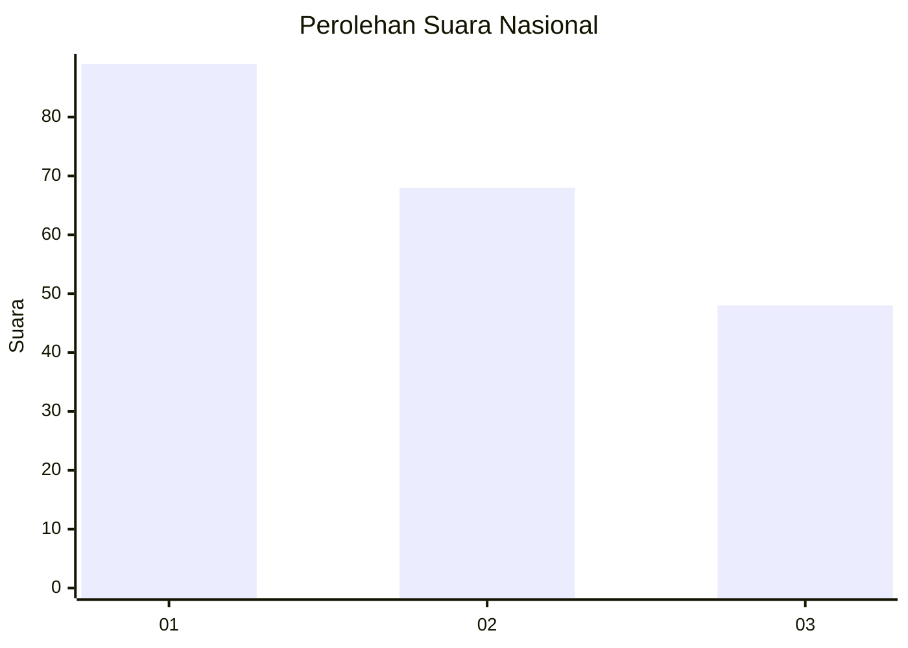
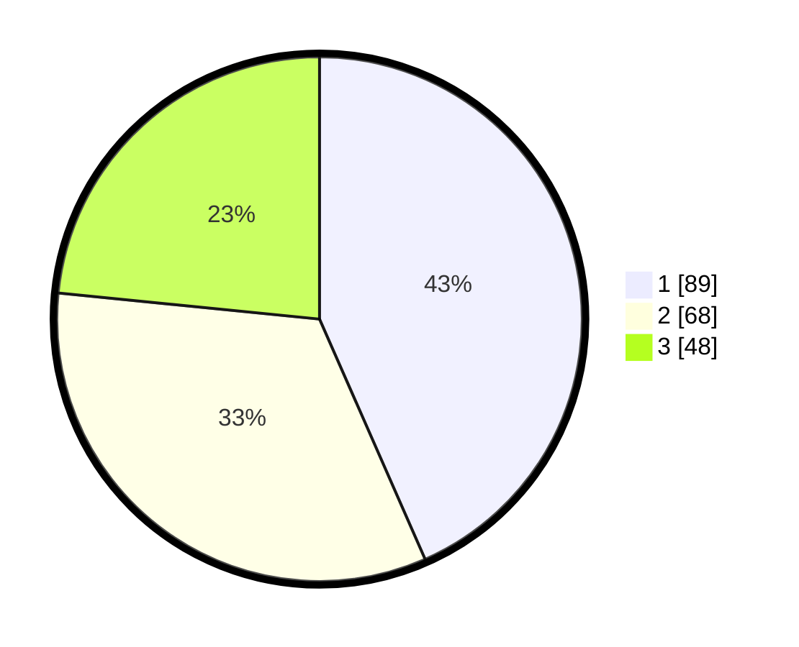

# Hasil

## Grafik

## Tabel

| No.    | Nama Paslon    | Suara | Suara (raw) | Persentase |
|:------ |:-------------- | -----:| -----------:| ----------:|
| 100025 | ANIES MUHAIMIN | 89    | [89][p-1]   | 43,41      |
| 100026 | PRABOWO GIBRAN | 68    | [68][p-2]   | 33,17      |
| 100027 | GANJAR MAHFUD  | 48    | [48][p-3]   | 23,41      |

[p-1]: https://github.com/gigit-pemilu/pemilu-2024/blob/main/pilpres/hitung-suara/sub/31-dki-jakarta/sub/72-jakarta-utara/sub/04-cilincing/sub/1002-sukapura/sub/136-tps/sub/paslon-1.txt
[p-2]: https://github.com/gigit-pemilu/pemilu-2024/blob/main/pilpres/hitung-suara/sub/31-dki-jakarta/sub/72-jakarta-utara/sub/04-cilincing/sub/1002-sukapura/sub/136-tps/sub/paslon-2.txt
[p-3]: https://github.com/gigit-pemilu/pemilu-2024/blob/main/pilpres/hitung-suara/sub/31-dki-jakarta/sub/72-jakarta-utara/sub/04-cilincing/sub/1002-sukapura/sub/136-tps/sub/paslon-3.txt

## Foto C Plano

https://sirekap-obj-formc.kpu.go.id/bc10/pemilu/ppwp/31/72/04/10/02/3172041002136-20240214-191209--f495a019-47bd-4992-98f7-d352f7cd398b.jpg

https://sirekap-obj-formc.kpu.go.id/bc10/pemilu/ppwp/31/72/04/10/02/3172041002136-20240214-190935--6d4d6f4f-99af-45da-b47f-10b1a5e68ff5.jpg

https://sirekap-obj-formc.kpu.go.id/bc10/pemilu/ppwp/31/72/04/10/02/3172041002136-20240214-190416--63810c98-daa0-4031-a5ff-1eb1ac27d075.jpg

## Metadata

| Key        | Value               |
| ---------- | ------------------- |
| Time Stamp | 2024-02-21 18:00:00 |

