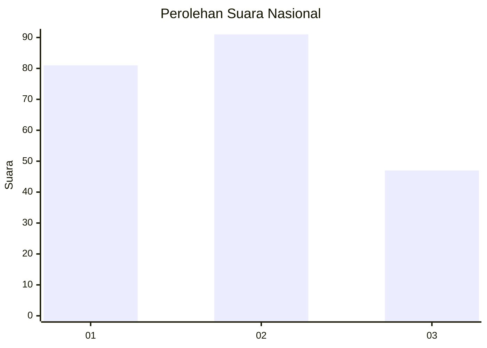
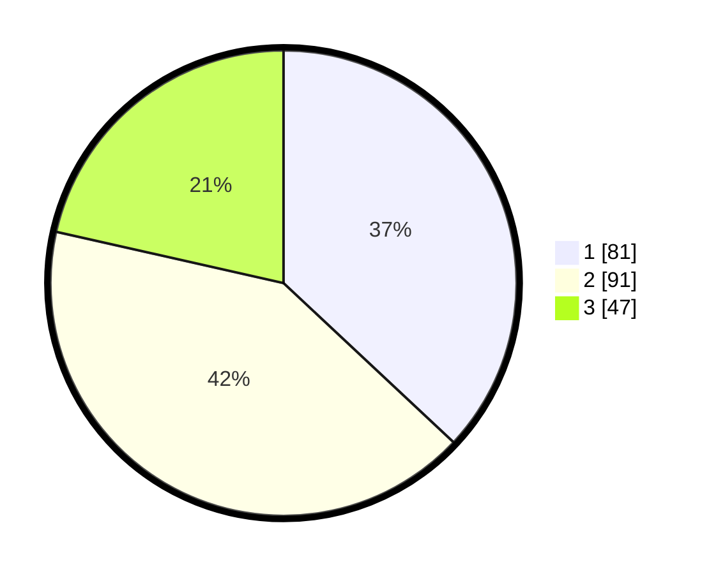

# Hasil

## Grafik

## Tabel

| No.    | Nama Paslon    | Suara | Suara (raw) | Persentase |
|:------ |:-------------- | -----:| -----------:| ----------:|
| 100025 | ANIES MUHAIMIN | 81    | [81][p-1]   | 36,99      |
| 100026 | PRABOWO GIBRAN | 91    | [91][p-2]   | 41,55      |
| 100027 | GANJAR MAHFUD  | 47    | [47][p-3]   | 21,46      |

[p-1]: https://github.com/gigit-pemilu/pemilu-2024/blob/main/pilpres/hitung-suara/sub/31-dki-jakarta/sub/72-jakarta-utara/sub/04-cilincing/sub/1002-sukapura/sub/137-tps/sub/paslon-1.txt
[p-2]: https://github.com/gigit-pemilu/pemilu-2024/blob/main/pilpres/hitung-suara/sub/31-dki-jakarta/sub/72-jakarta-utara/sub/04-cilincing/sub/1002-sukapura/sub/137-tps/sub/paslon-2.txt
[p-3]: https://github.com/gigit-pemilu/pemilu-2024/blob/main/pilpres/hitung-suara/sub/31-dki-jakarta/sub/72-jakarta-utara/sub/04-cilincing/sub/1002-sukapura/sub/137-tps/sub/paslon-3.txt

## Foto C Plano

https://sirekap-obj-formc.kpu.go.id/1023/pemilu/ppwp/31/72/04/10/02/3172041002137-20240214-155609--40d7856d-1a25-4b52-bd2c-f56398c23b8a.jpg

https://sirekap-obj-formc.kpu.go.id/1023/pemilu/ppwp/31/72/04/10/02/3172041002137-20240214-155252--8697dbf4-5060-4d0f-915f-5f4150371f86.jpg

https://sirekap-obj-formc.kpu.go.id/1023/pemilu/ppwp/31/72/04/10/02/3172041002137-20240214-160137--46b8b57c-bd36-499a-bb86-b7ace6f807aa.jpg

## Metadata

| Key        | Value               |
| ---------- | ------------------- |
| Time Stamp | 2024-02-15 00:41:44 |

