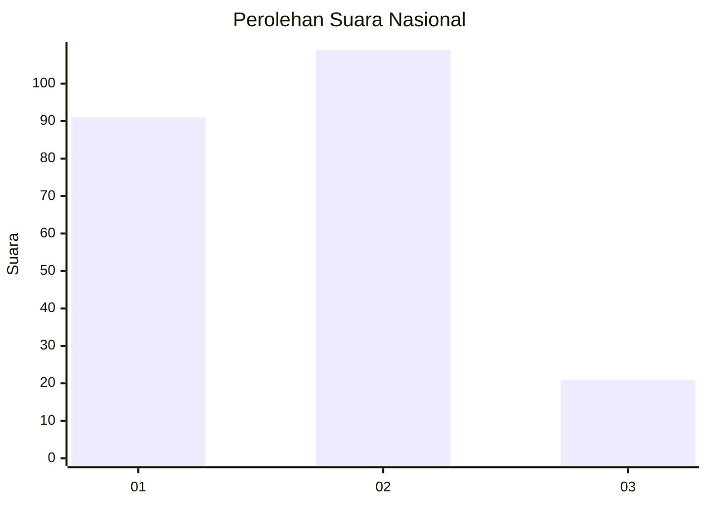
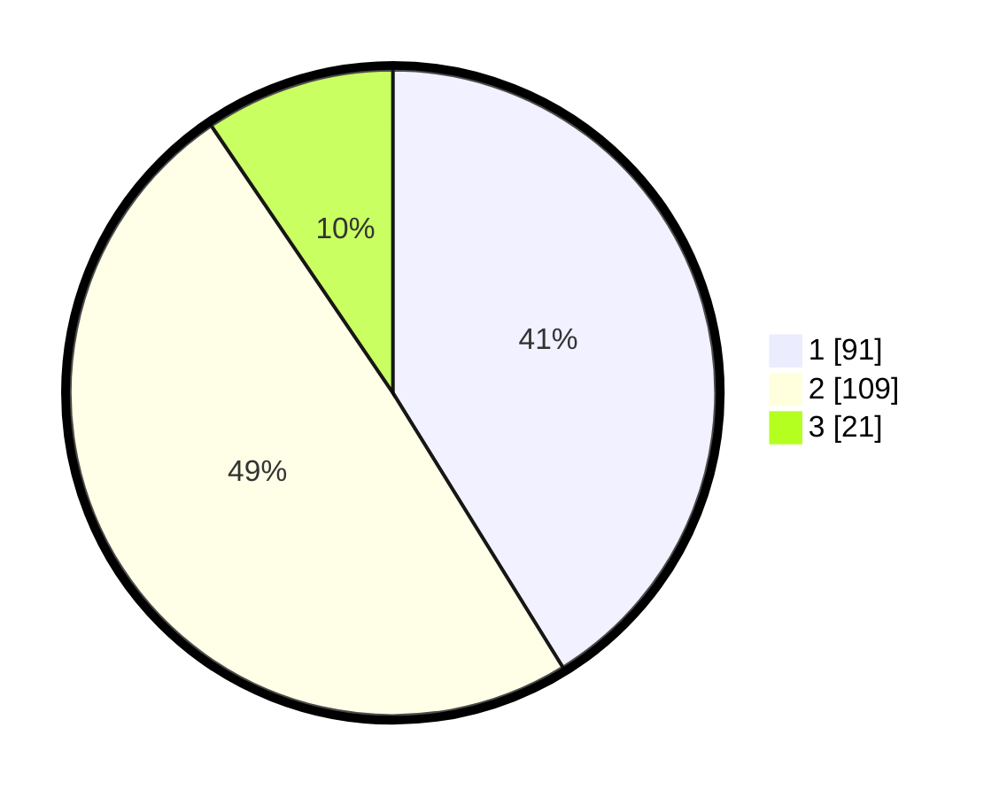

# Hasil

## Grafik

## Tabel

| No.    | Nama Paslon    | Suara | Suara (raw) | Persentase |
|:------ |:-------------- | -----:| -----------:| ----------:|
| 100025 | ANIES MUHAIMIN | 91    | [91][p-1]   | 41,18      |
| 100026 | PRABOWO GIBRAN | 109   | [109][p-2]  | 49,32      |
| 100027 | GANJAR MAHFUD  | 21    | [21][p-3]   | 9,50       |

[p-1]: https://github.com/gigit-pemilu/pemilu-2024/blob/main/pilpres/hitung-suara/sub/31-dki-jakarta/sub/72-jakarta-utara/sub/04-cilincing/sub/1002-sukapura/sub/139-tps/sub/paslon-1.txt
[p-2]: https://github.com/gigit-pemilu/pemilu-2024/blob/main/pilpres/hitung-suara/sub/31-dki-jakarta/sub/72-jakarta-utara/sub/04-cilincing/sub/1002-sukapura/sub/139-tps/sub/paslon-2.txt
[p-3]: https://github.com/gigit-pemilu/pemilu-2024/blob/main/pilpres/hitung-suara/sub/31-dki-jakarta/sub/72-jakarta-utara/sub/04-cilincing/sub/1002-sukapura/sub/139-tps/sub/paslon-3.txt

## Foto C Plano

https://sirekap-obj-formc.kpu.go.id/fcc9/pemilu/ppwp/31/72/04/10/02/3172041002139-20240216-192751--8391bda5-d8d9-4186-8a75-2f7b74d05743.jpg

https://sirekap-obj-formc.kpu.go.id/fcc9/pemilu/ppwp/31/72/04/10/02/3172041002139-20240214-221803--ddf1f712-015c-4791-b9b5-ed315718a4bb.jpg

https://sirekap-obj-formc.kpu.go.id/fcc9/pemilu/ppwp/31/72/04/10/02/3172041002139-20240214-221930--022280de-cb95-4043-a88f-0f38ddd92686.jpg

## Metadata

| Key        | Value               |
| ---------- | ------------------- |
| Time Stamp | 2024-02-16 21:01:00 |

