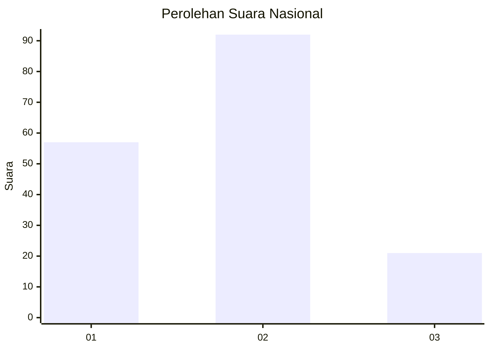
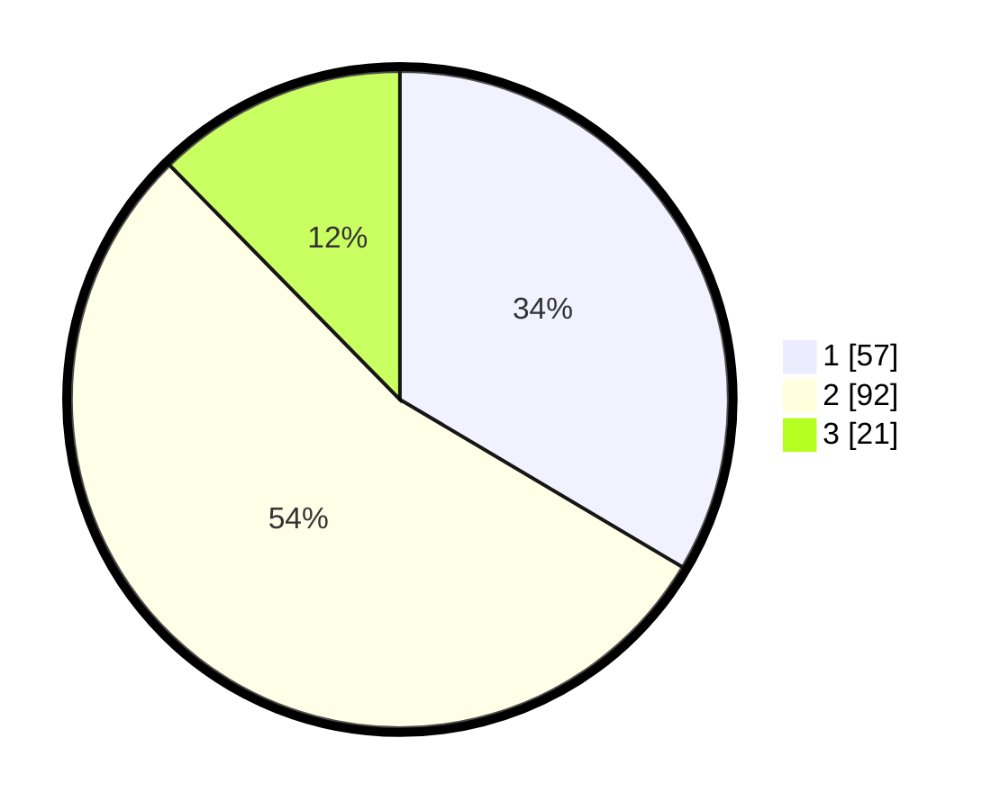

# Hasil

## Grafik

## Tabel

| No.    | Nama Paslon    | Suara | Suara (raw) | Persentase |
|:------ |:-------------- | -----:| -----------:| ----------:|
| 100025 | ANIES MUHAIMIN | 57    | [57][p-1]   | 33,53      |
| 100026 | PRABOWO GIBRAN | 92    | [92][p-2]   | 54,12      |
| 100027 | GANJAR MAHFUD  | 21    | [21][p-3]   | 12,35      |

[p-1]: https://github.com/gigit-pemilu/pemilu-2024/blob/main/pilpres/hitung-suara/sub/31-dki-jakarta/sub/72-jakarta-utara/sub/04-cilincing/sub/1002-sukapura/sub/155-tps/sub/paslon-1.txt
[p-2]: https://github.com/gigit-pemilu/pemilu-2024/blob/main/pilpres/hitung-suara/sub/31-dki-jakarta/sub/72-jakarta-utara/sub/04-cilincing/sub/1002-sukapura/sub/155-tps/sub/paslon-2.txt
[p-3]: https://github.com/gigit-pemilu/pemilu-2024/blob/main/pilpres/hitung-suara/sub/31-dki-jakarta/sub/72-jakarta-utara/sub/04-cilincing/sub/1002-sukapura/sub/155-tps/sub/paslon-3.txt

## Foto C Plano

https://sirekap-obj-formc.kpu.go.id/c79b/pemilu/ppwp/31/72/04/10/02/3172041002155-20240215-001225--016560e7-b0ec-40cc-9b9f-ad4b09cf4be5.jpg

https://sirekap-obj-formc.kpu.go.id/c79b/pemilu/ppwp/31/72/04/10/02/3172041002155-20240216-233309--30140427-57fb-4ba4-9271-ba6731d80155.jpg

https://sirekap-obj-formc.kpu.go.id/c79b/pemilu/ppwp/31/72/04/10/02/3172041002155-20240215-012958--eba8cbd5-9193-40ed-9d8e-0ebe856b1523.jpg

## Metadata

| Key        | Value               |
| ---------- | ------------------- |
| Time Stamp | 2024-02-21 15:00:00 |

