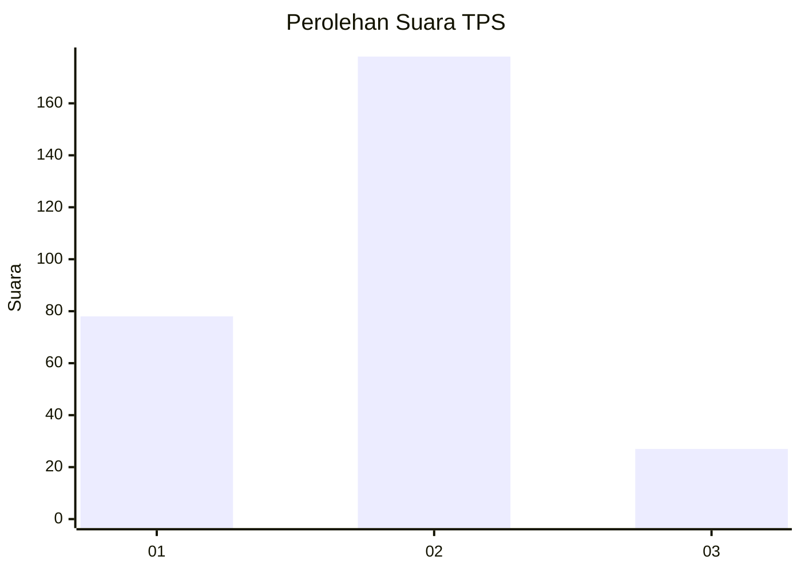
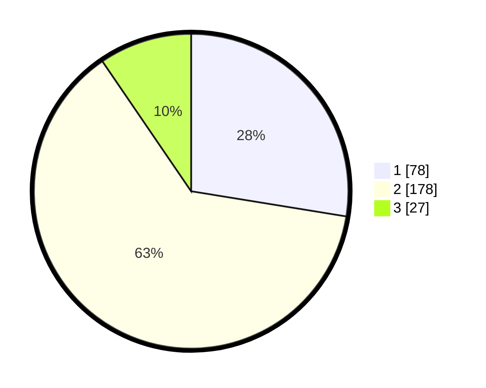

# Hasil

## Grafik

## Tabel

| No. | Nama Paslon    | Suara | Suara (raw) | Persentase |
|:--- |:-------------- | -----:| -----------:| ----------:|
| 1   | ANIES MUHAIMIN | 78    | [78][p-1]   | 27,56      |
| 2   | PRABOWO GIBRAN | 178   | [178][p-2]  | 62,90      |
| 3   | GANJAR MAHFUD  | 27    | [27][p-3]   | 9,54       |

[p-1]: https://github.com/gigit-pemilu/pemilu-2024-31-dki-jakarta/blob/main/pilpres/hitung-suara/sub/31-dki-jakarta/sub/72-jakarta-utara/sub/04-cilincing/sub/1002-sukapura/sub/163-tps/sub/paslon-1.txt
[p-2]: https://github.com/gigit-pemilu/pemilu-2024-31-dki-jakarta/blob/main/pilpres/hitung-suara/sub/31-dki-jakarta/sub/72-jakarta-utara/sub/04-cilincing/sub/1002-sukapura/sub/163-tps/sub/paslon-2.txt
[p-3]: https://github.com/gigit-pemilu/pemilu-2024-31-dki-jakarta/blob/main/pilpres/hitung-suara/sub/31-dki-jakarta/sub/72-jakarta-utara/sub/04-cilincing/sub/1002-sukapura/sub/163-tps/sub/paslon-3.txt

## Foto C Plano

https://sirekap-obj-formc.kpu.go.id/eeeb/pemilu/ppwp/31/72/04/10/02/3172041002163-20240214-190740--56954bcc-03a8-426f-90a5-bef8af91228e.jpg

https://sirekap-obj-formc.kpu.go.id/eeeb/pemilu/ppwp/31/72/04/10/02/3172041002163-20240214-190914--314c9be7-b410-4866-b973-c5ce53565258.jpg

https://sirekap-obj-formc.kpu.go.id/eeeb/pemilu/ppwp/31/72/04/10/02/3172041002163-20240214-190558--86b95004-828a-4d8f-ad78-657912506db3.jpg

## Metadata

| Key        | Value               |
| ---------- | ------------------- |
| Time Stamp | 2024-02-21 18:00:00 |

