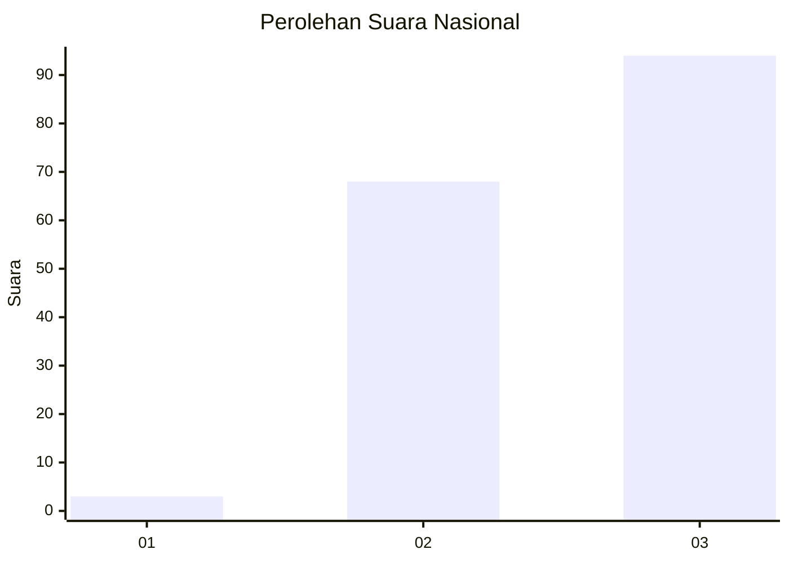
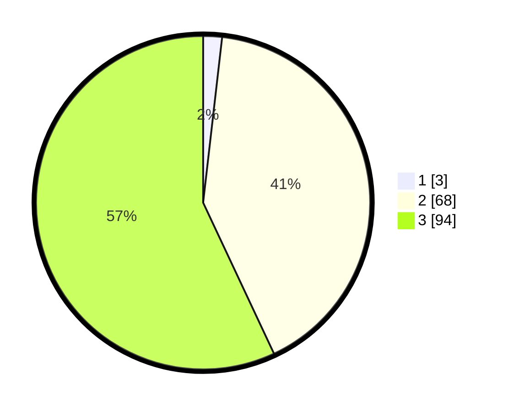

# Hasil

## Grafik

## Tabel

| No.    | Nama Paslon    | Suara | Suara (raw) | Persentase |
|:------ |:-------------- | -----:| -----------:| ----------:|
| 100025 | ANIES MUHAIMIN | 3     | [3][p-1]    | 1,82       |
| 100026 | PRABOWO GIBRAN | 68    | [68][p-2]   | 41,21      |
| 100027 | GANJAR MAHFUD  | 94    | [94][p-3]   | 56,97      |

[p-1]: https://github.com/gigit-pemilu/pemilu-2024/blob/main/pilpres/hitung-suara/sub/31-dki-jakarta/sub/72-jakarta-utara/sub/04-cilincing/sub/1002-sukapura/sub/170-tps/sub/paslon-1.txt
[p-2]: https://github.com/gigit-pemilu/pemilu-2024/blob/main/pilpres/hitung-suara/sub/31-dki-jakarta/sub/72-jakarta-utara/sub/04-cilincing/sub/1002-sukapura/sub/170-tps/sub/paslon-2.txt
[p-3]: https://github.com/gigit-pemilu/pemilu-2024/blob/main/pilpres/hitung-suara/sub/31-dki-jakarta/sub/72-jakarta-utara/sub/04-cilincing/sub/1002-sukapura/sub/170-tps/sub/paslon-3.txt

## Foto C Plano

https://sirekap-obj-formc.kpu.go.id/a457/pemilu/ppwp/31/72/04/10/02/3172041002170-20240214-205603--1d773c3a-0ec2-4743-85f4-e4fdf2b23e54.jpg

https://sirekap-obj-formc.kpu.go.id/a457/pemilu/ppwp/31/72/04/10/02/3172041002170-20240214-205751--723b5d95-e5a6-43b3-a8b9-4f4324881b76.jpg

https://sirekap-obj-formc.kpu.go.id/a457/pemilu/ppwp/31/72/04/10/02/3172041002170-20240214-211927--144263cc-23b8-4c0b-933d-9251aa4e8533.jpg

## Metadata

| Key        | Value               |
| ---------- | ------------------- |
| Time Stamp | 2024-02-20 22:00:00 |

