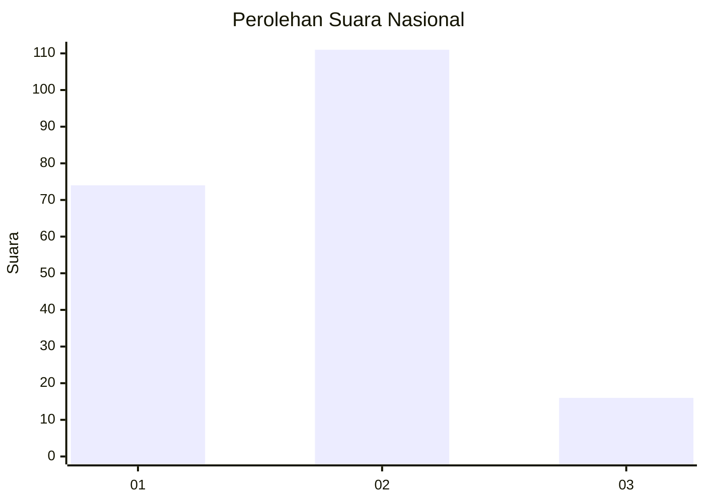

# Hasil

## Grafik

## Tabel

| No.    | Nama Paslon    | Suara | Suara (raw) | Persentase |
|:------ |:-------------- | -----:| -----------:| ----------:|
| 100025 | ANIES MUHAIMIN | 74    | [74][p-1]   | 36,82      |
| 100026 | PRABOWO GIBRAN | 111   | [111][p-2]  | 55,22      |
| 100027 | GANJAR MAHFUD  | 16    | [16][p-3]   | 7,96       |

[p-1]: https://github.com/gigit-pemilu/pemilu-2024/blob/main/pilpres/hitung-suara/sub/31-dki-jakarta/sub/72-jakarta-utara/sub/04-cilincing/sub/1003-marunda/sub/003-tps/sub/paslon-1.txt
[p-2]: https://github.com/gigit-pemilu/pemilu-2024/blob/main/pilpres/hitung-suara/sub/31-dki-jakarta/sub/72-jakarta-utara/sub/04-cilincing/sub/1003-marunda/sub/003-tps/sub/paslon-2.txt
[p-3]: https://github.com/gigit-pemilu/pemilu-2024/blob/main/pilpres/hitung-suara/sub/31-dki-jakarta/sub/72-jakarta-utara/sub/04-cilincing/sub/1003-marunda/sub/003-tps/sub/paslon-3.txt

## Foto C Plano

https://sirekap-obj-formc.kpu.go.id/a68a/pemilu/ppwp/31/72/04/10/03/3172041003003-20240216-111734--efd96dfd-258c-4651-b118-27827423e538.jpg

https://sirekap-obj-formc.kpu.go.id/a68a/pemilu/ppwp/31/72/04/10/03/3172041003003-20240215-015225--aabbb469-a54a-4bb0-889b-78b7bd614220.jpg

https://sirekap-obj-formc.kpu.go.id/a68a/pemilu/ppwp/31/72/04/10/03/3172041003003-20240215-015251--3a373487-3e56-4bea-a5e6-03bd462335b6.jpg

## Metadata

| Key        | Value               |
| ---------- | ------------------- |
| Time Stamp | 2024-02-20 20:00:00 |

