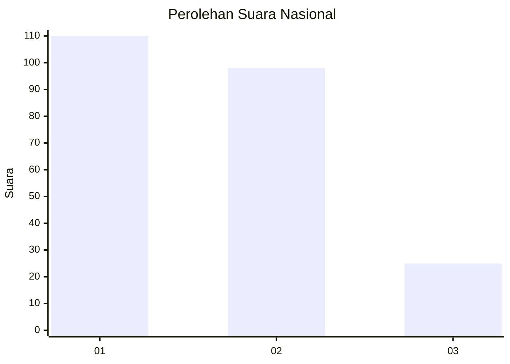
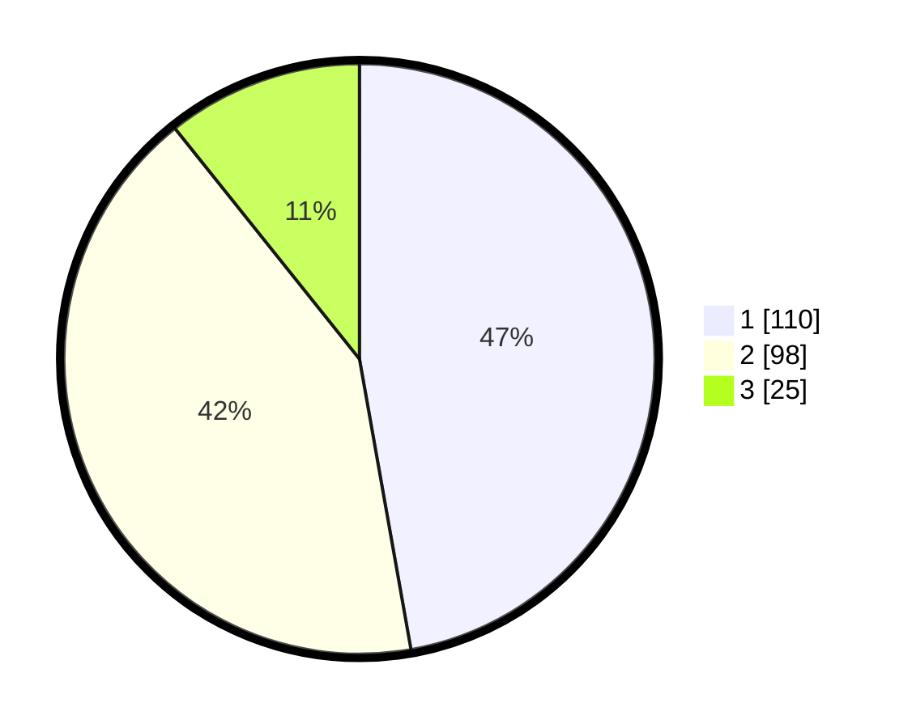

# Hasil

## Grafik

## Tabel

| No.    | Nama Paslon    | Suara | Suara (raw) | Persentase |
|:------ |:-------------- | -----:| -----------:| ----------:|
| 100025 | ANIES MUHAIMIN | 110   | [110][p-1]  | 47,21      |
| 100026 | PRABOWO GIBRAN | 98    | [98][p-2]   | 42,06      |
| 100027 | GANJAR MAHFUD  | 25    | [25][p-3]   | 10,73      |

[p-1]: https://github.com/gigit-pemilu/pemilu-2024/blob/main/pilpres/hitung-suara/sub/31-dki-jakarta/sub/72-jakarta-utara/sub/04-cilincing/sub/1003-marunda/sub/034-tps/sub/paslon-1.txt
[p-2]: https://github.com/gigit-pemilu/pemilu-2024/blob/main/pilpres/hitung-suara/sub/31-dki-jakarta/sub/72-jakarta-utara/sub/04-cilincing/sub/1003-marunda/sub/034-tps/sub/paslon-2.txt
[p-3]: https://github.com/gigit-pemilu/pemilu-2024/blob/main/pilpres/hitung-suara/sub/31-dki-jakarta/sub/72-jakarta-utara/sub/04-cilincing/sub/1003-marunda/sub/034-tps/sub/paslon-3.txt

## Foto C Plano

https://sirekap-obj-formc.kpu.go.id/61bb/pemilu/ppwp/31/72/04/10/03/3172041003034-20240214-233937--14c40db4-f272-4cfc-9a15-65db25b90573.jpg

https://sirekap-obj-formc.kpu.go.id/61bb/pemilu/ppwp/31/72/04/10/03/3172041003034-20240214-234203--d3e0ddca-2d8f-47a0-9caa-904832394c59.jpg

https://sirekap-obj-formc.kpu.go.id/61bb/pemilu/ppwp/31/72/04/10/03/3172041003034-20240214-234303--62cb358c-8ae8-4af5-a588-3a376ebc2b0c.jpg

## Metadata

| Key        | Value               |
| ---------- | ------------------- |
| Time Stamp | 2024-02-21 19:00:00 |

