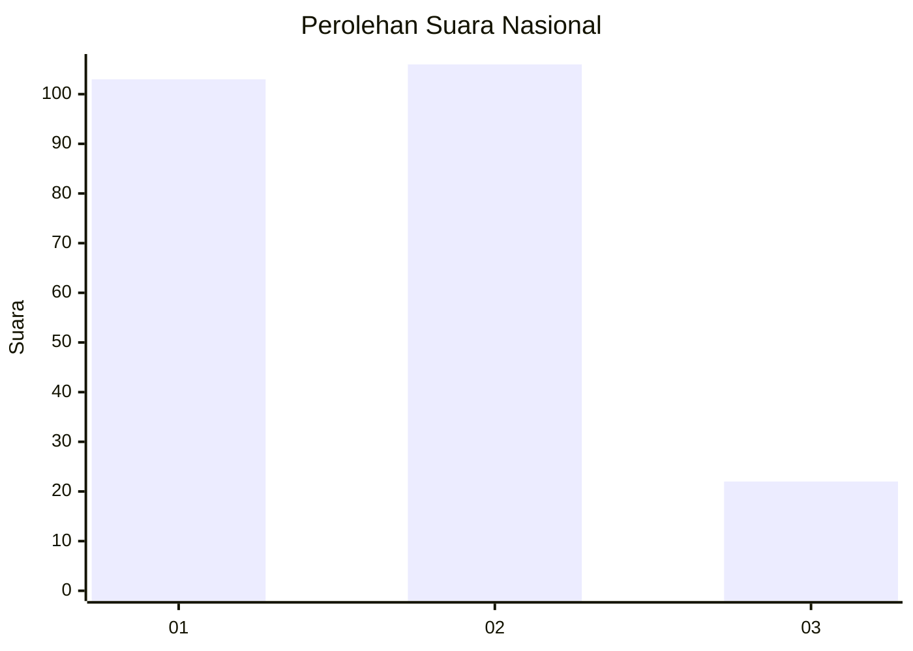
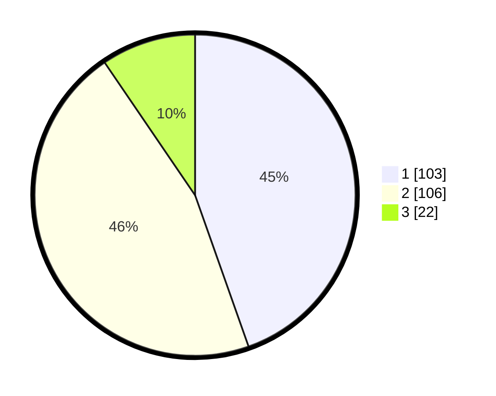

# Hasil

## Grafik

## Tabel

| No.    | Nama Paslon    | Suara | Suara (raw) | Persentase |
|:------ |:-------------- | -----:| -----------:| ----------:|
| 100025 | ANIES MUHAIMIN | 103   | [103][p-1]  | 44,59      |
| 100026 | PRABOWO GIBRAN | 106   | [106][p-2]  | 45,89      |
| 100027 | GANJAR MAHFUD  | 22    | [22][p-3]   | 9,52       |

[p-1]: https://github.com/gigit-pemilu/pemilu-2024/blob/main/pilpres/hitung-suara/sub/31-dki-jakarta/sub/72-jakarta-utara/sub/04-cilincing/sub/1003-marunda/sub/037-tps/sub/paslon-1.txt
[p-2]: https://github.com/gigit-pemilu/pemilu-2024/blob/main/pilpres/hitung-suara/sub/31-dki-jakarta/sub/72-jakarta-utara/sub/04-cilincing/sub/1003-marunda/sub/037-tps/sub/paslon-2.txt
[p-3]: https://github.com/gigit-pemilu/pemilu-2024/blob/main/pilpres/hitung-suara/sub/31-dki-jakarta/sub/72-jakarta-utara/sub/04-cilincing/sub/1003-marunda/sub/037-tps/sub/paslon-3.txt

## Foto C Plano

https://sirekap-obj-formc.kpu.go.id/e8d5/pemilu/ppwp/31/72/04/10/03/3172041003037-20240214-220309--916bdf98-cfa4-4ce3-b678-d42df698f842.jpg

https://sirekap-obj-formc.kpu.go.id/e8d5/pemilu/ppwp/31/72/04/10/03/3172041003037-20240214-220509--0c3ba3bf-8972-4e51-94ae-e71c9c6f2690.jpg

https://sirekap-obj-formc.kpu.go.id/e8d5/pemilu/ppwp/31/72/04/10/03/3172041003037-20240214-220710--606e8bd8-1680-4136-a966-6ca4c8c5de2e.jpg

## Metadata

| Key        | Value               |
| ---------- | ------------------- |
| Time Stamp | 2024-02-21 19:00:00 |

