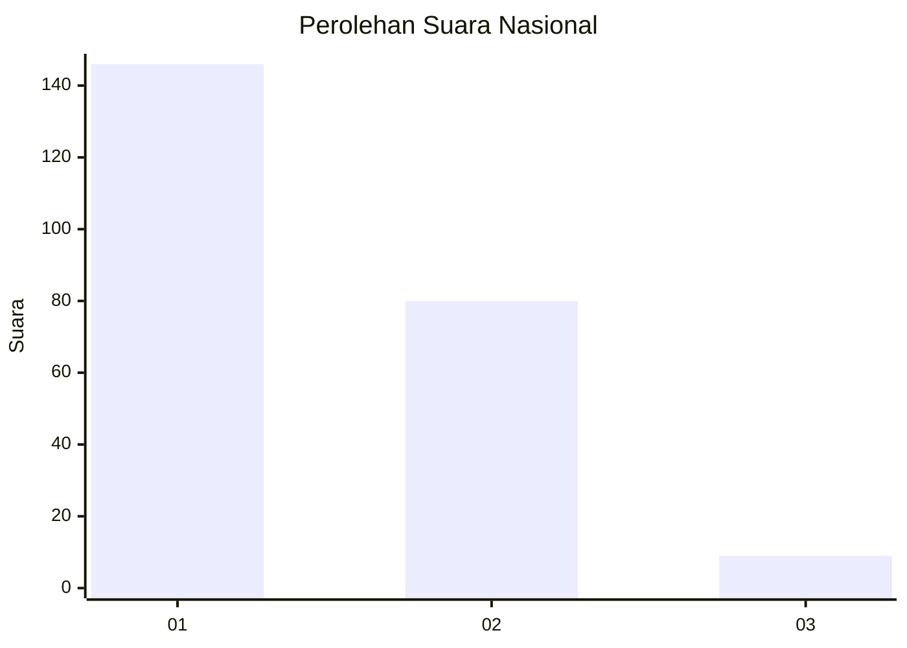
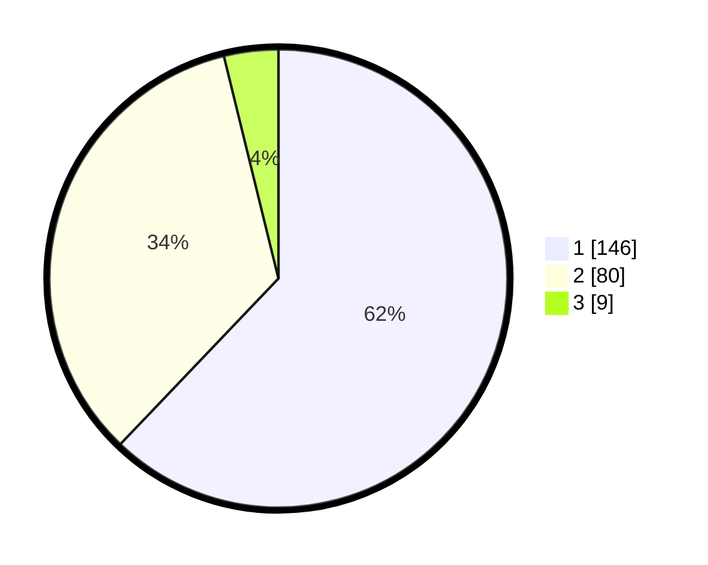

# Hasil

## Grafik

## Tabel

| No.    | Nama Paslon    | Suara | Suara (raw) | Persentase |
|:------ |:-------------- | -----:| -----------:| ----------:|
| 100025 | ANIES MUHAIMIN | 146   | [146][p-1]  | 62,13      |
| 100026 | PRABOWO GIBRAN | 80    | [80][p-2]   | 34,04      |
| 100027 | GANJAR MAHFUD  | 9     | [9][p-3]    | 3,83       |

[p-1]: https://github.com/gigit-pemilu/pemilu-2024/blob/main/pilpres/hitung-suara/sub/31-dki-jakarta/sub/72-jakarta-utara/sub/04-cilincing/sub/1003-marunda/sub/043-tps/sub/paslon-1.txt
[p-2]: https://github.com/gigit-pemilu/pemilu-2024/blob/main/pilpres/hitung-suara/sub/31-dki-jakarta/sub/72-jakarta-utara/sub/04-cilincing/sub/1003-marunda/sub/043-tps/sub/paslon-2.txt
[p-3]: https://github.com/gigit-pemilu/pemilu-2024/blob/main/pilpres/hitung-suara/sub/31-dki-jakarta/sub/72-jakarta-utara/sub/04-cilincing/sub/1003-marunda/sub/043-tps/sub/paslon-3.txt

## Foto C Plano

https://sirekap-obj-formc.kpu.go.id/7abf/pemilu/ppwp/31/72/04/10/03/3172041003043-20240215-023048--af7288f3-f9dd-4b5b-8f61-34c4f04320e3.jpg

https://sirekap-obj-formc.kpu.go.id/7abf/pemilu/ppwp/31/72/04/10/03/3172041003043-20240215-023215--ad992669-c89d-4fd0-8315-2011c3e1ddf2.jpg

https://sirekap-obj-formc.kpu.go.id/7abf/pemilu/ppwp/31/72/04/10/03/3172041003043-20240215-165225--7cb606f7-b6dd-4278-91bb-c22ab525e0f8.jpg

## Metadata

| Key        | Value               |
| ---------- | ------------------- |
| Time Stamp | 2024-02-15 19:30:26 |

