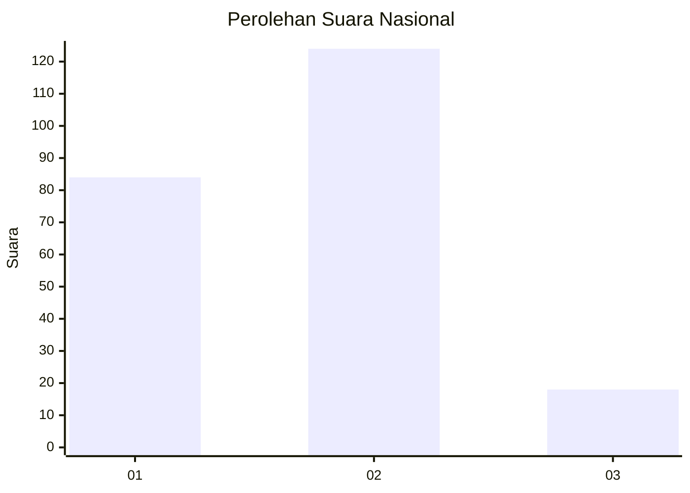

# Hasil

## Grafik

## Tabel

| No.    | Nama Paslon    | Suara | Suara (raw) | Persentase |
|:------ |:-------------- | -----:| -----------:| ----------:|
| 100025 | ANIES MUHAIMIN | 84    | [84][p-1]   | 37,17      |
| 100026 | PRABOWO GIBRAN | 124   | [124][p-2]  | 54,87      |
| 100027 | GANJAR MAHFUD  | 18    | [18][p-3]   | 7,96       |

[p-1]: https://github.com/gigit-pemilu/pemilu-2024/blob/main/pilpres/hitung-suara/sub/31-dki-jakarta/sub/72-jakarta-utara/sub/04-cilincing/sub/1003-marunda/sub/061-tps/sub/paslon-1.txt
[p-2]: https://github.com/gigit-pemilu/pemilu-2024/blob/main/pilpres/hitung-suara/sub/31-dki-jakarta/sub/72-jakarta-utara/sub/04-cilincing/sub/1003-marunda/sub/061-tps/sub/paslon-2.txt
[p-3]: https://github.com/gigit-pemilu/pemilu-2024/blob/main/pilpres/hitung-suara/sub/31-dki-jakarta/sub/72-jakarta-utara/sub/04-cilincing/sub/1003-marunda/sub/061-tps/sub/paslon-3.txt

## Foto C Plano

https://sirekap-obj-formc.kpu.go.id/0efc/pemilu/ppwp/31/72/04/10/03/3172041003061-20240215-003808--7dbd48e4-12ad-41b5-9179-eabc547b0b97.jpg

https://sirekap-obj-formc.kpu.go.id/0efc/pemilu/ppwp/31/72/04/10/03/3172041003061-20240215-004254--811b511b-0d74-4b00-97b5-625e2aac246c.jpg

https://sirekap-obj-formc.kpu.go.id/0efc/pemilu/ppwp/31/72/04/10/03/3172041003061-20240215-004714--34c7f2d6-3c2f-4e23-872d-5e459db939e1.jpg

## Metadata

| Key        | Value               |
| ---------- | ------------------- |
| Time Stamp | 2024-02-21 19:00:00 |

